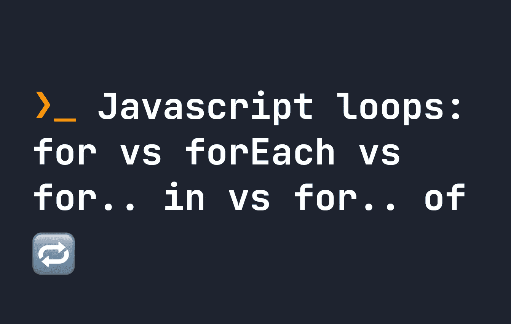

# JavaScript 循环:for vs forEach vs for…in vs for…of

> 原文：<https://javascript.plainenglish.io/javascript-loops-for-vs-foreach-vs-for-in-vs-for-of-1ffa4cce18e0?source=collection_archive---------9----------------------->

## JavaScript 中有很多方法可以迭代，但是它们都是什么意思呢？



Javascript 中有很多方法可以遍历一个项目数组或 Javascript 中的任何其他可迭代项目。你可能见过他们:

*   `arr.forEach()`
*   `for(let item of arr)`
*   `for(let item in arr)`
*   `for(let item = 0; item < arr.length; ++item)`

这可能看起来像是完成同一件事情的许多方法，但它们都有自己的细微差别。为了让这些工作，有问题的项目也需要是**可重复**。因此，虽然它们可以处理像 [Map](https://fjolt.com/article/javascript-map-data) 、 [Set](https://fjolt.com/article/javascript-sets) 和数组这样的东西，但是它们不能处理对象。字符串也是可迭代的。

既然有这么多种方式，在 Javascript 中什么时候使用`forEach`、`in`或`of`可能会令人困惑。今天，让我们来详细了解一下它们各自的作用，以及何时使用它们。

# forEach 方法

许多人被这个工具所吸引，因为从语言学上来说它是有意义的。`arr.forEach`听起来不错，它提供了一个简单的回调函数，可以像数组一样对 iterable 中的每个项做任何我们想做的事情:

```
let x = [ 1, 2, 3, 4, 5 ];
x.forEach((item, index) => {
    x[index] += 1;
});
console.log(x); // [ 2, 3, 4, 5, 6 ];
```

然而，`forEach`是一个方法——这意味着它只出现在 Javascript 中的某些数据类型上。例如，所有的`Array`都有一个`forEach`方法，`Map`和`Set`也是如此——但是尽管是可迭代的，`String`却没有。值得注意的是， [DOM 元素直到最近才有 forEach。因此，虽然它在许多不同的情况下都是可靠可用的。它也比常规的老式循环慢得多。](https://fjolt.com/article/javascript-multiple-elements-addeventlistener)

除此之外，`forEach`并不真正与像`await`这样的异步方法一起工作，或者承诺。在需要使用承诺或`await`的情况下，最好避免使用承诺或`await`而使用`for`循环。

虽然`forEach`绝对是一种迭代数组的简单方法，但它并不总是最好的。

# 在可迭代表上使用 for 循环

在 Javascript 中，有三种类型的`for`循环可以在可重复项上运行:

*   `for(let item of arr)`
*   `for(let item in arr)`
*   `for(let item = 0; item < arr.length; ++item)`

对于这种语言的新手来说，语法可能会很混乱。当 Javascript 首次出现时，大家使用的最初的`for`循环是上面列出的最后一个:

```
let x = [ 1, 2, 3, 4, 5 ];
for(let i = 0; i < x.length; ++i) {
    console.log(x[i]); // 1.. 2.. 3.. 4.. 5
}
```

这是一种简单直接的访问数组索引的方法。这里，`i`从`0`开始，对于数组`x`中的每一项递增。因此，`i`可靠地表示了每一项的索引，因此编写`x[i]`将让我们对数组中的每一项做一些事情。

此后，引入了两种新型的`for`回路- `in`和`of`。

# Javascript for 循环中的 in vs of

理解 Javascript for 循环中的`in`和`of`的最佳方式是`in`是我们刚刚看到的`for`循环的简化。访问数组中的索引是一种更简单的方法。

同时，`of`是表示**数组项本身**的一种简单方法。让我们看一个简单的例子。这里，我们使用`in`获取数组中每一项的索引:

```
let x = [ 5, 10, 15, 20, 25, 30 ];
for(let i in x) {
    console.log(i); // 0.. 1.. 2.. 3.. 4.. 5
}
```

同时，如果我们使用`of`，它将获得数组项的实际值:

```
let x = [ 5, 10, 15, 20, 25, 30 ];
for(let i of x) {
    console.log(i); // 5.. 10.. 15.. 20.. 25.. 30
}
```

因此，虽然`in`基本上简化了`for(let i = 0; i < x.length; ++i)`，但`of`实际上为我们提供了访问数组内容本身的新功能。如果我们的数组中有对象，这可能特别有用:

```
let x = [ { name: "John" }, { name: "Jacob" }, { name: "Jingleheimer" }, { name: "Schmidt" }]
for(let item of x) {
    console.log(item.name); // John.. Jacob.. Jingleheimer.. Schmidt
}
```

还需要注意的是，对于像`Map` s 和`Set` s 这样的其他可迭代对象，`for.. of`将返回一个既有键又有值的数组，而`in`将不起作用。例如:

```
let myMap = new Map();
myMap.set('x', 5);for(let x of myMap) {
    console.log(x); // [ 'x', 5 ]
}for(let x in myMap) {
    console.log(x); // does not console log anything
}
```

要了解更多关于地图和集合的信息，你可以在这里阅读我的详细的 [Javascript 地图指南](https://fjolt.com/article/javascript-map-data)和 [Javascript 集合指南](https://fjolt.com/article/javascript-sets)。

# 遍历对象

虽然对象本身在 Javascript 中是不可迭代的，但是它们可以通过使用`Object.keys()`或`Object.values()`转换成可迭代的。这将转换对象的键或值的数组，然后可以迭代该数组:

```
let obj = { name: "John", secondName: "Jacob", age: 154 };
let iterableKeys = Object.keys(obj);
for(let item of iterableKeys) {
    console.log(item); // name.. secondName.. age
}
```

# 结论

这大概包括了你需要知道的一切。总而言之:

*   `forEach`是一个附加到 Javascript 中大多数可迭代项的方法，只有少数例外。它是基于回调的，通常不支持承诺，并且比传统的 for 循环要慢。
*   每个可迭代对象上都有循环，过去,`for(let i = 0; i < x.length; ++i)`是人们使用的唯一格式。
*   引入`for.. in`是为了将`for(let i = 0; i < x.length; ++i)`简化为`for(let i in x)`。
*   最后，我们使用`for.. of`获得了访问 iterable 中每一项的值而不仅仅是键的能力。

我希望你喜欢这个指南，并且更好地了解在 JavaScript 中什么时候使用`in`、`forEach`和`of`。

*更多内容请看*[***plain English . io***](https://plainenglish.io/)*。报名参加我们的* [***免费周报***](http://newsletter.plainenglish.io/) *。关注我们关于*[***Twitter***](https://twitter.com/inPlainEngHQ)[***LinkedIn***](https://www.linkedin.com/company/inplainenglish/)*[***YouTube***](https://www.youtube.com/channel/UCtipWUghju290NWcn8jhyAw)*[***不和***](https://discord.gg/GtDtUAvyhW) *。对增长黑客感兴趣？检查* [***电路***](https://circuit.ooo/) *。***