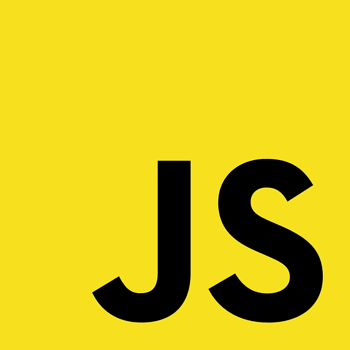

# 2022 年最著名的 JavaScript 库和框架

> 原文：<https://javascript.plainenglish.io/javascript-most-famous-libraries-and-framework-in-2022-90c6560f5ca4?source=collection_archive---------2----------------------->

## JavaScript 库和框架及其多种用例。

Javascript

如今，根据 Stack Overflow Developer Survey 2021，JavaScript 是世界上使用最多、最著名、最受认可的编程语言。可能，即使是 JavaScript 的创始人 Brendan Eich 也不会想到它会有今天的巨大成功。

他只打算开发一种语言，使 web 开发过程更加灵活，并且易于学习。他做到了。这之所以成为可能，是因为 JavaScript 的工作方式。事实上，它直接运行在浏览器上，让所有的开发更快、更高效。

第一天，名字不是 JavaScript，而是 Mocha，但他们想让它更类似于流行的 Java，这样人们就能认出它是一个构建良好的东西。多年来，JavaScript 一直在更新。每个版本都被称为 ES，编号为，例如，ES5。它的意思是 ECMA 脚本五，是官方 JavaScript 版本的第五个版本。

然后，在 2012 年开发了 TypeScript。它是 JavaScript 的超集，支持 JavaScript 没有的多种功能，比如强类型变量。这不是一个框架或库，我们可以把它看作是原始语言的扩展，让它更好地工作。目前，这是 JavaScript 的最高进化。

Brendan Eich, founder

## **用途**

JavaScript 几乎可以在任何地方使用:它用于游戏开发、移动开发、数据科学、机器学习、后端开发等等。反正 JavaScript 的主要用法，也是他独创的，就是前端开发。事实上，在浏览器的页面 DOM(文档对象模型)内部修改、处理和交互组件是很棒的。因此，正如您所猜测的，大多数框架和库都是为这个特定的用例而构建的。

无论如何，有大量的可能性，允许你用这种编程语言做几乎所有的事情，使它可能成为一种有多种用途的编程语言。

那么，我们要讨论什么框架和库呢？它们将根据它们的用例进行划分。对于前端:反应和角度。对于后端:Node.js 和 Expess。移动开发:反应原生。机器学习:TensorFlow.js .游戏开发:Phaser。让我们开始运行所有这些。

# 前端

## **反应过来**

React logo

React 是一个 JavaScript 开源前端库(不是一个框架)，由 Meta(创建时，脸书公司)在 2013 年开发，由它的创建者维护，但也由热情的开发人员和开源爱好者维护。

它的创建是因为脸书希望消除 C++每次对代码库进行新的更改时所花费的编译时间。因此，他们决定使用 JavaScript 作为一种解释语言来完成这项工作，并建立一套强大的指令集来使所有的过程更加敏捷和愉快。他们做到了。

React 是一个库而不是一个框架，因为它并不完整。它缺少有效呈现页面的语言。为了解决这个问题，使用了一个叫做 JSX 的扩展，它在语法上与 HTML 非常相似。它还支持为页面编写脚本的 TypeScript。

React 基于组件的概念。一个组件只是被处理的一个网页的一部分。它可以是整个 DOM，也可以只是页面末尾的一小段。每个组件可以包含其他组件，并且位于父组件中。这使得页面成为一种二叉树，但是不用担心，它比标准的数据结构更容易处理。

总之，根据 Stack Overflow 开发者调查，它是最流行的 web 框架，目前有超过 40%的开发者知道这项技术。这可能会使它的工作机会有点饱和，但会创造一个巨大的社区来帮助你。如果你想学一些前端开发的东西，绝对推荐。

官方网站:[*https://reactjs.org/*](https://reactjs.org/)

## **棱角分明**

Angular

Angular 也是一个开源前端开发框架(这次是完整的，不仅仅是一个库)，拥有 MIT 许可。它于 2016 年发布，一直主要由谷歌开发。它是过时的 AngularJS 的发展，目前是它的第二个版本(Angular2)。

AngularJS 是用 Javascript 编写的，而 Angular2 是用 TypeScript 编写的。这大概就是 Angular 这么好的支持 TypeScript 的原因。它也是对 Bootstrap 支持最好的框架，因此您可以使您的页面响应更快。

角度项目比反应项目更加结构化。事实上，您需要多个元素，比如模型，它们必须呈现在页面上。与 React 不同，它可以创建更多的页面，并处理它们。就所需空间而言，它显得有点重。它不如 React 紧凑。这就是为什么 React 更适合小项目，而 Angular 更适合大项目。

根据 Stack Overflow 调查，它是第四个最受欢迎的框架，拥有令人敬畏的 22.96%。谷歌认为这种语言在未来会有很大发展，所以它在不断改进它。在前端框架领域，这无疑是一个安全的选择。

官方网站:[*https://angular.io/*](https://angular.io/)

# 后端

## **Node.js，快递**

NodeJs and Express

然后，我们切换到后端。事实上，JavaScript 也可以做到这一点，这要归功于 Node.js，这是一个基于谷歌 Chrome 的 V8 引擎的运行时系统。但是，这意味着什么呢？意味着谷歌工程师拿走了 Chrome 的 V8 引擎，这是整个浏览器的大脑，让一切正常工作。然后，他们用它来创建一种虚拟环境，你可以在浏览器之外运行你的 JavaScript 代码。

事实上，多亏了 Node.js，您可以在自己的机器上运行 Javascript。它还广泛用于在服务器上运行 JavaScript。这允许并有助于为该语言的所有不同用途创建新的、更高效的库和包。

官方网站:[*https://nodejs.org/en/*](https://nodejs.org/en/)

其中一个框架是 Express，它被认为是 NodeJs 服务器的标准。它用于创建 web 应用程序和 API，可用于从另一个网站检索和存储信息。毫无疑问，它是使用最多的后端框架，在 Stack Overflow 开发者调查中获得了 23.82%的分数，总体排名第三。

它于 2014 年由 TJ Holowaychuk 发布，据说它的灵感来自 Sinatra(另一个软件，不是歌手)。这意味着它是一个具有强大功能的最小基础设施，但特别是根据开发者的需要，它有一个巨大的插件和额外的包集，可以增强整个开发堆栈。这样，更轻松、更愉快、更轻松，尤其是对于一个新的开发者来说。这就是它取得如此巨大成功的原因。

官方网站:【https://expressjs.com/】

# *移动(跨平台)开发*

## ***反应原生***

**

*React Native*

*React Native 是脸书在 2015 年开发的一个移动应用框架。为了让它发展得更快，他们创建了一个黑客马拉松，所以很多人用这种特殊的语言开发应用程序。它和 React 有相同的碱基，这就是为什么这两个名字如此相似。在开发领域，React 也非常类似。*

*事实上，它使用了组件 must 和单页。它还允许使用不同本地语言的代码，如 Java、Kotlin 或 Swift，以提高执行时间。事实上，React native 往往比本地语言慢(React Native 是跨平台的，正如短语“学习一次，在任何地方编写”所暗示的那样)。尽管如此，这是一项广泛使用的技术。*

*事实上，在栈溢出调查的语音“其他框架”中，它的得分为 14.51%，击败了跨平台开发的对手:Flutter。现在，它可能是最常用的跨平台框架，也掩盖了微软的 Xamarin。所以，如果你对开发移动应用感兴趣，React Native 是一个很好的选择。但是，如果性能是这个应用程序的核心，建议使用一种本地语言，如 Android 的 Kotlin 和 iOS 的 Swift。*

*官方网站:[*https://reactnative.dev/*](https://reactnative.dev/)*

# *机器学习*

## ***TensorFlow.js***

**

*Tensorflow.js*

*Tensorflow.js 是 Tensorflow 的 JavaScript 扩展，TensorFlow 是一个开源的机器学习框架。它以最有效的方式提供了最著名的模型和算法，因此您可以用尽可能少的代码以最好的方式执行您的项目。它集成了线性回归、逻辑回归、决策树等算法。*

*它是最常用的机器学习框架，在 Stack Overflow 开发者调查中的得分为 16.53%。有很多开发人员在他们的项目中使用 TensorFlow.js。尽管如此，JavaScript 本身并不是处理大量数据的最佳语言，因此有一些语言更适用于这种用例。最著名的显然是 Python。(如果你感兴趣，这里有一篇文章的链接，解释了这两种语言的区别:[*https://medium . com/@ mpossamaim/python-vs-JavaScript-e 8590d 346 c3b*](https://medium.com/@mpossamaim/python-vs-javascript-e8590d346c3b)*)**

**官方网站:[*https://www.tensorflow.org/js*](https://www.tensorflow.org/js)**

# **游戏开发**

## ****相位器****

****

**Phaser**

****

**Phaser 是一个基于 JavaScript 的 2D 游戏引擎，用于在桌面和移动设备上开发游戏。它是免费的，由光子风暴发展而来。它可能是最常用和最著名的 JavaScript 游戏引擎。尽管如此，它几乎是未知的。为什么？因为 JavaScript 并不是游戏开发的最优语言。最好的是 C #、C++或 Java。这些都是非常快速的编程语言，支持非常好的 OOP，这在游戏开发领域几乎是必须的。这就是为什么 JavaScript 在游戏开发中用得不多，只适用于新手开发的小游戏。对于专业使用来说，并不理想。**

**官方网站:[*https://phaser.io/*](https://phaser.io/)**

# **结论**

****

**好了，现在我们已经看到了所有用例中最好的和最常用的 JavaScript 框架和库。我们发现 JavaScript 是一种伟大的语言，它创造了很多东西，其中很多都做得非常好。也有一些事情是这种编程语言无法以最佳方式处理的，比如 ML 和游戏开发。**

**无论如何，通过这篇文章，我想向任何人展示你如何只依赖这种语言，但如果你打算成为一名软件工程师，情况就不是这样了。**

**希望你喜欢。如果你有，订阅更多。**

***更多内容请看*[***plain English . io***](http://plainenglish.io/)*。报名参加我们的* [***免费周报***](http://newsletter.plainenglish.io/) *。在我们的* [***社区***](https://discord.gg/GtDtUAvyhW) *获得独家获得写作机会和建议。***