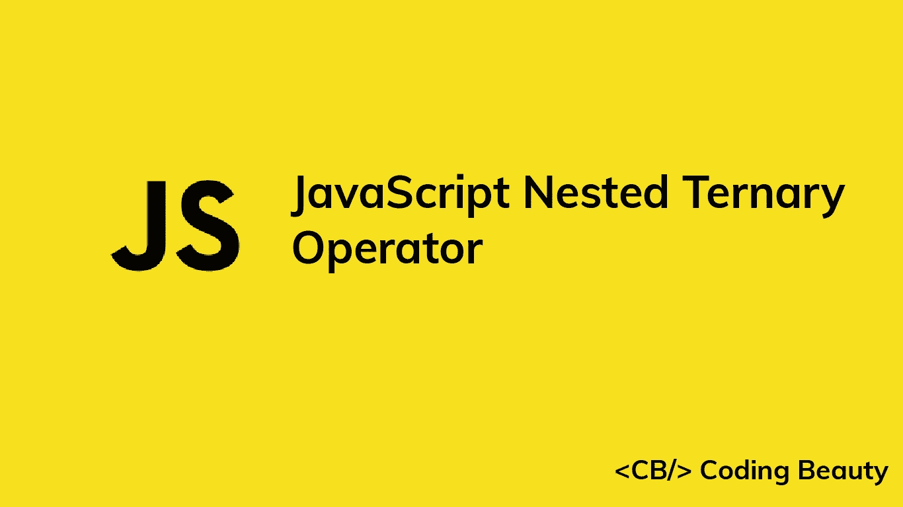

# 如何使用 JavaScript 嵌套三元运算符

> 原文：<https://javascript.plainenglish.io/javascript-nested-ternary-operator-dc28551fb8c3?source=collection_archive---------1----------------------->



如您所知，JavaScript 中的三元运算符是 if…else 语句的一种替代语句，常用于使代码更简洁、更易于理解。例如，我们可以有一个函数，根据传递给它的数字是奇数还是奇数，返回“是”或“否”。

```
function isOdd(num) {
  if (num % 2 === 1) return 'yes';
  else return 'no';
}
```

我们可以重构`isOdd`函数，使用一行条件语句，如下所示:

```
function isOdd(num) {
  return num % 2 === 1 ? 'yes' : 'no';
}
```

# JavaScript 中的嵌套三元运算符

我们可以将一个三元运算符作为表达式嵌套在另一个三元运算符中。我们可以用这个来代替 if…else if…else 语句和 switch 语句。例如，我们可以编写一段代码，将数字 1、2 和 3 的英文单词设置为一个变量。用 if…else if…else:

```
let num = 1;
let word;if (num === 1) word = 'one';
else if (num === 2) word = 'two';
else if (num === 3) word = 'three';
else num = 'unknown';
```

带开关…案例:

```
let num = 1;
let word;switch (num) {
  case 1:
    word = 'one';
    break;
  case 2:
    word = 'two';
    break;
  case 3:
    word = 'three';
    break;
  default:
    word = 'unknown';
    break;
}
```

现在有了嵌套的三元运算符:

```
let num = 1;
let word =
  num === 1
    ? 'one'
    : num === 2
    ? 'two'
    : num === 3
    ? 'three'
    : 'unknown';
```

上面的代码示例与前两个完全一样，并且不那么混乱。请注意，我们现在能够使用这种嵌套的三元方法在同一个语句中声明和设置变量。

*更新于:*[【codingbeautydev.com】](https://codingbeautydev.com/blog/javascript-nested-ternary-operator/)

# 订阅编码美容简讯

每周获取新的 web 开发技巧和教程。


[**订阅**](https://codingbeautydev.com/newsletter)