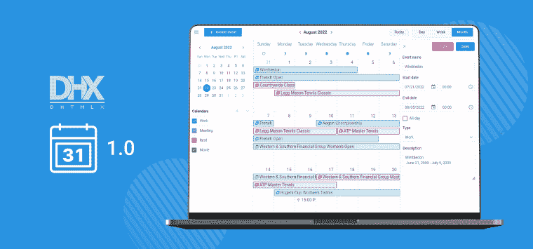

# JavaScript 新闻和更新:2022 年 8 月

> 原文：<https://javascript.plainenglish.io/javascript-news-and-updates-of-august-2022-6d68b7c91231?source=collection_archive---------9----------------------->

向所有 JavaScript 崇拜者致意！夏天结束了，这很令人难过，但是我们已经准备了一份最新 JavaScript 新闻的综述，让你高兴起来。今天，您将熟悉我们全新的 JavaScript 活动日历，它旨在快速实现网页上的规划功能。这里我们还重点介绍了 TypeScript、Astro 和 Docusaurus 的新版本。除此之外，您还将了解到一项超级昂贵的太空技术，这项技术在幕后使用了 JavaScript。最后，有几个有用的资源和提示可以帮助你扩展 JavaScript 的视野。

# 新闻和更新

## DHTMLX 推出了新的 JavaScript 事件日历组件

在开发商业 web 应用程序时，程序员经常被要求添加一个类似 Google 的事件日历来管理项目事件。从头开始开发这种功能需要花费大量的时间和精力。同时，找到一个轻量级的、易于使用的 JavaScript 库专门用于实现这个目标也是有问题的。这些问题已经成为 DHTMLX 团队创建新的 JavaScript 事件日历的主要动机。实际上，它可以被认为是我们更全面的调度器组件的简化版本。

新产品有一个简单而现代的 API，用户友好的 UI，以及开箱即用的主要功能。使用 DHTMLX 构建的事件日历允许添加任意数量的事件，动态编辑和重新安排所有活动，以及将事件分配到不同的日历中。该库带有三种内置视图模式(日、周、月)和方便的日历导航。在编程层面，它提供了大量配置和定制主要日历元素的机会。通过 CSS 变量可以很容易地改变日历的外观。还有 3 个预定义的主题(材料，柳树，黑暗)。此外，它可以与我们产品线中的其他新 JavaScript 工具一起顺利地整合到 web 项目中，这些工具包括[看板](https://dhtmlx.com/docs/products/dhtmlxKanban/)和[待办事项列表](https://dhtmlx.com/docs/products/dhtmlxTodo/)。在[发布文章](https://dhtmlx.com/blog/meet-dhtmlx-event-calendar-v1-0/)中了解更多信息。

# 认识 Astro 1.0

Astro 是一个相对较新的工具，吸引了开发社区的高度兴趣，GitHub 上已经有 18.3k 的 stars。本月，Astro 已经更新到第一个稳定版本(1.0 版)，并已准备好投入生产。本质上，它是一个构建系统，应该帮助开发人员交付高性能的 web 项目，并将它们部署到不同的主机平台上。它兼容流行的 UI 框架和其他前端工具。

但 Astro 最值得注意的是它所谓的“岛屿建筑”。这意味着网页上的所有静态元素都是用纯 HTML 和 CSS 创建的，而带有动态内容或交互(孤岛)的部分是用 JS 框架添加的。这种方法有助于减少项目中 JavaScript 的数量，并确保更快的加载。查看 Astro 博客以深入了解这个项目。

# Docusaurus 2.0 在这里

当涉及到将项目文档放到 web 上时，许多团队都依赖 Docusaurus。它是一个流行的静态站点生成器，帮助开发人员用最少的努力创建和维护文档。所有需要做的就是在 Markdown 中编写文档，Docusaurus 会处理所有其他的事情。很酷，对吧？顺便说一下，一些 DHTMLX 组件是在 Docusaurus 的帮助下编写的，目前我们对它非常满意。

但是 Docusaurus 团队并没有停留在他们目前成功的桂冠上，而是一直在努力使产品在各个方面变得更好。结果现在在 2.0 版中可用。新版本中引入的最重要的变化包括以下内容:具有插件系统的新模块化架构、对 MDX 格式的支持、更灵活的主题化等等。在[发布文章](https://docusaurus.io/blog/2022/08/01/announcing-docusaurus-2.0)中了解更多信息。

## TypeScript 4.8 简介

TypeScript 是开发人员中最受 T4 欢迎的编码技术之一，并且还在继续发展。最近，领导该项目的微软开发团队宣布发布 TypeScript 4.8。新版本没有引入任何新的功能，而是专注于改进一些现有的功能和优化构建时间。

例如，TypeScript 开发人员现在可以受益于更好的推断，例如条件类型中的*推断*类型变量，改进的*交集*和*联合*类型的工作，更快地执行 find-all-references 命令，等等。在这篇[文章](https://devblogs.microsoft.com/typescript/announcing-typescript-4-8/)中找到关于 v4.8 的更多详细信息，并通过[类型脚本路线图页面](https://github.com/Microsoft/TypeScript/wiki/Roadmap)了解未来的更新。

## 著名太空望远镜使用 JavaScript 引擎

即使你离人类太空探索很远，你也可能听说过詹姆斯·韦伯太空望远镜(JWST)。它向地球发送惊人的太空物体图像，帮助科学家揭开宇宙的秘密。但是你知道在软件层面上这个望远镜使用 JavaScript 代码吗？

最近公布的[技术手稿](https://www.jwst.nasa.gov/resources/ISIMmanuscript.pdf)称，望远镜核心模块的结构包括内置脚本处理器和 JavaScript 引擎。当需要让 JWST 执行某个动作时，操作员从地球向望远镜发出相应的命令。该命令由处理器在用 JavaScript 编写的预定义脚本的帮助下执行。该系统允许一次执行多达 10 个命令。JWST 的建设是在 2004 年启动的，因此，从今天的角度来看，望远镜的软件似乎已经过时了。然而，它仍然很好地处理了它的任务。

# **有用的提示和文章**

## 关于如何编写干净的 JS 代码的有用建议

现在在互联网上，你可以找到大量与处理糟糕代码相关的迷因。但众所周知，每个笑话里总有一点真理。在实践中，技术领导经常不得不敦促开发人员编写更简洁的代码，这样任何人都可以清楚地理解它，而无需进一步解释。干净的代码也更容易调试和维护。如果你是想在这一重要方面做得更好的人之一，这篇[文章](https://blog.bitsrc.io/5-ways-to-write-clean-javascript-code-19aa6338fe00)提供了一系列关于这一主题的好建议。

## 非标准看待 JS 框架之间的选择困境

选择一个前端 UI 框架是任何一个 web 开发者最有分量的问题之一。有时候，创建自己的框架似乎更容易。这个[视频](https://www.youtube.com/watch?v=SJeBRW1QQMA)的作者确实这么做了。在这里，您会发现关于流行框架的权衡以及如何为您的项目选择正确框架的有趣想法。该材料带有一丝幽默，当然值得一看。

## 在 JavaScript 中使用记忆

你听说过 JavaScript 中的记忆吗？这是一种非凡的优化技术，旨在加速 web 应用程序。它缓存函数调用的前一个结果，并在下次调用该函数时检索它。这种技术对于计算量大的函数特别有效，在这种情况下，性能提升会更大。如果您对这种技术在普通 JavaScript 和 React 中的实际应用感到好奇，这个[资源](https://www.makeuseof.com/javascript-react-memoization/)以几种不同的方式解释了如何做到这一点。

## 在 JavaScript 中将对象转换为字符串

有时，web 开发人员求助于将对象转换成字符串，目的是查看或存储它。有几种常用的方法来实现这一目标。例如，可以用 **toSting()** 、 **JSON.stringify()** 和自定义转换方法来完成。有趣的是，这些方法都有一些会影响最终结果的特性。因此，在选择其中一个之前，最好更详细地了解每个选项。这篇[文章](https://www.htmlgoodies.com/javascript/javascript-object-string/)会在短时间内帮你做到。

暂时就这样了。我们希望您喜欢这篇新闻摘要，并扩展您的 JavaScript 知识。

*更多内容看* [***说白了。报名参加我们的***](https://plainenglish.io/) **[***免费周报***](http://newsletter.plainenglish.io/) *。关注我们关于* [***推特***](https://twitter.com/inPlainEngHQ) ，[***LinkedIn***](https://www.linkedin.com/company/inplainenglish/)*，*[***YouTube***](https://www.youtube.com/channel/UCtipWUghju290NWcn8jhyAw)*，以及* [***不和***](https://discord.gg/GtDtUAvyhW) *。***