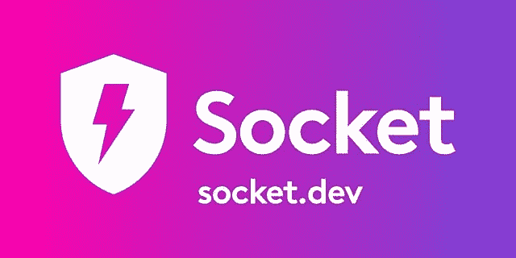

# 2022 年 3 月的 JavaScript 新闻和更新

> 原文：<https://javascript.plainenglish.io/javascript-news-and-updates-of-march-2022-398d87d189ce?source=collection_archive---------4----------------------->

## 熟悉 React 18、JavaScript 的语法变化、一种玩具编程语言，以及来自 JS 世界的其他发展。

如果您想知道 JavaScript 世界最近发生了什么有趣的事情，但没有时间关注新闻头条，DHTMLX 团队将为您提供最新信息。在本文中，您将了解备受期待的 React 18，一种玩具编程语言，微软改变 JavaScript 语法的计划，一种保护 JS 供应链的新工具，以及 Deno 和 Prettier 的微小更新。除此之外，我们还准备了一套有用的文章，可以帮助你拓展 JavaScript 的视野。

我们开始吧！

# 新闻和更新

## React 18 候选版本现已在 npm 上提供

在过去的几个月里，React 框架的重大更新已经成为 web 开发社区中讨论最多的话题之一。现在这个故事已经到了高潮，React 18 现在可以在 npm 上看到了。

这个版本中最显著的创新是并发渲染。这是 React 渲染模型的基本更新。它可以被视为一种新的实现机制，允许 React 同时准备几个版本的 UI。当使用本版本中包含的并发功能(如悬念、服务器端渲染和过渡)时，开发人员将会看到这种机制的真正价值。除此之外，React 18 还提供了更新的自动批处理、新的严格模式行为和一组有用的钩子。

还值得一提的是，React 开发团队继续致力于服务器组件，并希望在次要的 18.x 版本中添加它们。

如果您急于了解这个大版本的更多信息，请查看这篇文章:

 [## React v18.0 - React 博客

### React 18 现已在 npm 上发售！在我们的上一篇帖子中，我们分享了升级您的应用程序以做出反应的分步说明…

reactjs.org](https://reactjs.org/blog/2022/03/29/react-v18.html) 

## Bhai-Lang:用 TypeScript 编写的新玩具编程语言

一个内部笑话启发了一种叫做 Bhai-lang 的新编程语言。“兄弟”这个词在印地语中是兄弟的意思。两位来自印度的专业开发人员创造了这种动态类型语言，让编码变得更有趣。像其他编程语言一样，Bhai-lang 有自己的变量、类型、内置、条件和循环语法。如果您访问这个项目的官方网页，您可以通过使用操场特性来玩代码。此外，它还有一个 GitHub 库，在那里可以找到完整的源代码和其他有用的信息。

BHAI-LANG 官方网页:

 [## bhai lang——一种基于内部笑话的玩具编程语言

### Bhailang 支持 if-else-if 梯形构造，如果条件为 sahi，琼脂 bhai 块将执行，否则…

bhailang.js.org](https://bhailang.js.org/) 

GitHub 资源库:

 [## GitHub - DulLabs/bhai-lang:一种用 Typescript 编写的玩具编程语言

### 这是拜郎的官方仓库。Bhai lang 是一种用 Typescript 编写的玩具编程语言。创建新的…

github.com](https://github.com/DulLabs/bhai-lang) 

## Socket:保护 JavaScript 供应链的新平台

近年来，供应链攻击已经成为开源软件安全最具挑战性的问题之一。那些曾经面临这种攻击后果的人可能会开始怀疑开源解决方案的使用。开源维护者团队决定解决这个问题，并推出了名为 Socket 的平台，以确保 npm 包的安全性。

与许多其他扫描工具不同，Socket 旨在检测和阻止供应链攻击，以免造成任何伤害。它应用深度包检查来主动分析 npm 包的行为，以防止供应链攻击影响您代码中的依赖关系。

下面的文章提供了更多关于使用 Socket 工具的好处的信息，并解释了如何在实践中尝试它。

 [## 介绍插座-插座

### 在过去的七个月里，我们一直处于封闭的测试阶段，但是从今天开始，Socket 对任何人开放安装和试用…

套接字. dev](https://socket.dev/blog/introducing-socket) 

## 微软推广 JavaScript 语法的主要创新

微软已经宣布了对 JavaScript 增加类型语法的官方支持。对 TypeScript 的崇拜者来说，这一特性的采用可能会改变游戏规则。它将为程序员提供一个机会，将类型注释应用于 JS 代码，由 TypeScript 类型检查器进行检查，但完全被 JavaScript 引擎忽略。据微软代表称，新语法将被引擎视为注释，不会影响周围的代码。因此，这种语法更新将大大简化基于类型脚本的程序在浏览器中的执行。

有趣的是，JS 2021 最新调查的受访者认为静态类型是 JavaScript 目前缺少的最理想的特性。很快，这个特性将在 TC39 委员会的会议上作为 ECMAScript 规范的第一阶段提案(目前处于第 0 阶段)进行讨论。即使它获得了进一步考虑的许可，类型注释成为 JavaScript 的一部分可能还需要几年时间。

# Deno 1.20 的新特性

Ryan Dahl 和他的团队继续丰富 Deno 的新功能。最近，这个 JavaScript 运行时环境已经更新到 1.20 版本。该版本中最重要的改进之一是在代码执行期间，V8 JS 引擎和用 Rust 编写的运行时部分之间的通信速度提高了 60%。Deno 现在还允许对响应体使用自动压缩，对 AbortSignal 使用超时，使用几个新的子命令，等等。除此之外，v1.20 附带了最新版本的 TypeScript (v4.6)并支持 V8 10.0。

在 Deno 博客中发布的发行说明(下面的链接)中可以获得关于此更新的更多详细信息。

 [## Deno 1.20 发行说明

### Deno 1.20 提高了性能，自动压缩 http 响应，增加了“Deno 任务”，增加了“deno 工作台”，允许导入…

deno.com](https://deno.com/blog/v1.20) 

# 遇见更漂亮 2.6

当一个 web 项目变得越来越复杂，涉及到更多的参与者时，保持代码的可读性变得非常具有挑战性。这就是像 Prettier 这样的工具派上用场的地方。它是一个流行的代码格式化程序，帮助开发人员确保整个代码库的统一格式。这个有用工具的新版本已经在这个月发布了。此次更新包括备受期待的*singletattributeperline*选项。使用此功能，您可以在 Vue SFC 模板、HTML 和 JSX 中每行仅放置一个属性。奇怪的是，更漂亮的开发团队一直不愿意添加这个特性，说它与团队的选项哲学相矛盾。但是他们不能忽视许多用户对实现这个选项的呼吁。漂亮 2.6 现在也支持 TypeScript 4.6 和通过 Babel 格式化新的 JS 语法建议。

查看下面给出的发布文章，了解关于这个小更新的更多信息。

 [## 更漂亮的 2.6:新的 singleAttributePerLine 选项和新的 JavaScript 特性！较美丽

### 此版本包括一个新的“singleAttributePerLine”选项。这是一个在…中每行只打印一个属性的选项

更漂亮. io](https://prettier.io/blog/2022/03/16/2.6.0.html) 

# 有用的提示和文章

## 探索 DHTMLX 图表编辑器的功能

DHTMLX Diagram 是少数几个允许开发人员使用在线图表编辑器丰富 web 应用程序的 JavaScript 库之一。这一功能使最终用户能够展示他们在创建任何类型和复杂性的好看图表方面的技能，而无需任何代码操作。

DHTMLX 图编辑器提供了 3 种编辑模式:默认、组织结构图和思维导图。每种模式都有一个直观的 UI，它有几个部分，包含用户可能要求的构建、样式化和编辑图的所有内容。还有一种自动布局算法，可以立即将混乱的链接图形状转换为结构良好的图。但是这个 JavaScript 图表工具最令人愉快的地方是它的高度可定制性。强大的 API 允许添加自定义形状和调整编辑器的部分，以便于使用。

想了解更多？下面的文章提供了对 DHTMLX 图表编辑器功能的更深入的了解。

 [## DHTMLX JavaScript 图表编辑器概述

### 五年来，DHTMLX 图一直是我们产品组合的一部分，我们对它的…

dhtmlx.com](https://dhtmlx.com/blog/getting-deeper-insight-dhtmlx-javascript-diagram-editor/) 

## DHTMLX 开发者对 JS 2021 状态的看法

JS 状态调查可能是关于 JavaScript 趋势的最流行的信息源之一。但是总有一个问题，这种调查的实际结果如何与开发团队的实践经验保持一致。为了回答这个问题，我们请 DHTMLX 开发人员分享他们对 JS 2021 状态最有趣方面的想法。查看本文中的结果:

 [## DHTMLX 对 JS 2021 状态的反思

### 每年年底，JS 团队都会邀请来自世界各地的开发人员分享他们对……

dhtmlx.com](https://dhtmlx.com/blog/dhtmlx-state-js-2021/) 

## 何时使用 CSS 和 HTML 代替 JavaScript

很难说你可以用 JavaScript 做很多有趣的事情。但是有时候开发人员会被 JS 冲昏头脑，用它来实现一些功能，这些功能可以通过 CSS 和 HTML 来实现，只需要较少的时间和精力。

下面这篇文章的作者提供了五种基本场景，在这些场景中使用 CSS 和 HTML 比 JavaScript 更合理:

 [## 不需要 Javascript 的 5 件事

### Javascript 可以做很多，但是真的用过头了。HTML 和 CSS 本身惊人的强大，所以让我们…

lexoral.com](https://lexoral.com/blog/you-dont-need-js/) 

## 要在代码中避免的常见 React 反模式

多年来，React 一直是创建用户界面最广泛使用的技术之一。程序员喜欢 React，因为它具有非凡的灵活性、性能和强大的社区支持。但是像任何其他 web 开发工具一样，这个 JavaScript 库也有潜在的缺陷。React 应用程序中经常出现许多反模式，即糟糕的编程实践。

下面的视频回顾了 10 个 React 反模式，并给出了一些关于如何在代码库中避免它们的有用提示:

## 用 JavaScript 创建一个基本的聊天机器人

对于许多在线企业来说，使用聊天机器人来最大限度地加强客户支持已经成为一种常见的做法。该程序旨在与客户互动，并自动解决日常支持任务。聊天机器人的使用通常不仅有助于提高客户体验的质量，还能降低支持成本。因此，从头开始学习如何构建这样一个工具是很有用的。

提供使用 HTML、CSS 和 JavaScript 创建基本聊天机器人的必要步骤的教程可以在这里找到:

 [## 如何用 JavaScript | HTMLGoodies.com 创建一个基本的聊天机器人

### 在这个 web 开发教程中，我们将看到如何使用 HTML、CSS 和普通 JavaScript 创建一个基本的聊天机器人…

www.htmlgoodies.com](https://www.htmlgoodies.com/javascript/basic-chatbot-in-javascript/) 

暂时就这样了。希望你喜欢这篇文章，并增加你的 JavaScript 知识。

*更多内容请看*[***plain English . io***](https://plainenglish.io/)*。报名参加我们的* [***免费周报***](http://newsletter.plainenglish.io/) *。关注我们关于*[***Twitter***](https://twitter.com/inPlainEngHQ)*和*[***LinkedIn***](https://www.linkedin.com/company/inplainenglish/)*。加入我们的* [***社区不和谐***](https://discord.gg/GtDtUAvyhW) *。*