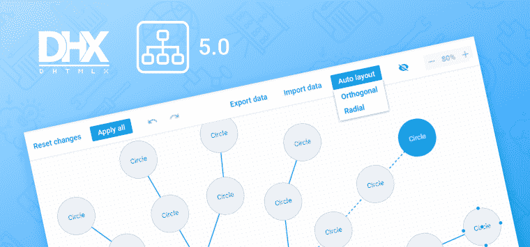
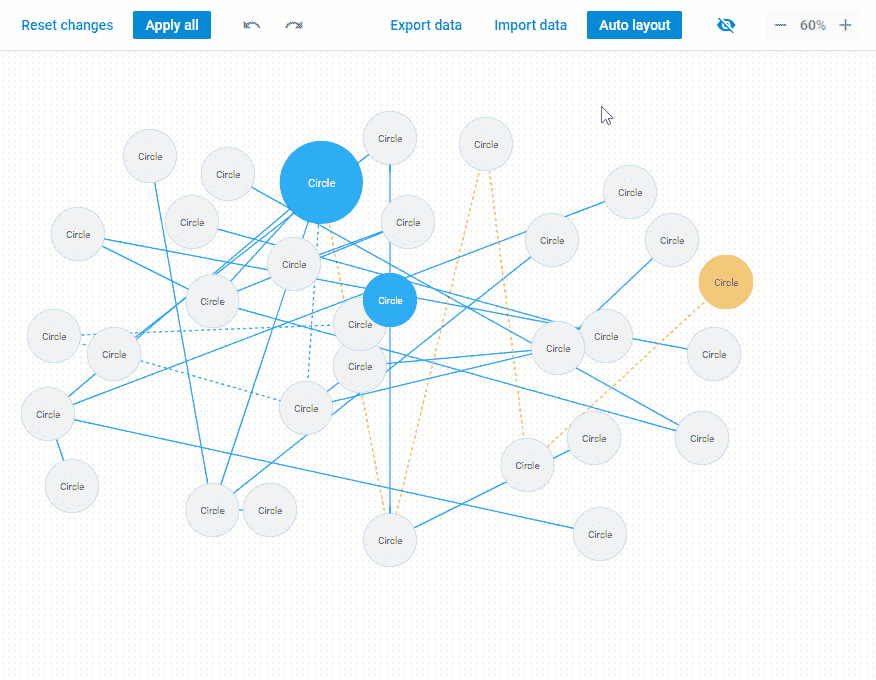
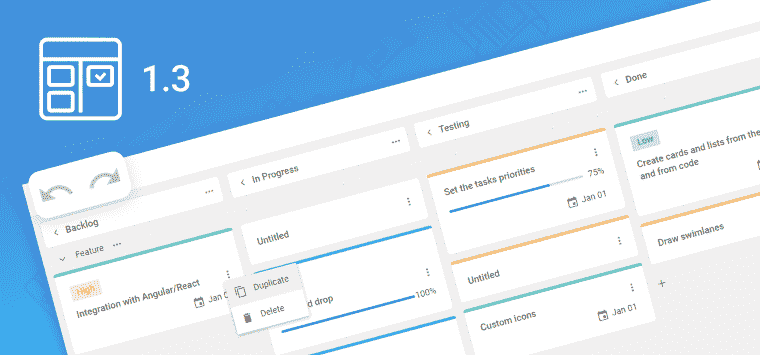

# JavaScript 新闻和更新:2022 年 9 月版

> 原文：<https://javascript.plainenglish.io/javascript-news-and-updates-of-september-2022-e426e1e2361d?source=collection_archive---------9----------------------->

大家好！我们回来与你分享 DHTMLX 生活中的主要事件和一些来自 JavaScript 世界的新鲜新闻。

首先，我们将强调 DHTMLX 图和看板组件的最新更新。然后，您将了解 Vue 的新 Power BI 组件，如何更有效地管理 Preact 中的状态，以及当前的 JS 社区从 Meta 获得了什么。在本文的第二部分，您可以找到专门针对 JavaScript 各个方面的有用资料。

# 新闻和更新

## DHTMLX Diagram v5.0 的新增功能

如果您曾经参与过商业 web 应用程序的开发，您可能会同意数据可视化经常被证明是这个过程中一个必要而又具有挑战性的部分。但是，如果您可以给最终用户一个机会，通过一个特殊的编辑器动态地构建各种图表、图示和图形，那会怎么样呢？DHTMLX 图在这里可以帮到你。我们的 JavaScript 库附带了一个辅助图表编辑器，可以集成到任何 web 应用程序中，并提供一种无代码的方式来可视化数据。该工具在 DHTMLX 图表的最新主要更新中获得了一组新特性。

从 v5.0 开始，图表编辑器将使用户能够使用新的径向自动布局算法以径向顺序自动排列随机连接的形状。还可以使用快捷键组合将相同的样式设置快速应用于一组形状。除了自动布局功能，编辑器现在还支持多种对齐和分布选项，以及用于在网格上手动组织形状的对齐线。如果你想了解更多关于 DHTMLX Diagram v5.0 的细节，请查看[发布文章](https://dhtmlx.com/blog/dhtmlx-diagram-5-0/)。

## DHTMLX 看板 1.3 版简介

9 月，DHTMLX 开发团队还将 JavaScript 看板更新到了 1.3 版本。看板经常在项目管理应用程序中实现，用于在高层次上可视化工作流，由于定期更新，DHTMLX 解决方案成为实现此目的的更合适的工具。在 1.3 版中，您可以找到许多新特性，这些特性对 web 开发人员和最终用户都有好处

这个小更新的主要特点是可以通过撤销/重做操作来管理看板编辑历史。除此之外，您将能够创建一个多用户后端，在卡片中设置日期范围，复制任何任务及其内容，并将看板数据导出到 JSON 文件。此外，还有一些有用的 API 升级。关于最新 DHTMLX 看板版本的完整信息可以在发布文章中找到。

## Vue.js 的新电源 BI 组件

Vue.js 仍然是使用最广泛的 JavaScript 框架之一，它为更顺利地开发各种基于 web 的软件解决方案提供了基础。对于那些选择 Vue.js 构建面向业务的 web 应用程序的开发人员来说，这是一个好消息。本月，微软推出了一个名为[*PowerBIReportEmbed*](https://powerbi.microsoft.com/en-us/blog/power-bi-component-for-vue-js-applications-is-now-available/)的新组件，该组件将有助于将 Power BI 内容嵌入到 Vue 应用中。

Power BI 是微软提供的一个流行的商业智能软件解决方案。借助新组件，开发人员可以轻松引入报告、仪表盘、问答和许多其他有用的东西，从 Power BI 到基于 Vue 的应用程序，以实现更好、更准确的分析。这个组件已经在 [npm](https://www.npmjs.com/package/powerbi-client-vue-js) 和 [GitHub](https://github.com/microsoft/powerbi-client-vue-js/) 上公开发布。你也可以在这个[演示应用](https://github.com/microsoft/powerbi-client-vue-js/tree/main/vue/demo)中了解它的工作原理。除此之外，值得一提的是，微软也为 Angular 和 React 提供了类似的组件。

## Preact 中管理状态的新方法

Preact 通常被称为反应的一种简化但更具性能的替代方法。不久前，Preact 开发团队提出了一个新的有前途的功能，叫做 Signals。这种新颖的目标是快速管理 web 应用程序中的状态，而不考虑它们的复杂性。实际上，状态管理是许多 web 开发人员最头疼的问题之一。使用 Preact 信号，应该可以优化定义应用程序状态的数据发生变化时的处理。根据测试结果，这种方法比常见的更新机制(如 React hooks)有效得多。你可以在这篇[文章](https://preactjs.com/blog/introducing-signals/)中了解更多关于信号的技术方面。

# Meta 向 JavaScript 社区提供 MemLab 工具

内存泄漏是 JavaScript 中的一个常见问题，可能会对 web 应用程序的各种性能相关特征产生负面影响。MemLab 是几年前由 Meta(脸书)设计的 JavaScript 内存测试工具，并成功用于该公司产品的内存优化。一般来说，它通过使用带有现成测试场景的无头浏览器、发现 JS 堆快照并分析它们来检测内存泄漏。本月早些时候，Meta 在 [GitHub](https://github.com/facebookincubator/memlab) 上发布了 MemLab 的源代码，以帮助一个庞大的 JavaScript 社区处理内存泄漏问题。所以任何网络开发者现在都可以开始使用 MemLab，完全免费。

# 有用的提示和文章

## 将 JavaScript 甘特图添加到 Salesforce LWC

随着 JavaScript 编程模型 sales force LWC(Lightning Web Components)的出现，许多 Web 开发人员开始使用它来交付基于云的业务应用。这类应用程序通常包括一些复杂的功能，如甘特图，可以与第三方工具集成，如我们的甘特图组件。这种整合可能是一个耗时的过程，如果你是自己做的话。实际上，我们收到了几个客户的请求，要求我们帮助将 DHTMLX Gantt 嵌入到 LWC 的 Salesforce 中。这就是为什么我们的团队准备了一个循序渐进的[视频教程](https://www.youtube.com/watch?v=1nXl9jfMdto)，教你如何毫不费力地完成这项工作。

## 更深入地了解 Node.js

今天，很难想象不使用 Node.js 开发 web 应用程序。尽管这个运行时环境有许多缺点，但它仍然是构建后端服务的首选。由于 Node.js 在开发领域中扮演着如此重要的角色，因此很好地了解它的基础部分对于在真实场景中充分利用这项技术是非常有用的。在这篇由知名 JavaScript 专家 Axel Rauschmayer 博士撰写的[文章](https://2ality.com/2022/09/nodejs-overview.html)中，您可以找到 Node.js 主要元素及其操作原理的详细概述。

## 探索有用的浏览器 API

毫不奇怪，web 开发人员经常使用流行的 JavaScript 特性，如可选链接、nullish 合并、websockets 等。构建 web 应用程序时。但与此同时，有一些浏览器 API 在开发过程中非常有用。它们是页面可见性 API、Web 共享 API、广播频道 API、国际化 API。但是这些 API 经常不被注意，在论坛和流行的网络资源上很少被报道。幸运的是，这篇文章的作者强调了这些 API 的主要特性，并解释了如何在实践中使用它们。

## 使用 JavaScript 数学函数

如果你计划创建一个 web 应用程序，其逻辑以各种算术计算为前提，Javascript 提供了很多数学计算的可能性。您可以利用内置的 JavaScript Math 对象和一系列有用的函数来执行任何复杂度的计算。那些需要这方面指导的人，看看这篇[文章](https://www.sitepoint.com/javascript-math-functions/)。

*更多内容看* [***说白了就是***](https://plainenglish.io/) *。报名参加我们的* [***免费周报***](http://newsletter.plainenglish.io/) *。关注我们关于* [***推特***](https://twitter.com/inPlainEngHQ) ， [***领英***](https://www.linkedin.com/company/inplainenglish/) ***，***[***YouTube***](https://www.youtube.com/channel/UCtipWUghju290NWcn8jhyAw)***，以及****[***不和***](https://discord.gg/GtDtUAvyhW) *对成长黑客感兴趣？检查出* [***电路***](https://circuit.ooo/) ***。****