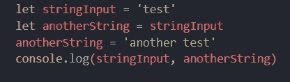
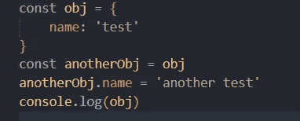
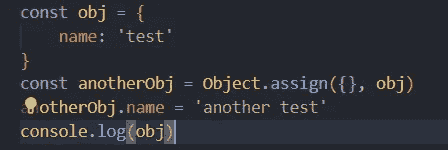
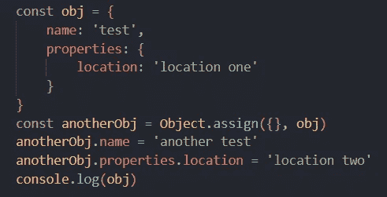
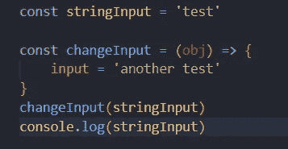
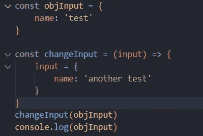
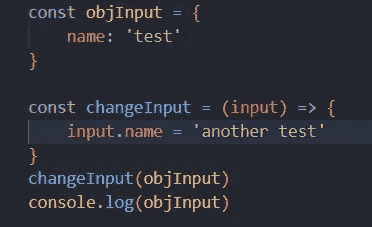

# JavaScript 对象引用及其副本

> 原文：<https://javascript.plainenglish.io/javascript-object-references-and-its-copy-92d3d76ef92?source=collection_archive---------4----------------------->

## 通过引用传递和通过值传递及其在 JavaScript 中的修改


Photo by [Sigmund](https://unsplash.com/@sigmund?utm_source=medium&utm_medium=referral) on [Unsplash](https://unsplash.com?utm_source=medium&utm_medium=referral)

# JavaScript 对象引用及其副本

在处理 JavaScript 时，你将会面临这样的困惑:JavaScript 如何处理它的基本变量和非基本变量，以及它们何时被用作值或引用。使用这些值时，每种方法的工作方式都不同。

今天，我们将讨论 JavaScript 如何定义其引用和对象，以及如何在不同的场合处理它们。

## 类型

让我们从基础开始，有两种类型的 JavaScript 对象，即原语和非原语。原语类型有[字符串、数字、空、布尔、BigInt、符号(新引入的)，以及未定义的](https://developer.mozilla.org/en-US/docs/Glossary/Primitive)。

另一方面，非基元类型是存储中的引用，因为它们没有已定义的存储。非原始类型在存储中会变得很大，这就是 JS 将它最好地用于引用(也称为对象)的原因。每个对象都是从 G [全局对象类](https://developer.mozilla.org/en-US/docs/Web/JavaScript/Reference/Global_Objects/Object)派生出来的。

每个对象都分配了一个[标识符](https://developer.mozilla.org/en-US/docs/Glossary/Identifier)，它保存了它们引用的值，就像常规变量一样，标识符也有它们的作用域和 Unicode。

## 更新基本类型

让我们从基本类型开始，更新它们。我们将首先创建一个字符串变量并将其赋给另一个变量，然后更新新变量并比较输出。



Primitive Type Example

以下程序的输出将是唯一的，并声明每个原始值将保存在另一个内存地址中:

```
Output - test another test
```

## 更新非原始类型

当我们使用非原始类型时，期望是不同的。我们要做和上面一样的事情，但是我们不更新值，而是更新里面的属性。



Non-primitive type example

在这种情况下，输出将更新原始对象，因为它们指向相同的位置:

```
Output - { name: 'another test' }
```

我们可以通过使用`Object.assign`来克隆对象，值将会不同。举个例子，



Using Object.assign

在这种情况下，输出将是不同的，结果将打印原始对象，因为它们指向不同的内存地址:

```
Output - { name: 'test' }
```

## 如果我们有嵌套的非原始属性呢？

我们正在尝试的例子是指向作为基本类型的属性，但是如果任何一个属性是非基本的呢？

让我们看看预期的场景，我们将在我们的对象中创建一个非原始的属性，并尝试更新最新的对象，并将其与现有的对象进行比较:



Using Object.assign with nested objects

程序的输出将是:

```
Output - { name: 'test', properties: { location: 'location two' } }
```

现在，这是一件有趣的事情，`name`属性是原语，因此有不同的位置，但`properties`是非原语，与`obj.properties`共享相同的地址，当更新它时，也更新嵌套的对象。这是因为`Object.assign`只在顶层创建一个属性，不做嵌套克隆。

*对于嵌套克隆，有* `*structuredClone(node v17), recursive methods, JSON.parse(JSON.stringify(obj))and third party library*` *等方法。*

# 将变量传递给函数

当我们处理函数和传递值时，有两种方式传递变量:传值和传引用。首先，让我们了解当一个变量被传递给一个函数时，JavaScript 将如何定义该做什么。

## 按值传递与按引用传递

在 JavaScript 中，它从不明确地比较类型是值还是引用，但是当我们调用一个只有很少参数的方法时，会发生一个简单的机制。JavaScript 将创建输入的副本。

由于我们创建的每个函数都是[函数](https://developer.mozilla.org/en-US/docs/Web/JavaScript/Reference/Global_Objects/Function/prototype)类的衍生物，因此每个函数都有一个名为`arguments`的属性，它是一个数组并被分配给方法。点击阅读更多关于[参数的信息。](https://developer.mozilla.org/en-US/docs/Web/JavaScript/Reference/Functions/arguments)

因为参数是非原始类型。JavaScript 使用`Object.assign(arguments, [...rest])`，其中 rest 是作为数组传递的参数，当函数中的任何变量被更新时，它是一个被更新的 arguments 关键字。

因为我们创建了一个新的参数实例，如果值是原语，它将创建一个新的地址，另一方面，对于非原语，它将指向同一个实例变量。

## 传递原始类型

现在，我们知道函数将创建一个新的变量，所以传递一个原始类型似乎没有任何问题，变量将保持其原始状态。



Example of primitive passed value to a method

以下程序的输出将是未经修改的原始状态:

```
Output - test
```

## 传递非基元类型并更新其引用

当传递非原始类型时，它也创建一个副本，并且该值将被引用。但是当更新引用时，它将指向另一个变量，因为我们传递给它的是一个副本，而不是一个实际的对象。



Example of non-primitive passed value to a method

由于我们更新了引用本身，以下程序的输出仍将保持其原始状态，没有任何修改:

```
Output - { name: 'test' }
```

## 传递非原始类型并更新其属性

按照上面的例子，如果我们更新引用，那么它将指向一个新的内存地址，但是如果我们更新属性，那么它将更新值。



Example of non-primitive passed value to a method and updating properties

以下程序的输出将不会处于其原始状态，name 属性将被赋予一个新值，因为引用不会用相同的标识符进行修改和更新。

```
Output - { name: 'another test' }
```

## 结论

JavaScript 是一种令人惊讶的语言，当在深层使用时，它的所有实现都有其独特之处。最复杂的情况是当我们处理一个嵌套对象时，每个对象都有自己唯一的共享标识符。因此，建议使用您想要的引用，并始终创建一个带有`Object.assign`属性的嵌套对象，以避免冲突。

希望你今天学到好东西，开心编码！

*更多内容尽在* [***说白了. io***](https://plainenglish.io/) *。报名参加我们的* [***免费周报***](http://newsletter.plainenglish.io/) *。关注我们关于* [***推特***](https://twitter.com/inPlainEngHQ) ，[***LinkedIn***](https://www.linkedin.com/company/inplainenglish/)*，*[***YouTube***](https://www.youtube.com/channel/UCtipWUghju290NWcn8jhyAw)*，* [***不和***](https://discord.gg/GtDtUAvyhW) *。*