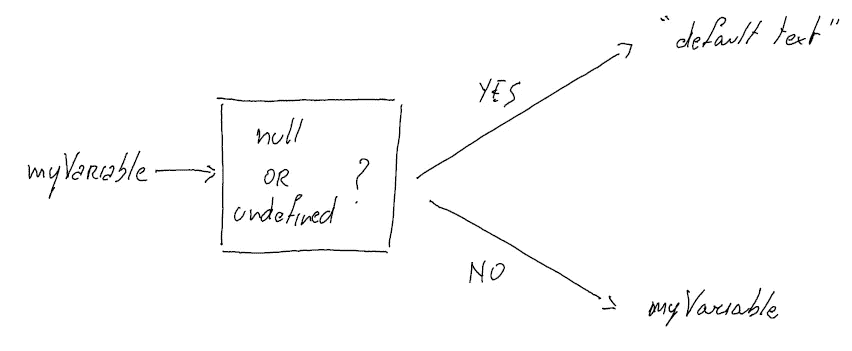

# JavaScript？？(无效合并)运算符:它是如何工作的？

> 原文：<https://javascript.plainenglish.io/javascript-operator-5d3bd92e835e?source=collection_archive---------1----------------------->


Photo by [Pankaj Patel](https://unsplash.com/@pankajpatel?utm_source=medium&utm_medium=referral) on [Unsplash](https://unsplash.com?utm_source=medium&utm_medium=referral)

JavaScript 双问号(？？)运算符称为 nullish 合并运算符，当变量或表达式的计算结果为 null 或未定义时，它会提供默认值。

[MDN](https://developer.mozilla.org/en-US/docs/Web/JavaScript/Reference/Operators/Nullish_coalescing_operator) 定义零化合并运算符(？？)作为"*一种逻辑运算符，当其左侧操作数为空或未定义时返回其右侧操作数，否则返回其左侧操作数。*

这可能看起来很复杂，但它非常简单！

# 理解 JavaScript？？操作员

让我们看看下面的例子。

```
const favoriteFruit = null;const result = favoriteFruit ?? 'You did not tell me';console.log(result); // "You did not tell me"
```

*   我们首先声明变量 *favoriteFruit* ，并将其设为空。
*   然后，让我们这样读下一行:如果 *favoriteFruit* 为 null，那么默认值为“你没有告诉我”。默认值被分配给*结果*变量。
*   最后，我们记录*结果*，我们看到“你没有告诉我”。

因此，如果第一个变量的值(零化合并运算符左边的那个，即？？)为空，则使用默认值，即？？接线员。

让我们再举一个例子，然后我会解释为什么这两个例子。

```
const favoriteFruit_1 = undefined;const result = favoriteFruit_1 ?? 'You did not tell me, again!';console.log(result); // "You did not tell me, again!"
```

按照前面的例子，

*   我们从声明变量 *favoriteFruit_1* 开始，但是这次我们让它*未定义。*
*   然后，让我们这样读下一行:如果 *favoriteFruit_1* 未定义，那么缺省值是‘你又没告诉我！’。默认值被分配给*结果*变量。
*   最后，我们记录*结果*，我们看到“你又没告诉我！”。

所以，如果第一个变量的值(左边的那个？？运算符)未定义，请使用默认值，即？？接线员。

## 为什么用两个例子来解释 JavaScript？？接线员？

因为这就是你所需要的！

你能读懂任何 JavaScript？？运算符如下: ***如果第一个值为空/未定义，则使用默认值*** *。*



This is what a nullish coalescing operator (??) will return

重要的是要记住 null 和 undefined 是唯一两种会提示使用默认值的情况！每当使用 nullish 合并运算符时，像""或 0 这样的空字符串都不会触发默认值。

# 使用 JavaScript 的其他情况？？操作员

如上所述，当您使用 JavaScript 双问号时，null 和 undefined 是唯一两种会提示使用默认值的情况。

让我们看看当我们使用空字符串时会发生什么。

```
const emptyString = ''; const result = emptyString ?? 'You did not tell me, again!';console.log(result); // ""
```

尽管变量 *emptyString* 的值为 falsy，但 nullish 合并操作符以通常的方式工作:*如果第一个值为 null/undefined，则使用默认值。*

第一个值是空的还是未定义的？没有。然后，我们使用值为""的第一个变量！

当我们使用数字 0 时，情况也是如此。

```
const numberZero = 0;const result = numberZero ?? 'You did not tell me, again!';console.log(result); // 0
```

第一个值是空的还是未定义的？没有。然后，我们使用第一个值为 0 的变量！

# 结论

使用 nullish 合并操作符或双问号相当简单。

当你看到 JavaScript 时。？运算符，遵循此逻辑: ***如果第一个值为空/未定义则使用默认值。***

如果这是有用的，你可能会喜欢

*   [三元运算符](https://medium.com/@lorenzozar/javascript-ternary-operator-b76a02c90850)或
*   [JavaScript？。可选链接！](https://medium.com/@lorenzozar/javascript-optional-chaining-7a2bce30c450)

与其在面试中学习，不如在这里学习！

*更多内容看* [***说白了。报名参加我们的***](http://plainenglish.io/) **[***免费周报***](http://newsletter.plainenglish.io/) *。在我们的* [***社区不和谐***](https://discord.gg/GtDtUAvyhW) *获得独家获取写作机会和建议。***