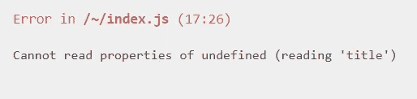
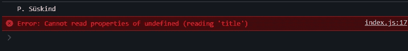
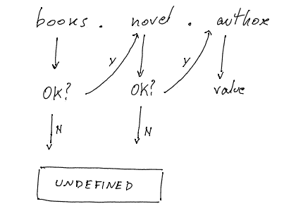

# JavaScript？。可选链接:实用指南

> 原文：<https://javascript.plainenglish.io/javascript-optional-chaining-7a2bce30c450?source=collection_archive---------3----------------------->


Photo by [Pankaj Patel](https://unsplash.com/@pankajpatel?utm_source=medium&utm_medium=referral) on [Unsplash](https://unsplash.com?utm_source=medium&utm_medium=referral)

所以，你知道 JavaScript(？？)[无效合并](https://medium.com/@lorenzozar/javascript-operator-5d3bd92e835e)运算符。

您有足够的特权知道唯一一个接受三个操作数的 JavaScript 操作符，即[条件(三元)操作符](/javascript-ternary-operator-b76a02c90850)。

但是可选的链接(**)呢？。**)操作员？

在继续之前，您应该熟悉 nullish (null 或 undefined)的概念，它不同于 falsy。快速查看一下[无效合并操作符](https://medium.com/@lorenzozar/javascript-operator-5d3bd92e835e)会有所帮助！只是我的两分钱。

# JavaScript 可选链接运算符

遵循 MDN 定义，"*可选的链接操作符(？。)使您能够读取位于连接对象链深处的属性值，而不必检查链中的每个引用是否有效*”。

换句话说，可选的链接运算符(？。)允许我们检查对象内部，即使一些键值可能不在那里。

MDN 报告了以下示例:

```
let nestedProp = obj.first?.second;
```

但是，我们再退一步，理解一下这个东西是从哪里来的。

## JavaScript 链接

我再一次参考 [MDN](https://developer.mozilla.org/en-US/docs/Web/JavaScript/Data_structures) 。*在 JavaScript 中，对象可以看作是属性的集合。[…]属性值可以是任何类型的值，包括其他对象，[…]属性使用键值*来标识。

下面是一个名为 *books* 的 JavaScript 对象:

```
let books = {title: 'Animal Farm'}
```

*books* 对象有一个名为 title 的键和一个与该键相关联的值。值是一个字符串，它是*动物庄园*。

现在，为了访问与*标题*键相关联的值，我们从对象的名称开始，并使用`.`链接操作符链接键的名称:

```
console.log(books.title); // Animal Farm
```

这是基本对象的工作方式。

让我们将我们的对象扩展到以下内容:

```
let books = { title: 'Animal Farm', novel: { title: 'Perfume', author: 'P. Süskind', },};
```

*书籍*对象有两个键:

*   **标题**。该值是一个字符串，它是动物农场。
*   **小说**。值是另一个带有两个键的对象:*标题*和*作者*。

为了访问与 *author* 键相关联的值，我们从对象的名称开始，并使用`.`链接操作符链接键的名称:

```
console.log(books.novel.author); // P. Süskind
```

只要每把钥匙都在，这一切都很好。

## 打破枷锁

如果缺少一个引用，例如，结果是 nullish (null 或 undefined…*我告诉过你…* )，一切都崩溃了。

这里有一个例子:

```
console.log(books.novel.author); // P. Süskind
console.log(books.horror.title);
```

这是一个可怕的场景！不仅仅是因为我们在寻找一个恐怖的*标题，*，还因为这是你的用户将在屏幕上看到的:



This is the horrible scenario you will face when breaking the chain

这还不是全部！让我们看看控制台。



This is the error you will see in your console when breaking the chain

该错误表明 javascript 无法读取未定义内容的*标题*属性，例如*恐怖*键。结果，一切都崩溃了，这不是一个非常酷的用户体验。

## **传统修复**

避免完全崩溃的最简单方法之一是用逻辑 AND (&&)操作符验证每个引用。

```
console.log(books.novel.author); // P. Süskindconsole.log(books.horror && books.horror.title); // undefined
```

第二个 console.log 返回 undefined，因为*恐怖*键不存在。但是，应用程序不会崩溃。

**这是怎么回事？**

在访问 *books.horror.title* 的值之前，确认 *books.horror* 的值未定义。

*这里的窍门是，逻辑 AND 表达式是一个短路运算符。当每个操作数都被转换为布尔值时，如果发现一次转换的结果为假，则 and 运算符停止并返回该假操作数的原始值；它不计算任何剩余的操作数*、 [MDN](https://developer.mozilla.org/en-US/docs/Web/JavaScript/Reference/Operators/Logical_AND#short-circuit_evaluation) 。

所以，由于第一个操作数， *books.horror，*是 *undefined* 即 nullish(我告诉过你……)和 falsy，and 运算符停止并返回 *undefined* 。

这是在后台应用&&操作符来验证每个键和 book 对象本身所发生的事情。



The logical AND expression validates every reference where it is used in the chain

这就是 app 不崩溃的原因！它甚至没有到达*books . terror . title .*

虽然验证每个引用是可行的，但是对象通常比上面的例子更复杂，并且以这种方式检查每个引用是不可伸缩的。

## 镇上新来的男孩？。

最后，我们回到可选链接(**？。**)操作员。

正如我们所说的，复杂的对象可能有很深的嵌套结构。

使用可选的链接运算符(？。)，但是，在尝试访问引用的值之前，您不必使用逻辑 AND (&&)运算符显式测试和短路。

```
console.log(books.novel.author); // P. Süskindconsole.log(books.horror?.title); // undefinedconsole.log(books.novel.title); // Perfume
```

通过使用？。在尝试访问 *books.horror.title.* 之前，操作员 JavaScript 隐式检查 *books.horror* 是否为空或未定义

由于 *books.horror* 为 nullish，表达式自动短路，返回未定义。

我最近得到了 JavaScript 问号的这个东西，所以你可能想检查以下内容:

*   N [ullish 合并](https://medium.com/@lorenzozar/javascript-operator-5d3bd92e835e)运算符
*   [条件(三元)运算符](/javascript-ternary-operator-b76a02c90850)

*更多内容看* [***说白了。报名参加我们的***](http://plainenglish.io/) **[***免费周报***](http://newsletter.plainenglish.io/) *。在我们的* [***社区获得独家访问写作机会和建议***](https://discord.gg/GtDtUAvyhW) *。***