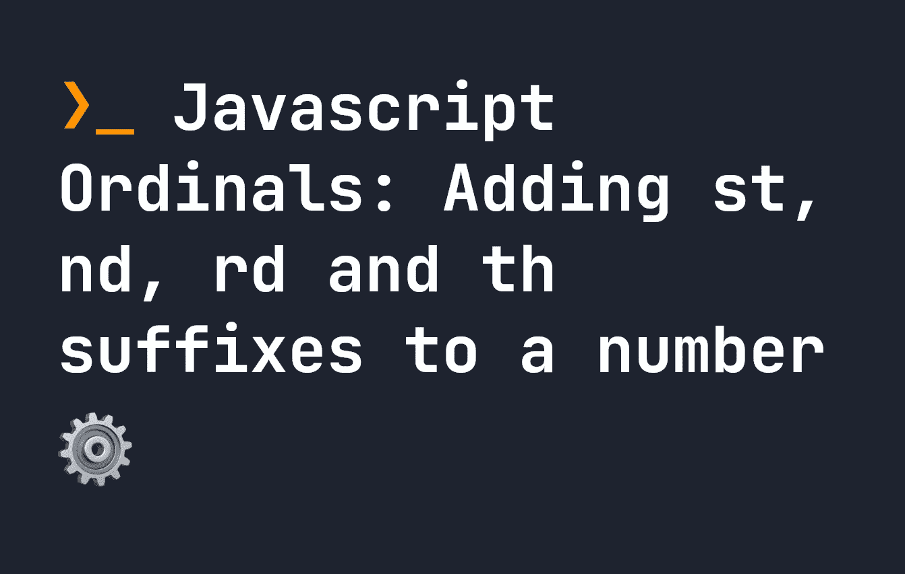

# JavaScript Ordinals:向数字添加 st、nd、rd 和 th 后缀

> 原文：<https://javascript.plainenglish.io/javascript-ordinals-adding-st-nd-rd-and-th-suffixes-to-a-number-dfa87631afd4?source=collection_archive---------13----------------------->

## 当我们给一个数字添加序号后缀时，它会因国家、语言和地区而异。让我们来看一种可靠地实现这一点的方法。



在 Javascript 中，使用绝对数字通常被认为是最佳实践，因为`number`是一个已定义的类型。然而，当在用户界面中表达这些数字时，我们更有可能希望用不同的方式来表达它们。例如，假设我有下面的数字列表。我想仍然将它们存储为数字，但是在向用户显示它们时添加`nd`、`st`、`rd`或`th`:

```
let x = [ 1, 13, 22, 100, 1204, 133 ];
```

当然，我可以手动完成这项工作，并存储特定前缀的每个数字，或者定义自定义规则，但这有点麻烦——如果我需要支持多种语言呢？虽然在英语中我们用`3rd`来表示`3rd`地点，但在其他语言中可能不一样。

幸运的是，Javascript 中有一个解决方案——使用`Intl.PluralRules`。这将基于区域设置定义多个规则:

```
let plurals = Intl.PluralRules();
let x = plurals.select(0) // Returns "other"
let y = plurals.select(1) // Returns "one"
let z = plurals.select(2) // Returns "other"
```

默认情况下，`PluralRules`被配置为`cardinal`，这意味着任何大于 1 的都被认为是复数。上面，你可以看到，`PluralRules`让我们区分一个数是不是复数。

当我们将它设置为`ordinal`时，事情变得更加有趣，这考虑到了我们使用数字的方式。在这里，它将告诉我们如何处理每个数字的语言特定规则——因此我们可以做像`2nd`、`3rd`和`4th`这样的事情

```
const plurals = new Intl.PluralRules('en-US', { type: 'ordinal' });
let a = plurals.select(0); // Returns "other"
let b = plurals.select(1); // Returns "one"
let c = plurals.select(2); // Returns "two"
let d = plurals.select(3); // Returns "few"
let e = plurals.select(4); // Returns "other"
```

现在我们可以根据地区定制输出，这样我们就不会遇到奇怪的问题。这里，我们使用`en-US`，但是任何其他有效的语言环境也可以。要将我们的编号映射到`1st`、`2nd`、`3rd`等，我们只需创建如下映射:

```
let x = [ 1, 13, 22, 100, 1204, 133 ];const plurals = new Intl.PluralRules('en-US', { type: 'ordinal' });let pluralMapping = {
    "one" : "st",
    "two" : "nd",
    "few" : "rd",
    "other" : "th"
}let y = [];
x.forEach((item) => {
    let getPlural = plurals.select(item);
    let pluralEnding = pluralMapping[getPlural]
    y.push(`${item}${pluralEnding}`)
})console.log(y); // ['1st', '13th', '22nd', '100th', '1204th', '133rd']
```

*更多内容请看*[***plain English . io***](https://plainenglish.io/)*。报名参加我们的* [***免费周报***](http://newsletter.plainenglish.io/) *。关注我们关于*[***Twitter***](https://twitter.com/inPlainEngHQ)[***LinkedIn***](https://www.linkedin.com/company/inplainenglish/)*[***YouTube***](https://www.youtube.com/channel/UCtipWUghju290NWcn8jhyAw)*[***不和***](https://discord.gg/GtDtUAvyhW) *。对增长黑客感兴趣？检查* [***电路***](https://circuit.ooo/) *。***