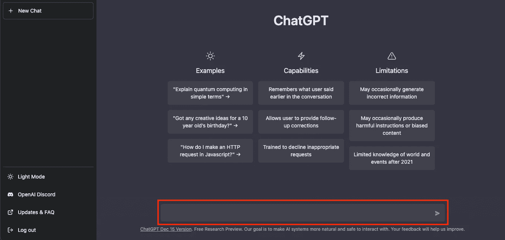

# JavaScript 概述 ChatGPT 访谈

> 原文：<https://javascript.plainenglish.io/javascript-overview-an-interview-with-chatgpt-26034166fd04?source=collection_archive---------4----------------------->

## 由 ChatGPT 组成的 JavaScript 概述


Photo by [Aideal Hwa](https://unsplash.com/@aideal?utm_source=unsplash&utm_medium=referral&utm_content=creditCopyText) on [Unsplash](https://unsplash.com/s/photos/robot-and-human?utm_source=unsplash&utm_medium=referral&utm_content=creditCopyText)

# 介绍

ChatGPT 是 GPT(预训练生成转换器)语言模型的变体，专门为聊天机器人应用程序设计。它在一个大型的会话记录数据集上进行训练，能够在会话上下文中对给定的提示生成类似人类的响应。

在这一点上，ChatGPT 是从 GPT-3.5 进行微调的，它是从我们大约两个月前编写的 GPT-3 改进而来的。GPT 是一种自回归语言模型，它使用转换器架构来生成文本。它在大型文本数据集上进行了预训练，然后可以针对特定任务进行微调，如语言翻译、摘要和文本生成。

正如在[之前的文章](https://medium.com/better-programming/exploring-gpt-3-in-next-js-4a2744011827)中所描述的，任何人都可以建立一个 OpenAI 账户并试用 ChatGPT。

这里是 ChatGPT 的界面，我们可以在红框里提交一个问题。



Image by author

与 ChatGPT 交谈，我们进行了一次关于 JavaScript 的虚拟采访。该过程有三个目的:

*   从 ChatGPT 学习 JavaScript。
*   评估 ChatGPT 的成熟度。
*   轻松撰写一篇关于 JavaScript 的文章。

面试由以下 12 个问题和回答组成。

# 1.JavaScript 是什么？

JavaScript 是一种常用于 web 开发的编程语言。它是一种高级的解释性语言，其特点是动态、弱类型化。JavaScript 是现代 web 开发的重要组成部分，因为它允许开发人员创建交互式的、引人入胜的网站和应用程序。

JavaScript 用于向网页添加动态行为，例如响应用户输入、更新网页内容以及与服务器通信。所有现代 web 浏览器都支持它，并且可以与 HTML 和 CSS 结合使用来构建复杂的交互式 web 应用程序。

除了用于 web 开发之外，JavaScript 还用于移动应用程序、桌面应用程序和游戏的开发。它是一种用途广泛的通用语言，是任何开发人员学习的重要工具。

> 这是一个极好的概述(得分 100%)。

# 2.JavaScript 中有哪些重要的概念？

JavaScript 中有许多重要的概念，理解这些概念对任何开发人员都很重要。一些最重要的概念包括:

*   变量:变量用于在 JavaScript 中存储和操作数据。它们可以保存不同类型的数据，如数字、字符串和对象，并且可以使用“var”关键字或“let”和“const”关键字进行声明。
*   数据类型:JavaScript 有几种内置的数据类型，包括数字、字符串、布尔值和对象。为了有效地使用 JavaScript，理解不同的数据类型以及如何使用它们是很重要的。
*   函数:函数是可以通过名字定义和调用的代码块。它们可以接受参数和返回值，是语言模块化和可重用性的重要组成部分。
*   对象:对象是代表现实世界实体的属性和方法的集合。它们是 JavaScript 的重要组成部分，用于建模和操作语言中的数据。
*   数组:数组是值的有序集合，可以使用索引来访问。它们是 JavaScript 的重要组成部分，用于存储和操作数据列表。
*   控制结构:控制结构如循环和条件用来控制程序的流程。它们允许开发人员编写代码，这些代码可以根据特定条件做出决策并重复操作。
*   类:类是 JavaScript 中定义对象的一种方式，是该语言面向对象编程能力的重要组成部分。

这些只是 JavaScript 中一些重要概念的例子。为了有效地使用这种语言，还有许多其他概念需要理解，比如事件处理、异步编程和正则表达式。

> 总体不错，但是“var”关键词已经过时了(得分 80%)。

# 3.JavaScript 中应该用 var 声明变量吗？

在 JavaScript 中，“var”关键字用于声明变量。但是，通常建议在声明变量时使用“let”和“const”关键字，而不是“var”。

“let”关键字与“var”相似，它声明一个具有局部范围的变量。然而，与“var”不同，“let”关键字不允许在同一代码块中重新声明变量。这有助于防止意外错误并提高代码的可读性。

“const”关键字用于声明常量变量，该变量在声明后不能被重新赋值。当您希望确保某个值在整个程序中不发生变化时，这很有用。

一般来说，尽可能使用“let”或“const”而不是“var”是一个好主意，因为它们提供了更多的控制，有助于防止常见的编码错误。但是，在某些情况下，可能仍然会使用“var ”,例如当使用旧代码时，或者当不支持某些语言功能时。

> 第二个关于“var”的回答不错(得分 100%)。

# 4.JavaScript 有哪些版本？

自 1995 年首次推出以来，JavaScript 已经经历了几个版本和更新。JavaScript 的版本被称为 ECMAScript (ES)版本，因为 JavaScript 被欧洲计算机制造商协会(ECMA)标准化为 ECMAScript。

以下是 JavaScript 的主要版本列表，以及它们的发布日期:

*   ECMAScript 1 (ES1):发布于 1997 年
*   ECMAScript 2 (ES2):发布于 1998 年
*   ECMAScript 3 (ES3):发布于 1999 年
*   ECMAScript 4 (ES4):计划于 2007 年发布，但由于负责其开发的委员会内部的分歧而被放弃
*   ECMAScript 5 (ES5):发布于 2009 年
*   ECMAScript 5.1 (ES5.1):发布于 2011 年
*   ECMAScript 6 (ES6，也称为 ECMAScript 2015):于 2015 年发布
*   ECMAScript 7 (ES7，也称为 ECMAScript 2016):2016 年发布
*   ECMAScript 8 (ES8，也称为 ECMAScript 2017):2017 年发布
*   ECMAScript 9 (ES9，也称为 ECMAScript 2018):2018 年发布
*   ECMAScript 10 (ES10，也称为 ECMAScript 2019):2019 年发布
*   ECMAScript 11 (ES11，也称为 ECMAScript 2020):于 2020 年发布
*   ECMAScript 12 (ES12，也称为 ECMAScript 2021):于 2021 年发布

> 显然不包括最新版本 ECMAScript 13(得分 80%)。

# 5.告诉我 ECMAScript 13 的情况

ECMAScript 13 (ES13，也称为 ECMAScript 2022)是 JavaScript 所基于的标准 ECMAScript 的最新版本。它于 2021 年 6 月发布，包括许多新功能和语法变化。

ES13 中引入的一些主要功能包括:

*   数字分隔符:一种新的语法，通过用下划线分隔数字组，使大数字更容易阅读。
*   String.prototype.replaceAll():用给定字符串中的替换字符串替换所有搜索字符串的新方法。
*   零化合并算子(？？):一个新的运算符，允许您在表达式为空或未定义时为其提供默认值。
*   BigInt:一种新的数字基元类型，可以表示任意大的整数。
*   可选的链接运算符(？。):一个新的运算符，允许您安全地访问对象的属性，而不必检查对象是否为空或未定义。

ES13 还包括许多其他小功能和语法变化，以及一些性能改进。

> 这是一个相当不错的描述(得分 100%)。

# 6.告诉我 ECMAScript 14 的情况

ECMAScript 14 (ES14，也称为 ECMAScript 2023)是 ECMAScript 的下一个版本，是 JavaScript 所基于的标准。它目前处于早期开发阶段，计划于 2023 年 6 月发布。

> 这是一个准确的说法(得分 100%)。

# 7.2022 年流行的 JavaScript 库有哪些？

我很难准确预测哪些 JavaScript 库将在 2022 年流行，因为技术趋势变化很快。然而，目前流行的并且将来可能继续流行的一些库包括:

*   React: React 是一个用于构建用户界面的流行 JavaScript 库，由脸书开发和维护。它拥有一个庞大而活跃的开发人员社区，许多公司和组织使用它来构建 web 和移动应用程序。
*   Angular: Angular 是一个全面的 JavaScript 框架，用于构建由 Google 开发和维护的单页面应用程序。它被公司和组织广泛用于构建 web 应用程序，并拥有一个庞大而活跃的开发人员社区。
*   Vue.js: Vue.js 是一个渐进式的 JavaScript 框架，用于构建轻量级且易于学习的用户界面。它非常适合构建中小型应用程序，并且拥有一个不断增长的开发人员社区。
*   Bootstrap: Bootstrap 是一个流行的前端框架，用于开发响应迅速、移动优先的网站。它提供了一组预定义的样式和组件，可以轻松定制并用于快速构建响应性网站。
*   D3.js: D3.js 是一个 JavaScript 库，用于使用 web 标准操作和可视化数据。它被广泛用于为 web 创建交互式数据可视化。

值得注意的是，JavaScript 库的受欢迎程度可以根据项目的特定需求和目标而有所不同，不同的库在不同的上下文中可能或多或少受欢迎。

> 这是一个相当不错的答案(得分 100%)。

# 8.JavaScript 中的新兴库有哪些？

总是有新的 JavaScript 库和框架被开发和发布，跟踪所有新出现的选项可能是一个挑战。最近广受欢迎并且值得关注的一些库包括:

*   Alpine.js:一个库，允许开发人员使用轻量级 JavaScript 语法向他们的网页添加交互行为。Alpine.js 旨在易于学习和使用，它可以用于构建各种各样的交互功能。
*   Deno: Deno 是 JavaScript 和 TypeScript 的运行时，构建在 V8 之上，V8 是 Google Chrome 中使用的 JavaScript 引擎。它的目标是成为 Node.js 的一个安全而现代的替代品，近年来已经获得了开发人员的大量关注。
*   Fastify: Fastify 是一个用于构建 web 服务器和应用程序的高性能 JavaScript 框架。它被设计成快速、轻量级、易于使用，并且拥有一个不断增长的开发人员社区。
*   GraphQL: GraphQL 是一种 API 查询语言，允许开发人员以灵活高效的方式从服务器请求特定数据。作为基于 REST 的 API 的替代品，它变得越来越流行，并得到越来越多的库和框架的支持。
*   Hyperapp:用于构建 web 应用程序的极简 JavaScript 库。Hyperapp 被设计成轻量级和易于使用的，它专注于为构建应用程序提供一套简单的工具。
*   Next.js: Next.js 是一个用于构建服务器呈现的 React 应用程序的框架。它旨在易于使用和设置，并提供一系列功能来帮助开发人员构建高效和可伸缩的应用程序。
*   Nuxt.js: Nuxt.js 是一个用于构建服务器渲染的 Vue.js 应用程序的框架。它旨在易于使用和设置，并提供一系列功能来帮助开发人员构建高效和可伸缩的应用程序。
*   Quasar:一个使用 Vue.js 构建跨平台应用程序的框架。Quasar 提供了一系列工具和特性，用于构建可以在 web、移动设备和桌面平台上运行的应用程序。
*   Stimulus: Stimulus 是一个轻量级的 JavaScript 框架，用于为 web 应用程序添加交互性。它旨在易于使用并与现有项目集成，并提供了一种简单的方法来将交互式行为添加到网页中。
*   Svelte: Svelte 是一个新的 JavaScript 编译器，允许开发人员使用声明性语法构建 web 应用程序。它被设计成快速、轻量级、易于使用，并且拥有一个不断增长的开发人员社区。

这些只是值得关注的新兴 JavaScript 库和框架的几个例子。与任何技术一样，在决定使用哪些工具和库之前，仔细评估项目的特定需求和目标是很重要的。

> 这是一个包含 3 个重新生成的回答(得分 80%)的列表。重新生成的响应是您向 ChatGPT 请求的同一个问题的新答案。

# 9.我们应该如何测试 JavaScript 代码？

有许多方法可以测试 JavaScript 代码，最佳方法取决于项目的特定需求和目标。测试 JavaScript 代码的一些常用方法包括:

*   单元测试:单元测试包括编写小的、孤立的测试，这些测试验证单个代码单元的行为，比如函数或类。这有助于确保代码正确可靠。
*   集成测试:集成测试包括测试不同的代码单元如何作为一个系统一起工作。这有助于确保代码是正确和可靠的，也有助于识别当代码与其他代码结合使用时可能出现的任何问题。
*   端到端测试:端到端测试包括从用户的角度测试整个应用程序，模拟真实场景并验证应用程序的行为是否符合预期。这有助于确保应用程序是正确和可靠的，也有助于识别在真实环境中使用代码时可能出现的任何问题。

有很多工具和框架可以用来测试 JavaScript 代码，比如 Jest、Mocha 和 Chai。为您的特定项目和测试需求选择正确的工具和方法是非常重要的。

> 这是一个相当好的答案(得分 100%)。

# 10.我们应该如何进行 JavaScript 的生产构建？

要创建 JavaScript 应用程序的生产版本，您需要执行以下步骤:

*   缩小代码:缩小代码包括删除不必要的字符，如空白和注释，缩短变量和函数的名称，以减少代码的大小，提高效率。这可以使用诸如 UglifyJS 或闭包编译器之类的工具来完成。
*   优化资产:优化图像、字体和其他资源等资产有助于减小应用程序的大小并提高其性能。这可以使用 ImageOptim 或 svgo 等工具来完成。
*   捆绑代码:捆绑代码包括将应用程序的所有代码和资产组合到一个文件或一组文件中，这些文件可以很容易地部署并提供给用户。这可以使用网络包或包裹等工具来完成。
*   配置生产环境:为了部署应用程序的生产构建，您将需要配置生产环境。这可能需要根据需要设置服务器、数据库和其他基础架构。
*   值得注意的是，创建 JavaScript 应用程序的生产构建所涉及的具体步骤可能会因项目的具体需求和目标而有所不同。仔细规划和测试生产构建以确保其正确和可靠是很重要的。

> 这是一个相当好的答案(得分 100%)。

# 11.JavaScript 的前景如何？

JavaScript 是一种流行且广泛使用的编程语言，是任何 web 开发人员必不可少的工具。它有望在未来继续成为网络开发领域的一项关键技术。

JavaScript 的主要趋势之一是越来越多地使用 JavaScript 框架和库，它们提供了预构建的、可重用的组件和工具，可用于快速高效地构建复杂的应用程序。一些流行的 JavaScript 框架包括 reactor、Angular 和 Vue.js。

JavaScript 的另一个趋势是越来越多的人采用 TypeScript，这是 JavaScript 的超集，为该语言增加了静态类型和其他特性。TypeScript 旨在使编写大型、复杂的应用程序变得更容易，并且在开发人员中变得越来越流行。

此外，通过使用运行时环境(如 Node.js ),在服务器端使用 JavaScript 的趋势越来越明显。这使得开发人员能够使用 JavaScript 构建全堆栈应用程序，并导致了许多服务器端 JavaScript 框架(如 Express 和 Nest.js)的开发。

总的来说，JavaScript 的前景非常乐观，预计在未来许多年里，它将继续是 web 开发领域的一项关键技术。

> 这是一个很好的预测(得分 100%)。

# 12.你能推荐一些 JavaScript 的学习资源吗？

是的，有很多学习 JavaScript 的资源。要考虑的一些方案包括:

*   在线教程和课程:有许多在线教程和课程可以帮助您学习 JavaScript。一些流行的选项包括 Codecademy、Udemy 和 Coursera。
*   书籍:有很多书籍涵盖了 JavaScript 的不同方面，从初学者到高级主题。一些受欢迎的选项包括 Marijn Haverbeke 的“雄辩的 JavaScript”和 David Flanagan 的“JavaScript:权威指南”。
*   网站和博客:有许多网站和博客提供学习 JavaScript 的教程、技巧和其他资源。一些流行的选项包括 MDN Web Docs、W3Schools 和 JavaScript.com。
*   YouTube 频道:有许多 YouTube 频道提供视频教程和其他学习 JavaScript 的资源。一些受欢迎的选项包括 Traversy 媒体和网络忍者。

值得注意的是，学习 JavaScript 的最佳资源将取决于您特定的学习风格和需求。为了全面理解这门语言，结合多种资源通常是有帮助的。

> 是很好的推荐(评分 100%)。

# 结论

我们对 ChatGPT 进行了虚拟采访。通过 12 个问题和答案，我们了解了很多关于 JavaScript 的知识。作为人类评分员，我们给 ChatGPT 打 95%的分。

我们可以编辑内容，使其成为正式的 JavaScript 概述。相反，我们保留了问答格式，以显示 ChatGPT 的强大功能。

你对 ChatGPT 有什么看法？是技术革命吗？

你从这篇文章中学到 JavaScript 了吗？

感谢阅读。

```
Want to Connect?

If you are interested, check out [my directory of web development articles](https://jenniferfubook.medium.com/jennifer-fus-web-development-publications-1a887e4454af).
```

*更多内容请看*[***plain English . io***](https://plainenglish.io/)*。报名参加我们的* [***免费周报***](http://newsletter.plainenglish.io/) *。关注我们关于*[***Twitter***](https://twitter.com/inPlainEngHQ)[***LinkedIn***](https://www.linkedin.com/company/inplainenglish/)*[***YouTube***](https://www.youtube.com/channel/UCtipWUghju290NWcn8jhyAw)*[***不和***](https://discord.gg/GtDtUAvyhW) ***。*****

*****对缩放您的软件启动感兴趣*** *？检查* [***电路***](https://circuit.ooo?utm=publication-post-cta) *。***