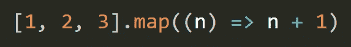
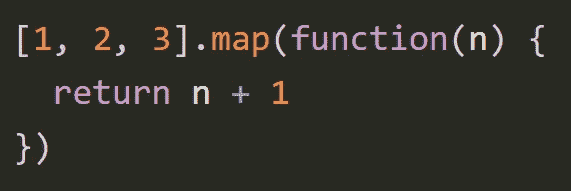

# 用于面试的 JavaScript 聚合填充

> 原文：<https://javascript.plainenglish.io/javascript-polyfills-for-interviews-f48c947a326?source=collection_archive---------8----------------------->

Photo by [Kalen Emsley](https://unsplash.com/@kalenemsley?utm_source=medium&utm_medium=referral) on [Unsplash](https://unsplash.com?utm_source=medium&utm_medium=referral)

JavaScript 是一种不断发展的语言。JavaScript 每年都会增加新的特性。当谈到我们的浏览器时，它们没有必要总是支持最新的功能。那么如何让我们的现代代码在还不了解最新特性的老引擎上工作呢？

有两个工具可以做到这一点。运输工人。
2。多填充物。

## 1.运输工人

翻译程序是一种特殊的软件，它将一个源代码翻译成另一个源代码。它可以解析(“阅读和理解”)现代代码，并使用旧的语法结构重写代码，这样它也可以在过时的引擎中工作。Babel 是一个 transpiler，让我们看看它是如何工作的。

IE11 和 Opera Mini 不支持箭头功能。

Babel 是一个编译器:它把用一种标准编写的代码转换成用另一种标准编写的代码。这里巴别塔会把它转换成这样。

## 2.多填充物

多填充是旧浏览器不支持的功能或特性，如果我们不为此编写一些替换功能，代码将会抛出运行时错误。因此，为了解决这个问题，我们编写了一些替换代码，以便一切工作正常。在当今的面试中，大多数公司都要求我们为常见的 JavaScript 功能编写多种填充。

这里我将列出最重要的几个。那些被问得更频繁的。

## *Polyfill for Array.flat()*

## Array.filter()的聚合填充

## Array.reduce()的 Polyfill

## Array.map()的 Polyfill

## Array.forEach()的 Polyfill

## Polyfill for Promise.all()

## Function.bind()的聚合填充

所以，当我想到面试中被问到的最重要的问题时，这些是我脑海中浮现的重要问题。

*如果你明白我在这里说的任何事情，请鼓掌回应并跟随我，因为它帮助我保持动力并从我的日程中抽出时间来写这些文章。这不会花你任何钱，但会帮我很多忙*

Gaurav Sharma 是一个狂热的读者和热情的旅行者。他试图通过传播他的知识和他的生活经历来过一个更有意义和目标的生活！跟随他踏上平衡数字生活和现实生活的新旅程。他住在印度的北阿坎德邦。他在 Instagram 上的[*@高尔夫。_.塞拉*](https://www.instagram.com/golf._.sierra/) *。*

*更多内容请看*[***plain English . io***](https://plainenglish.io/)*。报名参加我们的* [***免费周报***](http://newsletter.plainenglish.io/) *。关注我们关于*[***Twitter***](https://twitter.com/inPlainEngHQ)[***LinkedIn***](https://www.linkedin.com/company/inplainenglish/)*[***YouTube***](https://www.youtube.com/channel/UCtipWUghju290NWcn8jhyAw)*[***不和***](https://discord.gg/GtDtUAvyhW) *。对增长黑客感兴趣？检查* [***电路***](https://circuit.ooo/) *。***