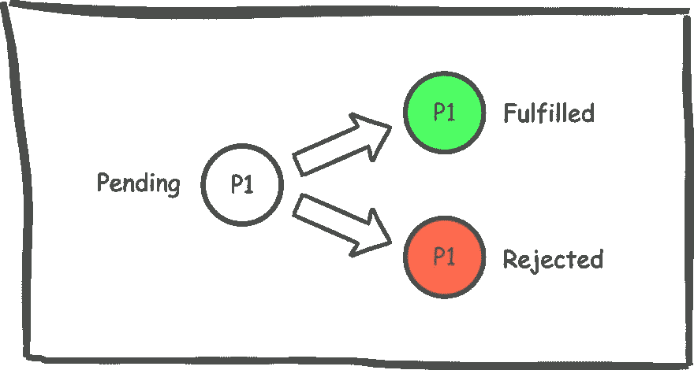

# JavaScript: Polyfills for Promise

> 原文：<https://javascript.plainenglish.io/javascript-polyfills-for-promise-877e5f1e6c0a?source=collection_archive---------0----------------------->

## 学习所有你需要知道的关于承诺的知识，以应对下一次 JavaScript 面试。

**Promise** 是我们在任何生产级应用中日常使用的一个概念。而且大部分浏览器都支持使用承诺。然而，在面试中，候选人经常被如何重写承诺功能的问题所困扰。

在这里，让我们来学习你需要知道的关于承诺的所有知识，以应对你的下一次 JavaScript 面试。


We all make Promises. From Pixabay.

# 承诺，什么是真正的交易？

承诺只不过是一个代理，它代表一个将在接下来的几分钟或几小时内变得可用的值(如果你的后端 API 特别慢的话😜).

承诺一般用来把自己从**回调地狱**中解救出来👹".如果你正在与**异步代码**斗争，那么**承诺**是处理这个问题的最好方法之一。

通过从**异步**代码同步返回一个对象**，Promise 解决了上述问题。在承诺返回一个对象之前，它将处于三种状态。**

1.  **履行**，如果承诺得到解决。
2.  **拒绝**，如果承诺被拒绝。
3.  **Pending** ，该状态直到它达到履行或拒绝。



当承诺处于待定状态时，您将处于黑盒中。在创建承诺的功能获得“已解决/已拒绝”状态之前，您不会知道结果。从程序上讲，您的承诺可以是以下内容之一:

```
const p1 = new Promise((resolve, reject) => {  resolve("Success");});**or**const p1 = new Promise((resolve, reject) => {  reject("Error");});
```

在执行过程中，必须有一个**enable**组件，它有助于处理承诺一旦实现后的响应。并且，需要有一个**捕捉**块来处理拒绝。

```
p1.then((response)=>console.log(response)).catch((err)=>{console.log(err)});
```

好了，这就是承诺的核心有多简单。

在现实世界的场景中，你不会只做一个承诺。相反，在达到最终状态之前，你将不得不面对十几个承诺。这就是像 **Promise.all** 和 **Promise.allSettled** 这样的概念变得有用的时候。

让我们理解这些概念中的每一个，并编写我们自己的聚合填充，以**确认**😇我们对这些理论的理解程度。

# 承诺。所有

Promise.all 将**返回单个承诺**当**所有承诺都成功履行，**或**其中一个承诺被拒绝。**

根据上述定义，我们对某些要素相当确定:

**无极**是一个函数

```
Promises.all = function(){}
```

必须将一组承诺传递给 **Promise.all**

```
Promises.all = function(arrayOfPromises){}
```

该函数必须返回一个**单个承诺**

```
Promises.all = function(arrayOfPromises){return new Promise((resolve, reject) => {})}
```

现在你知道了 **promise.all.** 的骨架，接下来，你需要执行每一个承诺，并且要么解决要么拒绝输出。

```
Promise.**letsBuildAnAll** = function (promises) {
  var count = promises.length
  var result = new Array(count).fill(false)
  return new Promise((resolve, reject) => {
     var checkIfDone = () => {
      if (--count === 0) resolve(result)
     }
    promises.forEach((promise, index) => {
     promise.then( (x) => {
       result[index] = x
      }, reject).then(checkIfDone)
    })
 })
}For Example:
var a = new Promise((resolve) => setTimeout(()=>{resolve(3)},200));
var b= new Promise((resolve,reject)=>reject(9));
var c= new Promise((resolve) => resolve(5));
var d= Promise.**letsBuildAnAll**([a,b,c]);
c.then(res=>console.log(res))The output is: **Promise<rejected>:9**
```

# 承诺。都解决了

**Promise.allSettled** 会在**所有承诺成功执行后**返回单个承诺**。这不取决于承诺是被解决还是被拒绝。**

现在，让我们再一次解码这个定义。

1.  **Promise.allSettled** 是一个函数。
2.  一组承诺作为参数传递给函数。
3.  该函数返回一个承诺。
4.  每一个承诺，作为一个论点，被执行。执行的结果存储在一个数组中。这个数组最终被解析并作为一个成功的承诺返回。
5.  对于每一个承诺，执行状态将被保存，如已完成或已拒绝。

```
Promise.**letsBuildAnAllSettled** = function (arrayOfPromises = []) {
  return new **Promise**(function promiseIterator(resolve, reject) {
    let result = [];
    arrayOfPromises.forEach((item) => {
      item
        .then((value) => {
          result.push({ status: "fulfilled", value: value });
          if (arrayOfPromises.length === result.length) resolve(result);
        })
        .catch((err) => {
          result.push({ status: "rejected", reason: `${err}` });
          if (arrayOfPromises.length === result.length) resolve(result);
        });
    });
  });
};For Example:
var a = new Promise((resolve) => setTimeout(()=>{resolve(3)},200));
var b = new Promise((resolve,reject)=>reject(9));
var c= new Promise((resolve) => resolve(5));

var d= Promise.**letsBuildAnAllSettled**([a,b,c]);
d.then(result=>console.log(result))The output is: **5**
```

# 承诺。任何

**承诺. any** 等待**任何一个承诺成功解析**。**如果所有的承诺都被拒绝，它会拒绝承诺，或者成功发送一个错误。**

任何承诺的定义都很简单。

1.  any 是一个函数，它接受一组承诺
2.  该函数返回一个承诺。
3.  当其中一个承诺被解决时，执行停止并返回一个结果承诺。
4.  当所有承诺都被拒绝时，将返回一个包含所有错误的数组。

```
Promise.**letsBuildAnAny** = function(arrayOfPromises){
let errors = [];
**return new Promise**((**resolve, reject**) => {
arrayOfPromises.forEach((promise, index)=>{
**Promise.resolve**(promise)
.then(**resolve**)
.catch((error)=>{
errors.push(error);
if(errors.length == arrayOfPromises.length)
**reject**(errors);
})
})
})
}For Example:
var a = new Promise((resolve) => setTimeout(()=>{resolve(3)},200));
var b = new Promise((resolve,reject)=>reject(9));
var c= new Promise((resolve) => resolve(5));

var d= Promise.**letsBuildAnAny**([a,b,c]);
d.then(result=>console.log(result))The output is: **5**
```

# 承诺.比赛

Promise.race 与 Promise.any 有很大不同 **Promise.race 是关于理解哪个承诺先完成的。在这里，我们寻找成功或被拒绝的承诺。这意味着，第一个被拒绝或成功完成的**承诺将作为结果**返回。这意味着:**

1.  竞赛是一个函数，它接受一系列的承诺。
2.  该函数返回一个承诺。
3.  当其中一个函数成功解析或被拒绝时，该函数终止。

```
Promise.**letsBuildARace** = function(arrayOfPromises){
return new Promise((resolve, reject) => {
arrayOfPromises.forEach((promise) => {
Promise.resolve(promise).then(resolve, reject);
})
})
}For Example:
var a = new Promise((resolve) => setTimeout(()=>{resolve(3)},200));
var b = new Promise((resolve,reject)=>reject(9));
var c= new Promise((resolve) => resolve(5));

var d= Promise.**letsBuildARace**([a,b,c]);
d.then(result=>console.log(result))The output is: **Promise<rejected>:9**
```

> 记住，**无极.竞**不同于**无极**。Promise.all 按顺序执行每个承诺，并等待其中一个承诺被拒绝，或者所有承诺都被解决。另一方面，一旦其中一个承诺被拒绝或解决，Promise.race 就会终止。

# 结论

我们都做出承诺，这些是简单的填充，帮助你理解在 Javascript 中使用承诺可以实现什么。当你开始使用承诺的时候，你会使用其中之一: **all，race，any 或 allsettled。每一种都不同，可以用来满足您的业务需求。**

> 如果你喜欢我的话，请跟随并继续学习。

*更多内容看* [*说白了. io*](http://plainenglish.io/) *。报名参加我们的* [*免费每周简讯*](http://newsletter.plainenglish.io/) *。在我们的* [*社区*](https://discord.gg/GtDtUAvyhW) *获得独家写作机会和建议。*