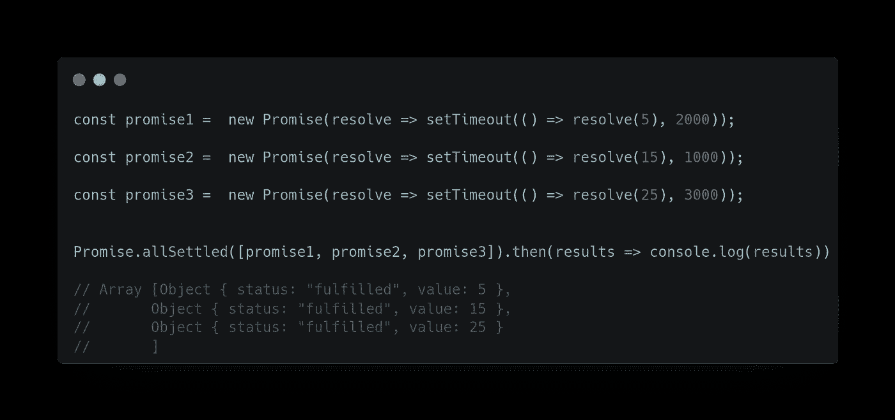
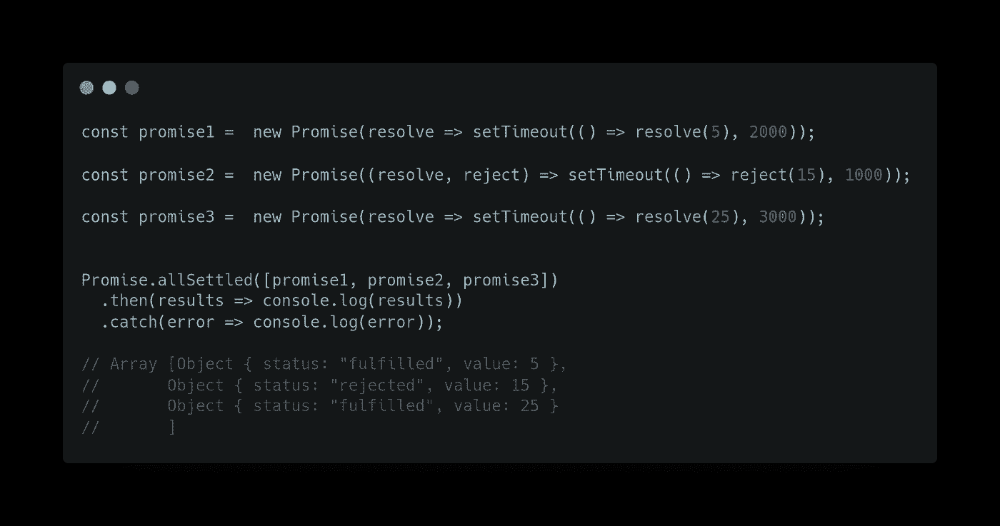
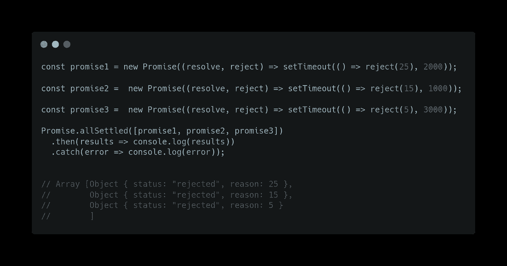

# JavaScript Promises:了解 Promise.allSettled()

> 原文：<https://javascript.plainenglish.io/javascript-promises-understanding-promise-allsettled-8d9635540697?source=collection_archive---------2----------------------->

## 如何使用`Promise.allSettled()`方法执行多个异步调用？


Photo by [Artem Sapegin](https://unsplash.com/@sapegin?utm_source=medium&utm_medium=referral) on [Unsplash](https://unsplash.com/?utm_source=medium&utm_medium=referral)

ECMAScript 2021 是最新的 JavaScript 版本，它为 JavaScript 语言引入了多个新特性。

在本文中，我们将学习如何使用`Promise.allSettled()`方法来执行多个异步调用。

# Promise.allSettled()方法

ES2020 引入了`promise.allSettled()`方法，该方法接受一个承诺列表，并返回一个新的承诺，该承诺在所有输入都已解决(解决或拒绝)后解决。不管是解决还是拒绝，`promise.allSettled()` 都会等结果。

语法:-

```
const data = Promise.allSettled([promise1,…]) // iterable object
```

您可以使用**提取承诺解析值。然后**语法:-

```
data.then((values) => {
  values; // [resultOfPromise1, resultOfPromise2, ...]
}).catch(error => {
  console.log(error)
}
```

或者**异步/等待**:

```
try{
 const result = await data;
 console.log(Result); //[resultPromise1, resultPromise2, ...]
} catch (error => {
 console.log(error);
}
```

请注意，结果数组的顺序与其源承诺中的顺序相同。

关于 `promise.allSettled()` 有趣的事情是:-

*   `Promise.allSettled()` 不管结果如何，等待所有承诺的达成。
*   得到的数组有:-
    - `{status:"fulfilled", value:result}`表示成功响应，
    - `{status:"rejected", reason:error}`表示错误。

结果是一个对象数组，由一个`**status**`字符串组成，对于成功响应为`**fulfilled**`，对于错误为`**rejected**`。对于成功的响应，我们将得到错误的`value`和`**reason**`。

为了更好地理解上述观点，我将向您展示一个示例:

# 例 1:所有承诺都兑现了

以下示例演示了所有承诺都已兑现的`Promise.allSettled()`方法:



正如你所看到的，承诺的结果和它的源承诺顺序相同。尽管第一个承诺比第二个承诺需要更多的时间来解决，但它仍然是一系列结果中的第一个。

# 示例 2:一个承诺被拒绝

以下示例演示了一个承诺被拒绝的`Promise.allSettled()`方法:



在上面的例子中可以看到，第二个承诺被拒绝，而不是立即拒绝整个，就像 promise.all()一样，它等待所有承诺完成，并给我们一个对象数组的结果。

# 示例 3:拒绝所有承诺

以下示例演示了拒绝所有承诺的`Promise.allSettled()`方法:



在这个例子中，所有的承诺都因为一个错误而被拒绝。因此，`promise.allSettled()`方法将返回一个包含状态**拒绝**字符串和**原因**属性的对象数组。

# 是什么让 Promise.allSettled()不同于 Promise.all()

*   当我们有多个彼此不依赖的异步任务要成功完成时，或者我们总是想知道每个承诺的结果时，我们必须使用`Promise.allSettled()`。
*   `Promise.all()`更适用于承诺相互依存的情况。
*   `Promise.all()`如果任何一个承诺被拒绝，则作为一个整体被拒绝；如果所有承诺都被解决，则该承诺将被履行。
*   `Promise.allSettled()`不管结果如何，只是等待所有的许诺都兑现。永远不会被拒绝。

## **结论:-**

`Promise.allSettled()`是一个有用的函数，用于并行执行多个独立的异步操作，如果被拒绝，则返回一个包含一个**状态**字符串和一个**值**属性或一个**原因**属性的对象数组。

它接受一个**可迭代对象**，比如一个承诺数组作为输入。

*   如果所有的承诺都兑现了，我会得到结果。
*   如果任何承诺被拒绝，我将得到结果。
*   如果所有的承诺都被拒绝，我会得到结果

## [浏览器兼容性](https://developer.mozilla.org/en-US/docs/Web/JavaScript/Reference/Global_Objects/Promise/allSettled#browser_compatibility)

请注意`promise.allSettled()`在除了 internet explorer 之外的所有现代浏览器中都完全支持。

这将是一系列文章，在下一篇文章中，我们将讨论 **promise.race()** 。敬请期待！

看看我以前的文章，在 [Promise.any()](/javascript-promises-understanding-promise-any-d8640d4c6ae5) 或者 [Promise.all()](/javascript-promises-understanding-promise-all-c6a126d02e86) 上。

请在评论区分享你的观点，欢迎反馈。
希望你会喜欢并分享这篇文章，以便更好地传播
查看我在上的其他文章

[](https://medium.com/@aayushtibra1997) [## Ayush Tibra -中等

### 阅读媒体上的阿尤什·蒂布拉的作品。前端开发者| ReactJS。每天，阿尤什·提布拉和成千上万的其他人…

medium.com](https://medium.com/@aayushtibra1997) 

***感谢阅读:)***

*更多内容请看*[***plain English . io***](https://plainenglish.io/)*。报名参加我们的* [***免费周报***](http://newsletter.plainenglish.io/) *。关注我们关于*[***Twitter***](https://twitter.com/inPlainEngHQ)*和*[***LinkedIn***](https://www.linkedin.com/company/inplainenglish/)*。加入我们的* [***社区不和谐***](https://discord.gg/GtDtUAvyhW) *。*