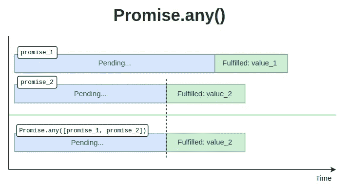
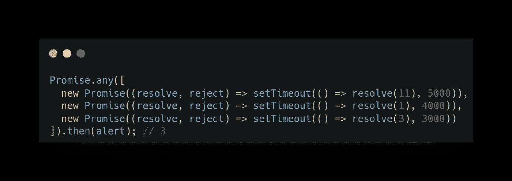
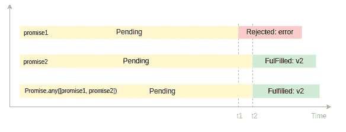
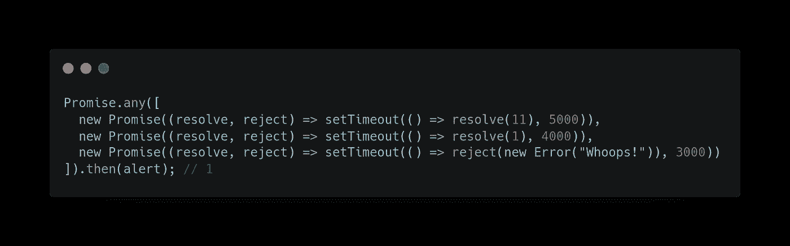
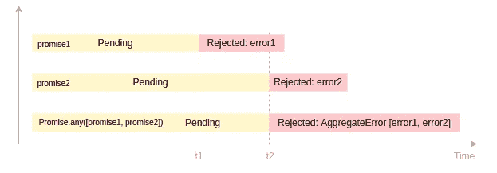
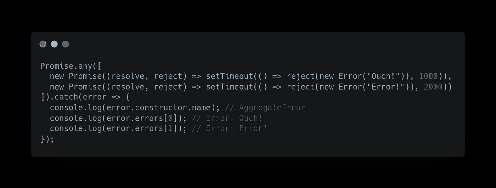

# JavaScript Promises:理解 Promise.any()

> 原文：<https://javascript.plainenglish.io/javascript-promises-understanding-promise-any-d8640d4c6ae5?source=collection_archive---------14----------------------->


Photo by [Artem Sapegin](https://unsplash.com/@sapegin?utm_source=medium&utm_medium=referral) on [Unsplash](https://unsplash.com?utm_source=medium&utm_medium=referral)

ECMAScript 2021 是最新的 JavaScript 版本，它为 JavaScript 语言引入了多个新特性。在本文中，我们将学习如何使用`Promise.any()` 方法来执行我们的异步调用。

# Promise.any()方法

`Promise.any()`将可迭代对象(如承诺数组)作为输入，并返回单个承诺，该承诺在可迭代对象中的任何承诺履行时立即解析，并返回已履行承诺的值。

```
const data = Promise.any([promise1,...]) // iterable object
```

您可以使用**提取承诺解析值。然后**语法:-

```
data.then((values) => {
  values; // [resultOfPromise1, resultOfPromise2, ...]
}).catch(error => {
  console.log(error)
}
```

或者**异步/等待**:

```
try{
 const result = await data;
 console.log(result); //[resultPromise1, resultPromise2, ...]
} catch (error => {
 console.log(error);
}
```

关于`promise.any()`要记住的几点

*   如果所有的承诺都实现了，那么无论哪个承诺执行得更快都将是结果。
*   如果其中一个承诺被拒绝，那么`promise.any()`忽略被拒绝的承诺并返回花费**较少**时间的承诺
*   如果所有的承诺都被拒绝，那么`promise.any()`方法被一个**聚合**错误对象拒绝。

为了更好地理解上述观点，我将向您展示一个示例:

## 例 1:所有承诺都兑现了



time: t1 for promise_1, t2: for promise_2

如图所示:

*   `promise_1`在时间 t1 解析为值`value_1`。
*   `promise_2`在时间 t2 解析为值`value_2`。
*   `Promise.any`返回`value_2` as，promise_2 解析速度比 promise_1 快，这是 promise_2 的结果。

以下示例演示了所有承诺都已兑现的`Promise.any()`方法:



正如您在上面的代码中所看到的， `promise.any()`将返回**‘3’**，因为它将查找成功履行且执行时间较短的承诺。

## 示例 2:一个承诺被拒绝



如图所示:

*   `promise1`在 T1 因出错而被拒绝。
*   `promise2`在时间 t2 解析为值`v2`。
*   `Promise.any`返回`v2`，因为它将忽略被拒绝的承诺(promises 1)

以下示例演示了一个承诺被拒绝的`Promise.any()`方法:



在上面的代码中可以看到，这里的最后一个承诺是最快的，但是被拒绝了，所以第二个承诺就成了结果。在第一个实现的承诺获胜后，所有其他承诺都被忽略，因此这里的值为“1”

**示例 3:拒绝所有承诺**



如图所示:

*   在 t1 因错误而被拒绝。
*   `promise2`在时间 t2 因出错而被拒绝。
*   `Promise.any`返回一个在 T2 被拒绝的承诺，其汇总包含错误 1 和错误 2

以下示例演示了拒绝所有承诺的`Promise.any()`方法:



在这个例子中，两个承诺都被拒绝，错误为“哎哟”和“错误”字符串。因此，`promise.any()`方法将返回一个具有这些错误属性的聚集对象。

# 结论:

`Promise.any()`有助于以竞争方式并行执行独立的异步操作，以获得任何第一个成功解析的承诺的值。

它接受一个**可迭代对象**，比如一个承诺数组作为输入。

*   使用 JavaScript `Promise.any()`方法获取一个承诺列表，并返回一个首先被**实现的承诺。**

[**浏览器兼容性**](https://developer.mozilla.org/en-US/docs/Web/JavaScript/Reference/Global_Objects/Promise/all#browser_compatibility)

请注意，除了 internet explorer 和 opera 之外，所有现代浏览器都完全支持`promise.any()`。

**⭐注意 *Node.js 15.0.0* 中支持 Promise.any()。如果你的 node.js 版本比那个版本老*，控制台可能会显示一个*类型的错误:承诺。any 不是函数*消息，需要更新后再试。***

> 请在评论区分享你的观点，是的，欢迎反馈。
> 希望你会喜欢并分享这篇文章，以便更好地到达
> 查看我的其他文章在—[**https://medium.com/@aayushtibra1997**](https://medium.com/@aayushtibra1997) **感谢阅读:)**

*更多内容请看*[***plain English . io***](https://plainenglish.io/)*。报名参加我们的* [***免费周报***](http://newsletter.plainenglish.io/) *。关注我们关于*[***Twitter***](https://twitter.com/inPlainEngHQ)*和*[***LinkedIn***](https://www.linkedin.com/company/inplainenglish/)*。加入我们的* [***社区不和谐***](https://discord.gg/GtDtUAvyhW) *。*