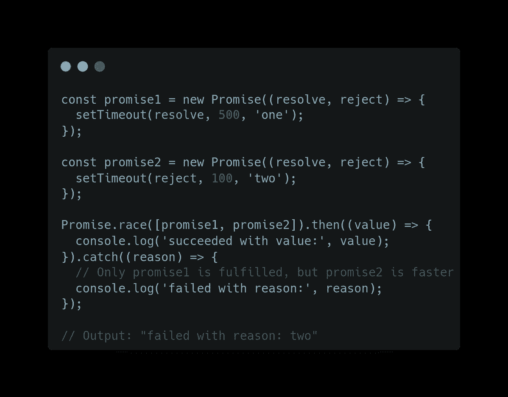

# JavaScript Promises:理解 Promise.race()

> 原文：<https://javascript.plainenglish.io/javascript-promises-understanding-promise-race-72ec28461d27?source=collection_archive---------5----------------------->


Photo by [Artem Sapegin](https://unsplash.com/@sapegin?utm_source=medium&utm_medium=referral) on [Unsplash](https://unsplash.com/?utm_source=medium&utm_medium=referral)

ECMAScript 2021 是最新的 JavaScript 版本，它为 JavaScript 语言引入了多个新特性。但是 promise.race()是在 ECMAScript 2015(ES6)中引入的，可用 7 年。

在本文中，我们将学习如何使用`Promise.race()`方法来执行多个异步调用。

## Promise.race()方法

根据 MDN [文件](https://developer.mozilla.org/en-US/docs/Web/JavaScript/Reference/Global_Objects/Promise/race)，

> `Promise.race()`将一个可迭代对象(如承诺数组)作为输入，并返回一个在可迭代的**中尽快解决的承诺(未实现)。一个约定的承诺可以被解决，也可以被拒绝。**
> 
> `race`函数返回一个`Promise`，其处理方式与作为参数传递的 iterable 承诺中的第一个承诺相同(取相同的值)。
> 
> 如果传递的 iterable 为空，则返回的承诺将永远挂起。
> 
> 如果 iterable 包含一个或多个非承诺值和/或一个已经确定的承诺，那么`Promise.race`将解析到 iterable 中的第一个值。

```
const data = Promise.race([promise1,...]) // iterable object
```

您可以使用**提取承诺解析值。然后**语法:-

```
data.then((values) => {
  values; // [resultOfPromise1, resultOfPromise2, ...]
}).catch(error => {
  console.log(error)
}
```

或者**异步/等待**:

```
try{
 const result = await data;
 console.log(result); //[resultPromise1, resultPromise2, ...]
} catch (error => {
 console.log(error);
}
```

关于`promise.race()`需要记住的几点

*   如果所有的承诺都实现了，那么无论哪个承诺实现得更快都将是结果。承诺是解决了还是拒绝了并不重要。无论哪个承诺执行得更快，它都会返回

为了更好地理解上述观点，我举一个例子:



在上面的例子中可以看到，第二个承诺被拒绝，而不是立即拒绝整个承诺，就像`promise.all()`一样，或者说`promise.race()` 不是忽略被拒绝的承诺，而是返回执行最快的承诺。

## 是什么让 Promise.race()不同于 Promise.any()

`Promise.race`和`Promise.any`做不同的事情:

*   `Promise.any()` 也返回最快的承诺，但它返回最快的**履行的**承诺。如果所有都被拒绝，则返回一个聚合错误。
*   虽然`Promise.race()`返回最快的**确定的**承诺，但是这些承诺是被拒绝还是被确定并不重要。如果所有的承诺都被拒绝，它仍然会返回最快的被拒绝的承诺。

## 示例:-

如果你给他们两个两个承诺，其中一个被拒绝，然后另一个被履行，来自`Promise.race`的承诺将被拒绝(因为第一个解决的承诺被拒绝),来自`Promise.any`的承诺将被履行(因为虽然第一个承诺被拒绝，第二个被履行)。

## 结论:-

`Promise.race()`有助于以竞争方式并行执行独立的异步操作，以获取任何第一个成功结算的承诺的值。

它接受一个**可迭代对象**，比如一个承诺数组作为输入。

*   使用 JavaScript `Promise.race()`方法获取一个承诺列表，并返回一个先解决的承诺。

## [浏览器兼容性](https://developer.mozilla.org/en-US/docs/Web/JavaScript/Reference/Global_Objects/Promise/race#browser_compatibility)

请注意，`promise.race()`在除了 internet explorer 之外的所有现代浏览器中都得到完全支持。

这将是关于承诺的系列文章的结束，如果你想查看请查看我以前的文章，关于 [Promise.any()](/javascript-promises-understanding-promise-any-d8640d4c6ae5) ， [Promise.all()](/javascript-promises-understanding-promise-all-c6a126d02e86) 和 [Promise.allSettled()。](https://medium.com/@aayushtibra1997/javascript-promises-understanding-promise-allsettled-8d9635540697)

> 请在评论区分享你的观点，是的，欢迎反馈。
> 希望你会喜欢并分享这篇文章，以便更好地阅读
> 查看我的其他文章，网址为—[**https://medium.com/@aayushtibra1997**](https://medium.com/@aayushtibra1997)**感谢阅读:)**

*更多内容请看*[***plain English . io***](https://plainenglish.io/)*。报名参加我们的* [***免费周报***](http://newsletter.plainenglish.io/) *。关注我们关于*[***Twitter***](https://twitter.com/inPlainEngHQ)*和*[***LinkedIn***](https://www.linkedin.com/company/inplainenglish/)*。加入我们的* [***社区不和谐***](https://discord.gg/GtDtUAvyhW) *。*