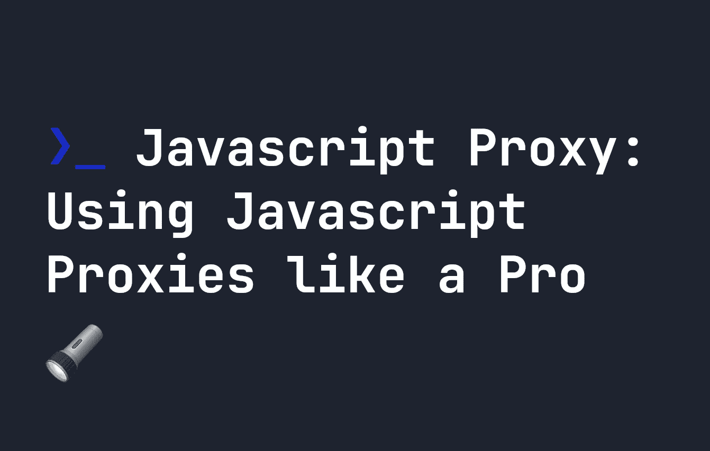

# JavaScript 代理:像专业人士一样使用 JavaScript 代理

> 原文：<https://javascript.plainenglish.io/javascript-proxy-using-javascript-proxies-like-a-pro-ed632342a3a2?source=collection_archive---------6----------------------->



代理是 JavaScript 中的对象，它允许你制作一个对象的代理，同时也为标准的对象操作如`get`、`set`和`has`定义自定义行为。这意味着，例如，如果有人试图从对象中获取属性值，您可以定义一组自定义行为。这将代理变成了一个非常强大的工具，所以让我们看看它们是如何工作的。

# JavaScript 代理的基础知识

上面的内容听起来很复杂，所以首先让我们看一个没有任何方法的简单例子。可以使用`new Proxy()`构造函数创建代理，它接受两个参数:

*   `target`，也就是最初的对象。
*   `handler`，这是我们将添加到我们的对象之上的一组方法或属性。

`handler`可以包含一个预定义方法的列表。例如，如果我们为`get`定义一个方法，它将定制当我们试图从一个对象中`get`一个项目时会发生什么。

```
let target = {
    firstName: "John",
    lastName: "Doe",
    age: 152
}let handler = {
    get: (object, prop) => {
        console.log(`Hi ${object.firstName} ${object.lastName}`)
    }
}let proxyExample = new Proxy(target, handler);proxyExample.age; // console logs "Hi John Doe"
```

由于我们试图`get`代理上的`proxyExample.age`的值，自定义的`get`处理程序触发了——所以我们控制台记录了`Hi ${object.firstName} ${object.lastName}`。正如你所看到的，这可以成为一个非常强大的工具，因为当一个对象的标准操作被调用时，你可以做任何事情。

请注意，当我们将`get`添加到上面的`handler`时，我们有一些自定义参数。您可以添加到代理的每个处理程序都带有一组自定义参数。

对于`get`，使用的功能是`get(object, prop, receiver)`:

*   `object`——最初的对象。在上例中，这是包含`firstName`、`lastName`和`age`的对象
*   `prop`——有人企图`get`的财产。上例中，`age`。
*   `reciever`——代理本身。

!

# 更新代理值

代理仍然引用原始对象，因此对象值和代理值的引用是相同的。因此，如果您尝试更新代理的值，它也会更新原始对象的值。例如，下面我尝试更新代理，如您所见，原始对象和代理都被更新:

```
let target = {
    name: "John",
    age: 152
}let handler = {
}let proxyExample = new Proxy(target, handler);
proxyExample.name = "Dave";console.log(proxyExample.name); // Console logs Dave
console.log(target.name); // Console logs Dave
```

知道这一点很有用——不要期望代理会完全创建一个单独的对象——这是**而不是**制作对象副本的一种方式。

# JavaScript 代理中的自定义处理程序

代理有许多自定义处理程序，允许我们基本上“捕获”任何对象操作，并对它做一些有趣的事情。最常用的方法有:

*   `proxy.apply(objects, thisObject, argList)` -一种捕获函数调用的方法。
*   `proxy.construct(object, argList, newTarget)` -当用`new`构造函数关键字调用函数时进行陷阱的方法。
*   `proxy.defineProperty(object, prop, descriptor)` -当一个新的属性被添加到一个使用`Object.defineProperty`的对象时的一种陷印方法。
*   `proxy.deleteProperty(object, prop)` -从对象中删除属性时的陷阱方法。
*   `proxy.get(object, prop, receiver)` -如前所述，当有人试图`get`从一个对象获取属性时的一种陷阱方法。
*   `proxy.set(object, prop, value, receiver)` -当属性被赋予一个值时进行陷阱的方法。
*   `proxy.has(object, prop)` -一种捕获`in`操作符的方法。

上面的方法足以完成你想用代理做的几乎所有事情。它们很好地涵盖了所有主要的对象操作，可以根据您的喜好进行修改和定制。

还有一些，除了这些非常基本的对象操作，我们还可以访问:

*   `proxy.getPrototypeOf(object)` -一个捕获`Object.getPrototypeOf`方法的方法。
*   `proxy.getOwnPropertyDescriptor(object, prop)`——一个捕获`getOwnPropertyDescriptor`的方法，返回一个特定属性的描述符——例如，它是可枚举的吗，等等。
*   `proxy.isExtensible(object)` -触发`Object.isExtensible()`时的一种陷阱方法。
*   `proxy.preventExtensions(object)` -触发`Object.preventExtensions()`时的一种陷阱方法。
*   `proxy.setPrototypeOf(object, prototype)` -触发`Object.setPrototypeOf()`时的一种陷阱方法。
*   `proxy.ownKeys(object)` -当像`Object.getOwnPropertyNames()`这样的方法被触发时的一种陷阱方法。

让我们更详细地看看其中的一些，以理解代理是如何工作的。

# 对代理使用 in 运算符

我们已经讲过了`proxy.get()`，所以让我们看看`has()`。这主要在我们使用`in`操作符时触发。例如，如果我们想在使用`in`时控制台记录一个属性不存在的事实，我们可以这样做:

```
let target = {
    firstName: "John",
    lastName: "Doe",
    age: 152
}let handler = {
    has: (object, prop) => {
        if(object[prop] === undefined) {
            console.log('Property not found');
        }
        return object[prop]
    }
}let proxyExample = new Proxy(target, handler);console.log('address' in proxyExample); 
// console logs 
// 'Property not found' 
// false
```

由于`address`没有在`target`中定义(因此也没有在`proxyExample`中定义)，尝试控制台日志`'address' in proxyExample`将返回 false——但是它也将控制台日志`'Property not found'`,正如我们在代理中定义的那样。

# 使用代理设置值

您可能想要修改的一个类似的有用方法是`set()`。下面，我使用定制的`set`处理程序来修改当我们试图改变用户年龄时会发生什么。对于每个 set 操作，如果属性是一个数字，那么当数字更新时，我们将控制台记录差异。

```
let target = {
    firstName: "John",
    lastName: "Doe",
    age: 152
}let handler = {
    set: (object, prop, value) => {
        if(typeof object[prop] === "number" && typeof value === "number") {
            console.log(`Change in number was ${value - object[prop]}`);
        }
        return object[prop]
    }
}let proxyExample = new Proxy(target, handler);proxyExample['age'] = 204;
// Console logs 
// Change in number was 52
```

由于`proxyExample.age`和更新的值`204`都是数字，我们不仅将我们的值更新为`204`，而且我们还得到一个有用的控制台日志，告诉我们这两个数字之间的差异。很酷，对吧？

虽然`set`将触发任何设置操作，包括向对象添加新项目，但是您也可以使用`defineProperty`实现类似的行为。例如，这也是可行的:

```
let target = {
    firstName: "John",
    lastName: "Doe",
    age: 152
}let handler = {
    defineProperty: (object, prop, descriptor) => {
        console.log(`A property was set - ${prop}`);
    },
}let proxyExample = new Proxy(target, handler);proxyExample['age'] = "123 Fake Street";
// Console logs
// A property was set - address
```

但是请注意，如果你添加了`set`和`defineProperty`作为句柄，在我们使用方括号`[]`或`.`符号设置属性的情况下，`set`将覆盖`defineProperty`。如果您显式使用`Object.defineProperty`，那么`defineProperty`仍然会触发，如下所示:

```
let target = {
    firstName: "John",
    lastName: "Doe",
    age: 152
}let handler = {
    defineProperty: (object, prop, descriptor) => {
        console.log(`A property was set with defineProperty - ${prop}`);
        return true;
    },
    set: (object, prop, descriptor) => {
        console.log(`A property was set - ${prop}`);
        return true;
    },
}let proxyExample = new Proxy(target, handler);Object.defineProperty(proxyExample, 'socialMedia', {
    value: 'twitter',
    writable: false
});
proxyExample['age'] = "123 Fake Street";
// Console logs
// A property was set with defineProperty - socialMedia
// A property was set - address
```

# 用代理删除值

除了这些有用的方法之外，我们还可以使用`deleteProperty`来处理如果用户使用`delete`关键字删除某些内容时会发生什么。例如，我们可以通过控制台日志让某人知道属性正在被删除:

```
let target = {
    firstName: "John",
    lastName: "Doe",
    age: 152
}let handler = {
    deleteProperty: (object, prop) => {
        console.log(`Poof! The ${prop} property was deleted`);
    },
}let proxyExample = new Proxy(target, handler);delete proxyExample['age'];
// Console logs
// Poof! The age property was deleted
```

# 用代理定制函数调用

当我们想调用一个函数时，代理还允许我们运行自定义代码。这是因为函数是对象的 JavaScript 怪癖。有两种方法可以做到这一点:

*   使用`apply()`处理程序，它捕获标准的函数调用。
*   用`construct()`处理程序，它捕获`new`构造函数调用。

这里有一个简单的例子，我们捕获一个函数调用，并通过在它的输出末尾添加一些东西来修改它。

```
let target = (firstName, lastName) => {
    return `Hello ${firstName} ${lastName}`
}let handler = {
    apply: (object, thisObject, argsList) => {
        let functionCall = object(...argsList);
        return `${functionCall}. I hope you are having a nice day!`
    },
}let proxyExample = new Proxy(target, handler);proxyExample("John", "Doe");
// Returns
// Hello John Doe. I hope you are having a nice day!
```

`apply`接受三个参数:

*   `object` -原始对象。
*   `thisObject` -函数/对象的`this`值。
*   `argsList` -传递给函数的参数。

上面，我们使用`object`参数调用了我们的函数，它包含了最初的`target`函数。然后我们在它的末尾添加了一些文本来改变函数的输出。又一次，很酷，对吧？

我们也可以使用`construct`做同样的事情，它也有三个参数:

*   `object`——原始对象。
*   `argsList` -函数/对象的参数。
*   `newTarget` -最初被调用的构造函数-即代理。

下面是一个函数返回一个对象的例子，我们使用代理上的`construct`方法向它添加一些属性:

```
function target(a, b, c) {
    return { 
        a: a,
        b: b,
        c: c
    }
}let handler = {
    construct: (object, argsList, newTarget) => {
        let functionCall = object(...argsList);
        return { ...functionCall, d: 105, e: 45 }
    },
}let proxyExample = new Proxy(target, handler);new proxyExample(15, 24, 45);
// Returns
// {a: 15, b: 24, c: 45, d: 105, e: 45}
```

# 结论

代理是 JavaScript 库中的一个神奇工具，它允许你修改对象的基本操作。这里有大量的方法可以使用，如果你正确使用它们，它们可以极大地简化你的代码。我希望你喜欢这篇文章——你可以在这里阅读更多我的 JavaScript 内容。

*更多内容请看*[***plain English . io***](https://plainenglish.io/)*。报名参加我们的* [***免费周报***](http://newsletter.plainenglish.io/) *。关注我们关于*[***Twitter***](https://twitter.com/inPlainEngHQ)[***LinkedIn***](https://www.linkedin.com/company/inplainenglish/)*[***YouTube***](https://www.youtube.com/channel/UCtipWUghju290NWcn8jhyAw)***，以及****[***不和***](https://discord.gg/GtDtUAvyhW) **