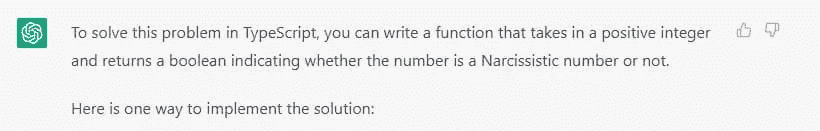
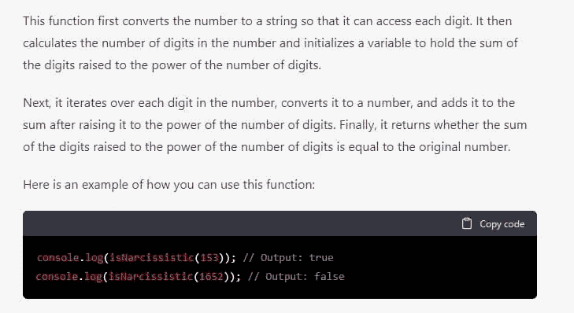

# 检测自恋数字的 JavaScript 方法

> 原文：<https://javascript.plainenglish.io/javascript-recipe-for-detecting-narcissistic-numbers-45a2837bf19f?source=collection_archive---------8----------------------->

## 毁灭 2022

## 识别以 10 为基数的阿姆斯特朗数的分步指南


我们正在接近圣诞节，因此灾难的结束。今天的练习还包括数学和数字的性质。我必须说，我对 CodeWars 提供的各种数学问题感到惊喜。这也让我发现了许多新事物，比如，[自恋的数字](https://en.wikipedia.org/wiki/Narcissistic_number)。但是让我们像往常一样从问题的正文开始。

# 问题是:我的号码看起来很大吗？

链接到[形](https://www.codewars.com/kata/5287e858c6b5a9678200083c)

自恋数(或阿姆斯特朗数)是一个正数，它是它自己的数字的和，每个数字的幂是给定基数的数字的幂。在这个形中，我们将限制自己为十进制(基数为 10)。

比如拿 153 (3 位数)，很自恋:

```
1^3 + 5^3 + 3^3 = 1 + 125 + 27 = 153
```

和 1652 (4 位数)，这不是:

```
1^4 + 6^4 + 5^4 + 2^4 = 1 + 1296 + 625 + 16 = 1938
```

**挑战:**

您的代码必须返回 true 或 false(不是“true”和“false”)，这取决于给定的数字是否是以 10 为基数的自恋数字。这在你的语言中可能是真的也可能是假的，例如 PHP。

不需要对文本字符串或其他无效输入进行错误检查，只有有效的非零正整数会被传递到函数中。

# 我的解决方案


我最喜欢这类问题的一点是，它能够很容易地从数学定义中分解出来。所以，我从维基百科开始:

```
In number theory, a narcissistic number (also known as a pluperfect digital invariant (PPDI), an Armstrong number (after Michael F. Armstrong) or a plus perfect number) in a given number base b is a number that is the sum of its own digits each raised to the power of the number of digits.
```

因此，要采取的步骤是:

1.  把数字分成位数
2.  计算数字的位数
3.  将每个数字提升到幂
4.  把各种结果加起来

最后一步是对获得的数和起始数进行简单的比较。如果两个数字相同，那么这个数字就是自恋数字。

将所有这些转换成 JavaScript，我得到了我一直在寻找的函数:

```
export const narcissistic = (n: number): boolean =>
  [...`${n}`].map(Number).reduce((a, x) => a + x ** `${n}`.length, 0) === n;
```

再次经历 5 个步骤，用公式将数字分成位数:

```
const digits: number[] = [...`${n}`].map(Number);
```

要计算一个数的位数，我可以计算出这个数本身的字符串长度(假设这个数是正数):

```
const exponent: number = `${n}`.length;
```

为了计算一个数的幂，我使用了[取幂运算符](https://developer.mozilla.org/en-US/docs/Web/JavaScript/Reference/Operators/Exponentiation) ( `**`)

```
const power: number = x ** exponent;
```

最后，我使用 [Array.reduce()](https://developer.mozilla.org/en-US/docs/Web/JavaScript/Reference/Global_Objects/Array/reduce) 方法来计算幂的和。

```
const sum: number = digits.reduce((a, x) => a + x ** exponent, 0);
```

我可以将各种操作合并成一个，从而获得问题的解决方案:

```
export const narcissistic = (n: number): boolean =>
  [...`${n}`].map(Number).reduce((a, x) => a + x ** `${n}`.length, 0) === n;
```

或者我可以用扩展的方式写同样的东西。结果更长，但可读性更强:

```
export function narcissistic(n: number): boolean {
  const digits: number[] = [...`${n}`].map(Number);
  const exponent: number = digits.length;
  const pow = (x: number) => x ** exponent;
  const sum: number = digits.reduce((a, x) => a + pow(x), 0);

  const result: boolean = sum === n;
  return result;
}
```

# 人工智能解决方案


我让 ChatGPT(现有最先进的人工智能之一)来解决同样的问题。这是它的解决方案:



```
function isNarcissistic(num: number): boolean {
  // Convert the number to a string so that we can access each digit
  const numStr = num.toString();

  // Calculate the number of digits in the number
  const numDigits = numStr.length;

  // Initialize a variable to hold the sum of the digits raised to the power of the number of digits
  let sum = 0;
  // Iterate over each digit in the number
  for (const digit of numStr) {
    // Convert the digit to a number and raise it to the power of the number of digits
    sum += Math.pow(parseInt(digit, 10), numDigits);
  }
  // Return whether the sum of the digits raised to the power of the number of digits is equal to the original number
  return sum === num;
}
```



解决方案是正确的，虽然不是很优雅。然而，与过去几天的测试相比，今天 ChatGPT 在第一次尝试中提供了一个正确的答案。

感谢阅读！敬请关注更多内容。

***不要错过我的下一篇文章—报名参加我的*** [***中邮箱列表***](https://medium.com/subscribe/@el3um4s)

[](https://el3um4s.medium.com/membership) [## 通过我的推荐链接加入 Medium—Samuele

### 阅读萨缪尔的每一个故事(以及媒体上成千上万的其他作家)。不是中等会员？在这里加入一块…

el3um4s.medium.com](https://el3um4s.medium.com/membership) 

*更多内容看* [***说白了。报名参加我们的***](https://plainenglish.io/) **[***免费周报***](http://newsletter.plainenglish.io/) *。关注我们关于* [***推特***](https://twitter.com/inPlainEngHQ) ，[***LinkedIn***](https://www.linkedin.com/company/inplainenglish/)*，*[***YouTube***](https://www.youtube.com/channel/UCtipWUghju290NWcn8jhyAw)*，以及* [***不和***](https://discord.gg/GtDtUAvyhW) ***。*****

***有兴趣缩放你的软件启动*** *？检查出* [***电路***](https://circuit.ooo?utm=publication-post-cta) *。*