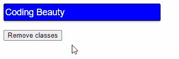

# 如何用 JavaScript 从一个元素中移除所有类

> 原文：<https://javascript.plainenglish.io/javascript-remove-all-classes-from-element-bdf36b84f396?source=collection_archive---------6----------------------->


```
const box = document.getElementById('box');// 👇 Remove all classes from element.
box.className = '';
```

对于此 HTML:

`index.html`

```
<!DOCTYPE html>
<html lang="en">
  <head>
    <title>Coding Beauty Tutorial</title>
    <style>
      .class-1 {
        height: 30px;
        width: 300px;
        font-size: 1.1em;
        box-shadow: 0 2px 3px #c0c0c0;
      } .class-2 {
        background-color: blue;
        color: white;
        border: 1px solid black;
        border-radius: 3px;
      }
    </style>
  </head>
  <body>
    <input id="input" type="text" class="class-1 class-2" />
    <br /><br />
    <button id="btn">Remove classes</button>
    <script src="index.js"></script>
  </body>
</html>
```

单击按钮时，这段 JavaScript 代码将从输入字段中删除所有类:

`index.js`

```
const btn = document.getElementById('btn');const input = document.getElementById('input');btn.addEventListener('click', () => {
  input.className = '';
});
```



`className`属性用于获取和设置指定元素的`class`属性的值。

将`className`设置为空字符串会有效地从元素中移除所有的类。

# 用`removeAttribute()`方法从元素中移除所有类

要使用这种方法从元素中移除所有类，请在为`class`属性指定的上调用`removeAttribute()`方法，即`element.removeAttribute('class')`。这个方法将从元素中移除`class`属性，有效地移除元素的所有类。

```
const box = document.getElementById('box');// 👇 Remove all classes from element
box.removeAttribute('class');
```

`removeAttribute()`获取一个名称，并从具有该名称的元素中移除属性。

对于此 HTML:

```
<!DOCTYPE html>
<html lang="en">
  <head>
    <title>Coding Beauty Tutorial</title>
    <style>
      .class-1 {
        height: 30px;
        font-size: 1.1em;
        box-shadow: 0 2px 3px #c0c0c0;
      } .class-2 {
        background-image: linear-gradient(to bottom, rgb(136, 136, 255), blue);
        color: white;
        border: none;
      }
    </style>
  </head>
  <body>
    <button id="styled-btn" type="text" class="class-1 class-2">
      Download
    </button>
    <br /><br />
    <button id="btn">Remove classes</button>
    <script src="index.js"></script>
  </body>
</html>
```

当单击另一个按钮时，这段 JavaScript 代码将删除样式化按钮中的所有类。

```
const btn = document.getElementById('btn');const styledButton = document.getElementById('styled-btn');btn.addEventListener('click', () => {
  styledButton.removeAttribute('class');
});
```


在第一种方法中，在设置了`className`属性之后，`class`属性仍然保留在元素上。但是使用`removeAttribute()`方法完全从元素中移除了`class`属性。

如果元素没有`class`属性，`removeAttribute()`将返回而不会导致错误。

这两种方法都可以，由你决定选择哪一种。我认为使用`className`属性更好，因为它更清楚地显示了你想做什么。

*原载于*[【codingbeautydev.com】T21](https://cbdev.link/6db10b)

# JavaScript 做的每一件疯狂的事情

一本关于 JavaScript 微妙的警告和鲜为人知的部分的迷人指南。


[**报名**](https://cbdev.link/d3c4eb) 立即免费领取一份。

*更多内容请看*[***plain English . io***](https://plainenglish.io/)*。报名参加我们的* [***免费周报***](http://newsletter.plainenglish.io/) *。关注我们上*[***Twitter***](https://twitter.com/inPlainEngHQ)[***LinkedIn***](https://www.linkedin.com/company/inplainenglish/)*[***YouTube***](https://www.youtube.com/channel/UCtipWUghju290NWcn8jhyAw)**和* [***不和***](https://discord.gg/GtDtUAvyhW) *对成长黑客感兴趣？检查* [***电路***](https://circuit.ooo/) ***。*****