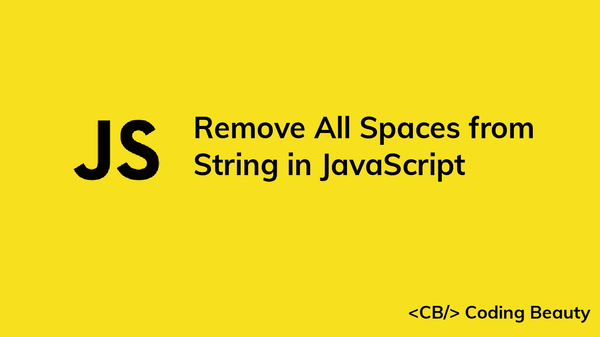

# 如何在 JavaScript 中删除字符串中的所有空格

> 原文：<https://javascript.plainenglish.io/javascript-remove-all-spaces-from-string-75f942ef2fbe?source=collection_archive---------13----------------------->



# 1.String replaceAll()方法

要在 JavaScript 中删除字符串中的所有空格，请在字符串上调用`replaceAll()`方法，将包含空格的字符串作为第一个参数，将空字符串(`''`)作为第二个参数。例如，`str.replaceAll(' ', '')`从`str`中删除所有空格。

```
const str = 'A B C';
const allSpacesRemoved = str.replaceAll(' ', '');console.log(allSpacesRemoved); // ABC
```

`String` `replaceAll()`方法返回一个新的字符串，其中所有匹配的模式都被替换掉了。第一个参数是要匹配的模式，第二个参数是替换。因此，将空字符串作为第二个参数传递会将所有空格替换为空，从而删除它们。

## 注意

JavaScript 中的字符串是不可变的，`replaceAll()`返回一个新的字符串而不修改原来的。

```
const str = 'A B C';
const allSpacesRemoved = str.replaceAll(' ', '');console.log(allSpacesRemoved); // ABC// Original not modified
console.log(str); // A B C
```

# 2.用正则表达式替换()方法

或者，我们可以通过调用字符串上的`replace()`方法，将匹配任何空格的正则表达式作为第一个参数，将空字符串(`''`)作为第二个参数，来删除字符串中的所有空格。

```
const str = 'A B C';
const allSpacesRemoved = str.replace(/ /g, '');console.log(allSpacesRemoved); // ABC
```

我们使用`g` regex 标志来指定字符串中的所有空格都应该匹配。如果没有此标志，将只匹配和替换第一个空格:

```
const str = 'A B C';// No 'g' flag in regex
const spacesRemoved = str.replace(/ /, '');// Only first space removed
console.log(spacesRemoved); // AB C
```

`String` `replace()`方法返回一个新字符串，其中所有匹配项都被传递给它的第二个参数所替换。我们传递一个空字符串作为第二个参数，用 nothing 替换所有的空格，这将删除它们。

## 注意

与`replaceAll()`一样，`replace()`返回一个新字符串，而不修改原来的字符串。

```
const str = 'A B C';
const spacesRemoved = str.replace(/ /g, '');console.log(spacesRemoved); // ABC// Original not modified
console.log(str); // A B C
```

## 小费

我们指定的正则表达式只匹配字符串中的空格。要匹配并删除所有空白字符(空格、制表符和换行符)，我们必须使用不同的正则表达式:

```
const str = 'A B C \t D \n E';
const whitespaceRemoved = str.replace(/\s/g, '');console.log(whitespaceRemoved); // ABC
```

*更新于:*[*codingbeautydev.com*](https://cbdev.link/9244df)

# JavaScript 做的每一件疯狂的事情

一本关于 JavaScript 微妙的警告和鲜为人知的部分的迷人指南。


[**注册**](https://cbdev.link/d3c4eb) 即可免费领取一份。