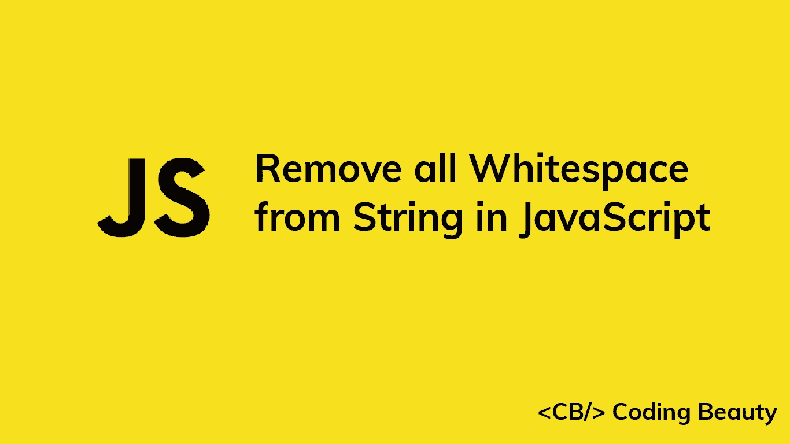

# 如何在 JavaScript 中删除字符串中的所有空格

> 原文：<https://javascript.plainenglish.io/javascript-remove-all-whitespace-from-string-ece685d0ec33?source=collection_archive---------8----------------------->



要在 JavaScript 中删除字符串中的所有空白，请对字符串调用`replace()`方法，传递一个匹配任何空白字符的正则表达式，并传递一个空字符串作为替换。例如，`str.replace(/\s/g, ''`)返回一个从`str`中删除了所有空格的新字符串。

```
const str = '1 2 3';const whitespaceRemoved = str.replace(/\s/g, '');
console.log(whitespaceRemoved); // 123
```

`\s` regex 元字符匹配空白字符，比如空格、制表符和换行符。

我们使用`g` regex 标志来指定应该匹配字符串中的所有空白字符。如果没有这个标志，只有第一个空格会被匹配和替换:

```
const str = '1 2 3';// No 'g' flag in regex
const whitespaceRemoved = str.replace(/\s/, '');// Only first whitespace removed
console.log(whitespaceRemoved); // 12 3
```

`replace()`方法返回一个新字符串，其中所有匹配项都被传递给它的第二个参数所替换。我们传递一个空字符串(`''`)作为第二个参数，用 nothing 替换所有的空白，这有效地删除了它们。

## 注意

`replace()`返回一个新字符串而不修改原始字符串，因为 JavaScript 中的字符串是不可变的。

```
const str = '1 2 3';
const whitespaceRemoved = str.replace(/\s/g, '');console.log(whitespaceRemoved); // 123// Not modified
console.log(str); // 1 2 3
```

*更新于:*[*codingbeautydev.com*](https://cbdev.link/943c5b)

# JavaScript 做的每一件疯狂的事情

一本关于 JavaScript 微妙的警告和鲜为人知的部分的迷人指南。


[**报名**](https://cbdev.link/d3c4eb) 立即免费领取一份。