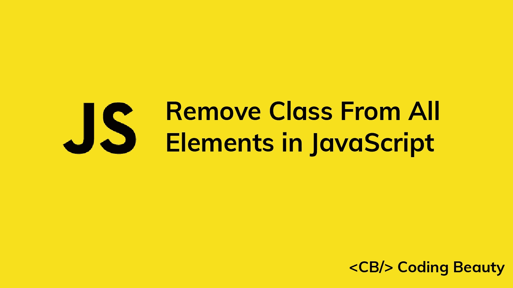
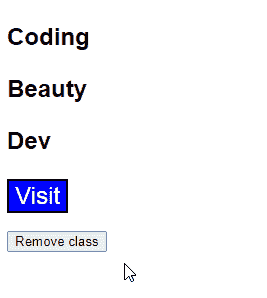

# 如何从 JavaScript 的所有元素中移除一个类

> 原文：<https://javascript.plainenglish.io/javascript-remove-class-from-all-elements-aed7b7b4a14e?source=collection_archive---------5----------------------->



要使用 JavaScript 从所有 HTML DOM 元素中删除一个类:

1.  用`document.querySelectorAll('*')`获得 DOM 中所有元素的列表。
2.  用`forEach()`遍历列表。
3.  对于每个元素，调用`classList.remove(class)`从每个元素中移除类。

即:

`HTML`

```
<p class="big bold text">Coding</p>
<p class="big bold text">Beauty</p>

<div class="container">
  <p class="big bold text">Dev</p>
  <button class="big btn raised">Visit</button>
</div>
<br />
<button id="remove">Remove class</button>
```

`JavaScript`

```
const removeBtn = document.getElementById('remove');

removeBtn.addEventListener('click', () => {
  const elements = document.querySelectorAll('*');
  elements.forEach((element) => {
    element.classList.remove('big');
  });
})
```

`CSS`

```
.bold {
  font-weight: bold;
}

.big {
  font-size: 1.5em;
}
.text {
  font-family: Arial;
}
.btn {
  color: white;
  background-color: blue;
}
```

这将是单击按钮后的 HTML:

`HTML`

```
<p class="bold text">Coding</p>
<p class="bold text">Beauty</p>

<div>
  <p class="bold text">Dev</p>
  <button class="btn raised">Visit</button>
</div>
<br />
<button id="remove">Remove class</button>
```



The classes are removed from the element when the button is clicked.

我们使用`[document.querySelectorAll()](https://developer.mozilla.org/en-US/docs/Web/API/Document/querySelectorAll)`方法来选择所有包含该类的 DOM 元素。

我们用`forEach()`方法迭代列表对象中的元素。该`forEach()`方法与`Array` `[forEach()](https://developer.mozilla.org/en-US/docs/Web/JavaScript/Reference/Global_Objects/Array/forEach)`类似。

# `classList.remove()`方法

我们使用`classList.remove()`方法从元素中移除一个类。您可以通过向`remove()`传递更多参数来删除多个类。

`JavaScript`

```
const elements = document.querySelectorAll('*');

elements.forEach((element) => {
  element.classList.remove('big', 'bold');
})
```

如果传递给`remove()`的任何类在元素上不存在，`remove()`将忽略它，而不是抛出一个错误。

# 从元素的所有子元素中移除类

前面的例子是从 DOM 中的每个元素中删除一个类。如果您想要移除某个特定 DOM 元素的所有子元素，例如，在我们的示例中，只移除`.container`元素的子元素，该怎么办呢？

为此，只需修改元素选择器的前缀`*`,并用空格将它们分开。我的意思是:

`JavaScript`

```
// Remove class from all children elements of .container div
const elements = document.querySelectorAll('.container *');

elements.forEach((element) => {
  element.classList.remove('big');
});
```

# 向所有元素添加类

就像`classList.remove()`方法从元素中移除一个或多个类一样，`classList.add()`方法向元素中添加一个或多个类。这意味着我们可以在`forEach()`方法中使用它从所有 DOM 元素中移除一个类:

`JavaScript`

```
const elements = document.querySelectorAll('.canvas *');

elements.forEach((element) => {
  element.classList.add('clickable', 'stylable');
});
```

*原载于*【codingbeautydev.com】

# *JavaScript 做的每一件疯狂的事情*

*一本关于 JavaScript 微妙的警告和鲜为人知的部分的迷人指南。*

**

*[**报名**](https://cbdev.link/d3c4eb) 立即免费领取一份。*

## *更多内容请访问 [PlainEnglish.io](https://plainenglish.io/) 。*

*报名参加我们的 [**免费每周简讯**](http://newsletter.plainenglish.io/) 。关注我们 [**推特**](https://twitter.com/inPlainEngHQ) ，[**LinkedIn**](https://www.linkedin.com/company/inplainenglish/)**，**[**YouTube**](https://www.youtube.com/channel/UCtipWUghju290NWcn8jhyAw)**，以及** [**不和谐**](https://discord.gg/GtDtUAvyhW) **。***

## *想用内容来扩展你的科技创业吗？检查[电路](https://circuit.ooo/?utm=publication-post-cta)。*

*我们提供免费的专家建议和定制解决方案，帮助您建立对您的技术产品或服务的认知和采用。*