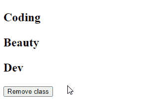

# 如何用 JavaScript 从多个元素中移除一个类

> 原文：<https://javascript.plainenglish.io/javascript-remove-class-from-multiple-elements-99e694e94ca6?source=collection_archive---------3----------------------->


要从 JavaScript 的多个元素中删除一个类:

1.  使用`document.querySelectorAll()`方法获得该类中所有元素的列表。
2.  用`forEach()`方法遍历列表。
3.  在每次迭代中，调用`classList.remove()`方法从每个元素中移除类。

即:

```
const elements = document.querySelectorAll('.class');

elements.forEach((element) => {
  element.classList.remove('class');
});
```

例如:

`HTML`

```
<p class="big bold text">Coding</p>
<p class="big bold text">Beauty</p>
<p class="big bold text">Dev</p>

<button id="remove">Remove class</button>
```

`JavaScript`

```
const removeBtn = document.getElementById('remove');

removeBtn.addEventListener('click', () => {
  const elements = document.querySelectorAll('.text');

  elements.forEach((element) => {
    element.classList.remove('big');
  });
});
```

`CSS`

```
.bold {
  font-weight: bold;
}

.big {
  font-size: 1.2em;
}
```

这将是单击按钮后的 HTML:

```
<p class="bold text">Coding</p>
<p class="bold text">Beauty</p>
<p class="bold text">Dev</p>

<button id="remove">Remove class</button>
```



The “big” class is removed when the button is clicked.

我们使用`[document.querySelectorAll()](https://developer.mozilla.org/en-US/docs/Web/API/Document/querySelectorAll)`方法来选择所有包含该类的 DOM 元素。

我们用`forEach()`方法迭代列表对象中的元素。这种`forEach()`方法的工作原理与`Array` `[forEach()](https://developer.mozilla.org/en-US/docs/Web/JavaScript/Reference/Global_Objects/Array/forEach)`相似。

# `document.getElementsByClassName()`方法

当选择器是类选择器时，我们可以用`[document.getElementsByClassName()](https://developer.mozilla.org/en-US/docs/Web/API/Document/getElementsByClassName)`方法代替`document.querySelectorAll()`方法。对于`getElementsByClassName()`，我们传递不带`.`(点)的类名，在用`forEach()`迭代之前，我们使用`[Array.from()](https://developer.mozilla.org/en-US/docs/Web/JavaScript/Reference/Global_Objects/Array/from)`将结果转换为数组。

```
const elements = Array.from(document.getElementsByClassName('text'));
elements.forEach((element) => {
  element.classList.remove('big');
});
```

# `classList.remove()`方法

我们使用`classList.remove()`方法从元素中移除一个类。您可以通过向`remove()`传递更多参数来删除多个类。

```
const elements = document.querySelectorAll('.text');

elements.forEach((element) => {
  element.classList.remove('big', 'bold');
});
```

如果传递给`remove()`的任何一个类在元素上不存在，`remove()`会忽略它，而不是抛出一个错误。

# 从具有不同选择器的元素中移除类

有时，在您想要移除类的元素之间没有公共的选择器。对于这种情况，您可以将多个逗号分隔的选择器传递给`querySelectorAll()`方法。

```
const elements = document.querySelectorAll('.text, #box-1, #box-2');

elements.forEach((element) => {
  element.classList.remove('bold');
});
```

# 向多个元素添加类

就像`classList.remove()`方法从元素中删除一个或多个类一样，`classList.add()`方法向元素中添加一个或多个类。这意味着我们可以在`forEach()`方法中使用它从多个 DOM 元素中移除一个类:

```
const elements = document.querySelectorAll('.text');
elements.forEach((element) => {
  element.classList.add('italic', 'underline');
});
```

【codingbeautydev.com】原载于[](https://cbdev.link/2662b4)

# *JavaScript 做的每一件疯狂的事情*

*一本关于 JavaScript 微妙的警告和鲜为人知的部分的迷人指南。*

**

*[**报名**](https://cbdev.link/d3c4eb) 立即免费领取一份。*