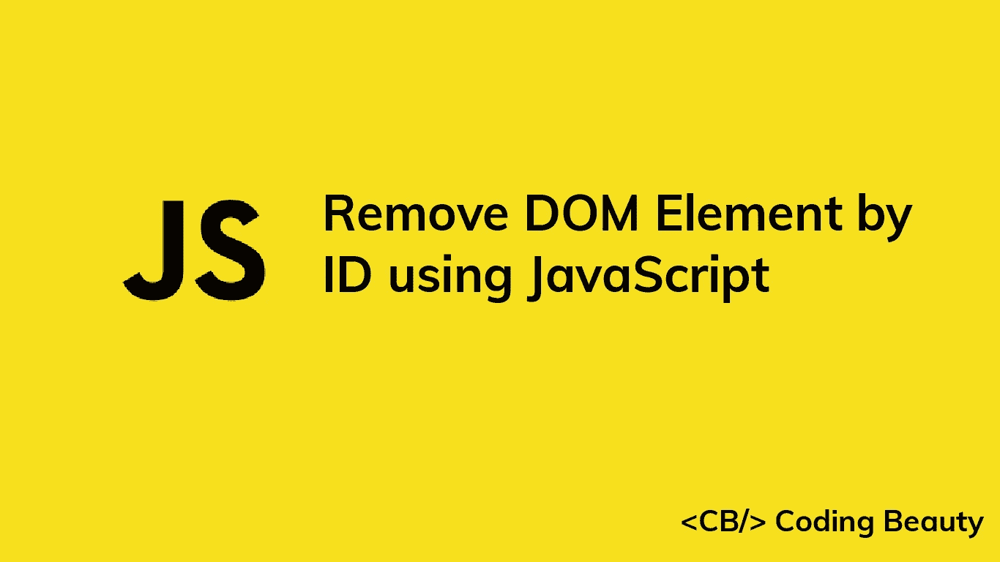

# 如何使用 JavaScript 通过 ID 移除 DOM 元素

> 原文：<https://javascript.plainenglish.io/javascript-remove-dom-element-by-id-9765d19f08f9?source=collection_archive---------13----------------------->

## 了解如何使用 JavaScript 通过 ID 轻松移除 HTML DOM 中的元素。



在本文中，我们将学习如何使用 JavaScript 通过 ID 轻松地移除 HTML DOM 中的元素。

# Element remove()方法

要通过 ID 移除 DOM 元素，使用`getElementById()`方法选择具有 ID 的元素，然后对该元素调用`remove()`方法。

例如:

**index.html**

```
<!DOCTYPE html>
<html>
  <head>
    <title>Coding Beauty Tutorial</title>
  </head>
  <body>
    <div class="box" id="box-1">This is a box</div> <script src="index.js"></script>
  </body>
</html>
```

下面是我们如何删除 id 为`box-1`的元素:

**index.js**

```
const box = document.getElementById('box-1');
box.remove();
```

`getElementById()`方法获取一个字符串，并返回 DOM 中 ID 与该字符串匹配的元素。

如果没有具有匹配 ID 的元素，`getElementByID()`返回`null`。

**index.js**

```
const box = document.getElementById('box-5');
console.log(box); // null
```

我们可以使用[可选链接操作符](https://developer.mozilla.org/en-US/docs/Web/JavaScript/Reference/Operators/Optional_chaining) ( `?.`)来调用`remove()`，以避免在没有 id 为的 DOM 元素时导致错误。

可选的链接操作符不会导致错误，而是会阻止方法调用并返回`undefined`。

**index.js**

```
const box = document.getElementById('box-5');
box?.remove(); // no error thrown
```

# 如何移除 DOM 元素而不移除其子元素

方法删除一个 DOM 元素及其子元素。如果想在 DOM 中保留元素的子元素呢？

**index.html**

```
<!DOCTYPE html>
<html>
  <head>
    <title>Coding Beauty Tutorial</title>
  </head>
  <body> <div id="parent">
      <p>Child 1</p>
      <p>Child 2</p>
    </div> <script src="index.js"></script>
  </body>
</html>
```

要删除 ID 为`parent`的`div`元素但保留其子元素，我们可以调用`div`的`replaceWith()`方法，将元素的子元素作为参数传递。

**index.js**

```
const element = document.getElementById('parent');element.replaceWith(...element.childNodes);
```

现在，文档的标记将如下所示:

```
<!DOCTYPE html>
<html>
  <head>
    <title>Coding Beauty Tutorial</title>
  </head>
  <body>
    <p>Child 1</p>
    <p>Child 2</p> <script src="index.js"></script>
  </body>
</html>
```

属性返回一个元素的子节点列表。我们用它来获取元素的子元素。

`replaceWith()`方法用一组`Node`或字符串对象替换 DOM 中的元素。我们在元素上调用它，用子元素替换它。

*更新于:*[*codingbeautydev.com*](https://cbdev.link/3da419)

# JavaScript 做的每一件疯狂的事情

一本关于 JavaScript 微妙的警告和鲜为人知的部分的迷人指南。


[**报名**](https://cbdev.link/d3c4eb) 立即免费领取一份。