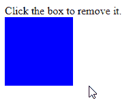
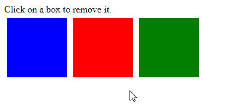

# 如何在 JavaScript 中移除 DOM 元素 OnClick

> 原文：<https://javascript.plainenglish.io/javascript-remove-element-on-click-efa1fbd18dad?source=collection_archive---------2----------------------->


在 JavaScript 中从 DOM `onclick`中移除元素:

1.  用类似于`getElementById()`的方法选择 DOM 元素。
2.  向元素添加一个`click`事件监听器。
3.  在事件处理程序中的元素上调用`remove()`方法。

```
const element = document.getElementById('#el');element.remove();
```

考虑这个样本 HTML:

**index.html**

```
<!DOCTYPE html>
<html lang="en">
  <head>
    <title>Coding Beauty Tutorial</title>
    <style>
      #box {
        height: 100px;
        width: 100px;
        background-color: blue;
      }
    </style>
  </head>
  <body>
    Click the box to remove it. <div id="box"></div> <script src="index.js"></script>
  </body>
</html>
```

下面是我们如何在点击元素时移除它。

**索引. js**

```
const box = document.getElementById('box');box.addEventListener('click', () => {
  box.remove();
});
```



我们使用了`addEventListener()`方法将`click`事件的处理程序添加到`#box`元素中。每当用户单击该框时，都会调用此事件处理程序。

在 handler 函数中，我们调用元素上的`remove()`方法将它从 DOM 中移除。

我们也可以使用传递给处理程序的`event`对象上的`target`属性来移除元素。

```
const box = document.getElementById('box');box.addEventListener('click', (event) => {
  event.target.remove();
});
```

我们可以使用`event`对象来访问有用的信息，并执行与事件相关的某些操作。对于`click`事件，`target`属性让我们访问被点击的 DOM 元素。

当我们想要在 onclick 上动态移除许多元素时，使用`target`属性移除元素是很有用的。

例如:

**index.html**

```
<!DOCTYPE html>
<html lang="en">
  <head>
    <title>Coding Beauty Tutorial</title>
    <link rel="stylesheet" href="index.css" />
  </head>
  <body>
    Click on a box to remove it. <div class="container">
      <div class="box" id="box-1"></div>
      <div class="box" id="box-2"></div>
      <div class="box" id="box-3"></div>
    </div> <script src="index.js"></script>
  </body>
</html>
```

`index.css`

```
.container {
  display: flex;
}.box {
  height: 100px;
  width: 100px;
  margin: 5px;
}#box-1 {
  background-color: blue;
}#box-2 {
  background-color: red;
}#box-3 {
  background-color: green;
}
```

**index.js**

```
const boxes = document.getElementsByClassName('box');for (const box of boxes) {
  box.addEventListener('click', (event) => {
    event.target.remove();
  });
}
```



我们还可以通过向所有元素的父元素添加一个事件监听器来删除任何一个元素`onclick`。

**index.js**

```
const container = document.querySelector('.container');container.addEventListener('click', (event) => {
  event.target.remove();
});
```

这是因为`target`属性返回 DOM 中被点击的最里面的元素。这与`event.currentTarget`属性形成对比，后者返回事件监听器被添加到的元素。

*原载于*[*codingbeautydev.com*](https://cbdev.link/a382a9)

# ES13 中 11 个惊人的新 JavaScript 特性

本指南将带您快速了解 ECMAScript 13 中添加的所有最新功能。这些强大的新特性将会用更短、更富于表现力的代码来更新您的 JavaScript。


[**报名**](https://cbdev.link/900477) 立即免费领取一份。

*更多内容请看*[***plain English . io***](https://plainenglish.io/)*。报名参加我们的* [***免费周报***](http://newsletter.plainenglish.io/) *。关注我们关于*[***Twitter***](https://twitter.com/inPlainEngHQ)[***LinkedIn***](https://www.linkedin.com/company/inplainenglish/)*[***YouTube***](https://www.youtube.com/channel/UCtipWUghju290NWcn8jhyAw)***，以及****[***不和***](https://discord.gg/GtDtUAvyhW) **