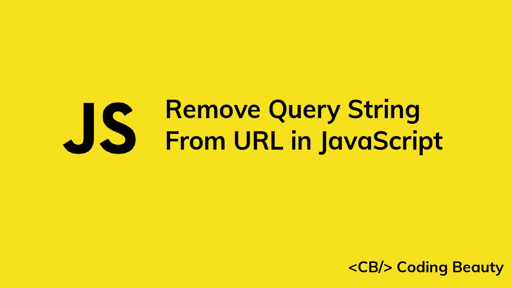

# 如何用 JavaScript 从 URL 中删除查询字符串

> 原文：<https://javascript.plainenglish.io/javascript-remove-query-string-from-url-489bc47b89f8?source=collection_archive---------7----------------------->



要在 JavaScript 中从 URL 中删除查询字符串:

1.  使用`URL()`构造函数从 URL 字符串创建一个`URL`对象。
2.  将`URL`对象的`search`属性设置为空字符串(`''`)。
3.  用`URL`对象的`toString()`方法获得结果 URL。

```
const url = 'https://example.com/posts?page=5&sort=desc#hash';const urlObj = new URL(url);urlObj.search = '';const result = urlObj.toString();console.log(result); // [https://example.com/posts#hash](https://example.com/posts#hash)
```

我们可以使用`URL`类来解析、构造、规范化和编码 URL。

`URL()`构造函数返回一个新创建的`URL`对象，表示作为参数传递的 URL 字符串。`URL`对象具有允许我们容易地读取和修改 URL 的组成部分的属性。

```
const url = 'https://example.com/posts?page=5&sort=desc#hash';const urlObj = new URL(url);console.log(urlObj.host); // example.comconsole.log(urlObj.origin); // https://example.comconsole.log(urlObj.protocol); // https:
```

`search`属性返回 URL 的查询字符串，包括`?`字符。它不包括哈希。

```
const url = 'https://example.com/posts?page=5&sort=desc#hash';const urlObj = new URL(url);console.log(urlObj.search); // ?page=5&sort=desc
```

通过将`search`设置为空字符串(`''`，我们从 URL 中移除查询字符串。

# 从 URL 中删除带哈希的查询字符串

要删除 URL 的散列和查询字符串，还需要将`hash`属性设置为空字符串:

```
const url = 'https://example.com/posts?page=5&sort=desc#hash';const urlObj = new URL(url);urlObj.search = '';
urlObj.hash = '';const result = urlObj.toString();console.log(result); // [https://example.com/posts](https://example.com/posts)
```

属性返回 URL 的片段标识符，包括字符。

```
const url = 'https://example.com/posts?page=5&sort=desc#hash';const urlObj = new URL(url);console.log(urlObj.hash); // #hash
```

通过将`hash`设置为空字符串(`''`)，我们从 URL 中删除了散列和查询字符串。

*原载于【codingbeautydev.com】[](https://cbdev.link/e1a21a)*

# *ES13 中 11 个惊人的新 JavaScript 特性*

*本指南将带您快速了解 ECMAScript 13 中添加的所有最新功能。这些强大的新特性将会用更短、更富于表现力的代码来更新您的 JavaScript。*

**

*[**报名**](https://cbdev.link/900477) 立即免费领取一份。*