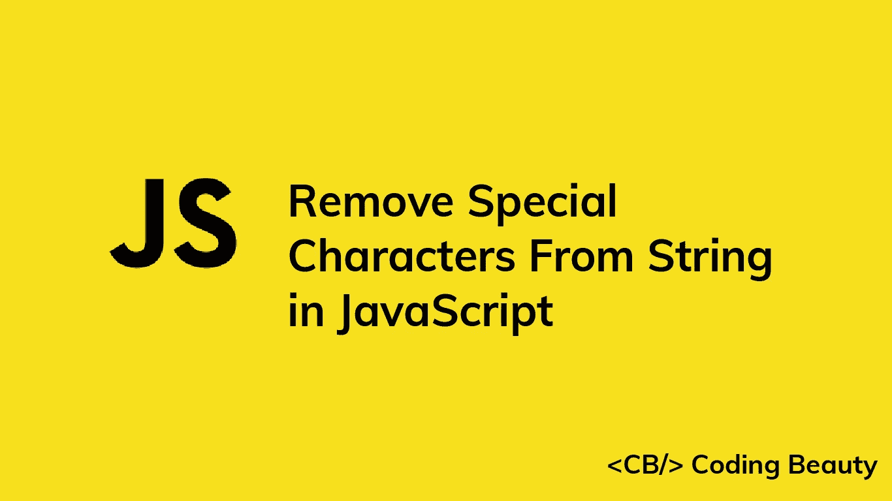

# 如何在 JavaScript 中删除字符串中的特殊字符

> 原文：<https://javascript.plainenglish.io/javascript-remove-special-characters-from-string-74e4db3b3bb0?source=collection_archive---------11----------------------->



要从字符串中删除所有特殊字符，调用字符串上的`replace()`方法，传递一个白名单正则表达式和一个空字符串作为参数，即`str.replace(/^a-zA-Z0-9 ]/g, '')`。`replace()`方法将返回一个不包含任何特殊字符的新字符串。

例如:

```
const str = 'milk and @#$%&!bread';const noSpecialChars = str.replace(/[^a-zA-Z0-9 ]/g, '');console.log(noSpecialChars); // milk and bread
```

`String` `replace()`方法在一个字符串中搜索一个值(子串或正则表达式)，并返回一个新字符串，该值被一个子串替换。它不会修改原始字符串。

正则表达式(`[]`)中的方括号表示字符类。只有包含在其中的字符才会被匹配。

但是在方括号中放置插入符号(`^`)作为第一个字符后，只有方括号中的**不是**的字符才会被匹配。

在插入符号之后，我们指定:

*   小写(`a-z`)和大写(`A-Z`)字母的范围。
*   从`0-9`开始的数字范围。
*   一个空格字符(`' '`)。

因此 regex 匹配任何不是小写或大写字母、数字或空格的字符，而`replace()`方法返回一个新字符串，其中所有这些字符都从原始字符串中删除。

`g`(全局)标志指定模式的每一次出现都应该匹配。

如果我们没有传递一个全局标志，那么只有字符串中的第一个特殊字符会被匹配并删除。

```
const str = 'milk and @#$%&!bread';// 👇 No 'g' flag in regex
const noSpecialChars = str.replace(/[^a-zA-Z0-9 ]/, '');// 👇 Only first special character removed
console.log(noSpecialChars); // milk and #$%&!bread
```

# 用`\w`字符缩短正则表达式。

我们可以用`\w`字符稍微缩短这个正则表达式。

```
const str = 'milk and @#$%&!bread';const noSpecialChars = str.replace(/[^\w ]/g, '');console.log(noSpecialChars); // milk and bread
```

`\w`字符匹配大小写拉丁字母、数字和**下划线**。

因为`\w`匹配下划线，所以它不能单独用来从字符串中删除这个特殊字符。

```
const str = '_milk_ _and _@#$%&!_bread_';const noSpecialChars = str.replace(/[^\w ]/g, '');console.log(noSpecialChars); // _milk_ _and_ _bread_
```

我们需要一个不同的正则表达式来删除下划线:

```
const str = '_milk_ _and _@#$%&!_bread_';const noSpecialChars = str.replace(/([^\w ]|_)/g, '');console.log(noSpecialChars); // milk and bread
```

管道符号(`|`)允许在一个字符串中匹配两种模式中的任何一种，类似于一个字符类。为了使用管道符号，我们需要将这两种模式用括号括起来(`(`和`)`)，这就是我们所做的。

*原载于*[*codingbeautydev.com*](https://cbdev.link/014bb8)

# JavaScript 做的每一件疯狂的事情

一本关于 JavaScript 微妙的警告和鲜为人知的部分的迷人指南。


[**报名**](https://cbdev.link/d3c4eb) 立即免费领取一份。