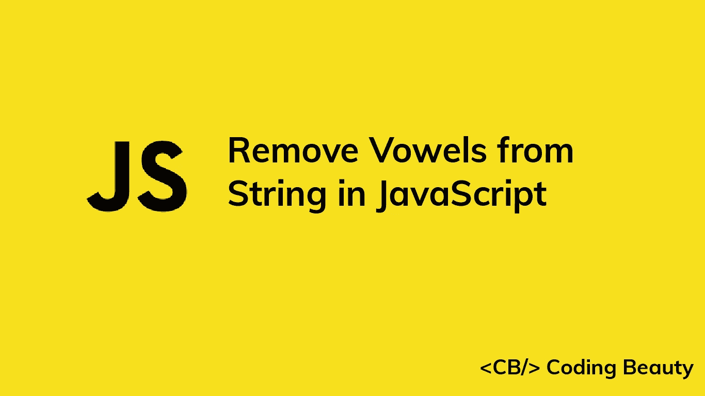
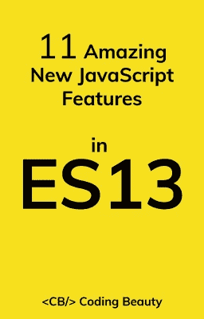

# 如何在 JavaScript 中删除字符串中的所有元音

> 原文：<https://javascript.plainenglish.io/javascript-remove-vowels-from-string-a6e9a39632af?source=collection_archive---------6----------------------->



要在 JavaScript 中删除一个字符串中的所有元音，用这个正则表达式对该字符串调用`replace()`方法:`/[aeiou]/gi`，即`str.replace(/[aeiou]/gi, '')`。`replace()`将返回一个新字符串，其中原始字符串中的所有元音都被替换为空字符串。

例如:

```
const str = 'coding beauty';const noVowels = str.replace(/[aeiou]/gi, '');console.log(noVowels); // cdng bty
```

# 字符串 replace()方法

[字符串替换()](https://developer.mozilla.org/en-US/docs/Web/JavaScript/Reference/Global_Objects/String/replace)方法有两个参数:

1.  `pattern` -在给定字符串中搜索的模式。我们为此使用了正则表达式，但它也可以是字符串。
2.  `replacement` -用于替换字符串中指定模式的匹配项的字符串。通过传递一个空字符串(`''`)，我们删除了给定字符串中该模式的所有出现。

**注意** : `replace()`不修改原字符串，而是返回一个新字符串。字符串在 JavaScript 中是不可变的。

# 理解正则表达式

我们使用两个正斜杠(`/ /`)来指定正则表达式的开始和结束。

`[]`字符用于指定匹配任何一组特定字符的模式。例如，图案`[abc]`将匹配`'a'`、`'b'`或`'c'`。同样，`[aeiou]`模式将匹配英语字母表中 5 个元音字符中的任何一个。

`g`(全局)正则表达式标志用于匹配正则表达式模式的所有出现。如果没有这个标志，在调用`replace()`后，只有第一个模式匹配会被删除。

```
const str = 'coding beauty';// "g" regex flag not set
const noVowels = str.replace(/[aeiou]/i, '');// Only first vowel removed
console.log(noVowels); // cding beauty
```

`i`(忽略大小写)标志用于在给定字符串中执行不区分大小写的正则表达式匹配搜索。这确保了从字符串中删除所有元音字母，无论它们是否大写。

```
const str = 'cOding bEaUty';// "i" regex flag NOT set
const noVowels1 = str.replace(/[aeiou]/g, '');// Only lowercased vowels removed
console.log(noVowels1); // cOdng bEUty// "i" regex flag set
const noVowels2 = str.replace(/[aeiou]/gi, '');// All vowels removed
console.log(noVowels2); // cdng bty
```

要获得 JavaScript 中正则表达式模式的全面指南，请查看 MDN 文档中的这个[正则表达式语法备忘单](https://developer.mozilla.org/en-US/docs/Web/JavaScript/Guide/Regular_Expressions/Cheatsheet)。

*原载于*[*codingbeautydev.com*](https://cbdev.link/c51440)

# ES13 中 11 个惊人的新 JavaScript 特性

本指南将带您快速了解 ECMAScript 13 中添加的所有最新功能。这些强大的新特性将会用更短、更富于表现力的代码来更新您的 JavaScript。



[注册](https://cbdev.link/900477)，立即免费领取一份。

*更多内容看* [***说白了。报名参加我们的***](https://plainenglish.io/) **[***免费周报***](http://newsletter.plainenglish.io/) *。关注我们关于* [***推特***](https://twitter.com/inPlainEngHQ)[***LinkedIn***](https://www.linkedin.com/company/inplainenglish/)*[***YouTube***](https://www.youtube.com/channel/UCtipWUghju290NWcn8jhyAw)*[***不和***](https://discord.gg/GtDtUAvyhW) *。*****