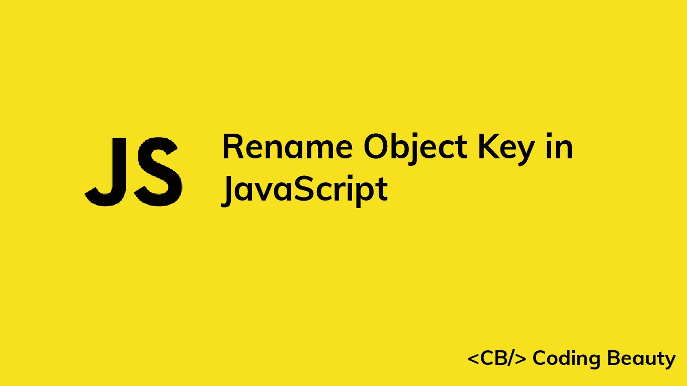

# 如何在 JavaScript 中重命名对象键

> 原文：<https://javascript.plainenglish.io/javascript-rename-object-key-3e83609ae06b?source=collection_archive---------10----------------------->



要在 JavaScript 中重命名对象键，请将旧键属性的值赋给带有新键的新属性，然后删除旧键属性。

```
const obj = { oldKey: 'value' };obj['newKey'] = obj['oldKey'];
delete obj['oldKey'];console.log(obj); // { newKey: 'value' }
```

在这个例子中，我们通过直接分配给用新键索引的对象来创建新属性。我们用`delete`操作符删除旧的键属性。

**注意:**我们也可以使用`Object.assign()`方法在对象中创建一个新的属性:

```
const obj = { oldKey: 'value' };Object.assign(obj, { newKey: obj.oldKey })['oldKey'];
delete obj['oldKey'];console.log(obj); // { newKey: 'value' }
```

这允许我们在一条语句中重命名对象键:

```
const obj = { oldKey: 'value' };delete Object.assign(obj, { newKey: obj.oldKey })['oldKey'];console.log(obj); // { newKey: 'value' }
```

传递给`Object.assign()`的第一个参数是应用源属性的目标对象。rest 参数是一个或多个包含要应用于目标的属性的源对象。

**注意:**为了确保新的键属性的行为与旧的键属性一致，在删除它之前，使用`Object.defineProperty()`和`Object.getOwnPropertyDescriptor()`创建一个与旧的键属性具有相同描述符的新属性。例如:

```
const obj = { oldKey: 'value' };Object.defineProperty(
  obj,
  'newKey',
  Object.getOwnPropertyDescriptor(obj, 'oldKey')
);
delete obj['oldKey'];console.log(obj); // { newKey: 'value' }
```

现在，新的键属性将保留旧的键属性的某些特征，例如可枚举性和可写性。

*更新于:*[*codingbeautydev.com*](https://codingbeautydev.com/blog/javascript-rename-object-key/)

每周获取新的 web 开发技巧和教程。


[**订阅**](https://codingbeautydev.com/newsletter)