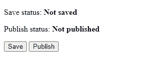
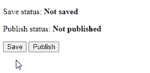

# 如何在 JavaScript 中解析来自外部的承诺

> 原文：<https://javascript.plainenglish.io/javascript-resolve-promise-from-outside-cefdb7381128?source=collection_archive---------2----------------------->


要在 JavaScript 中解析来自外部的承诺，将`resolve`回调赋给在`Promise`构造函数范围之外定义的变量，然后调用该变量来解析`Promise`。例如:

```
let promiseResolve;
let promiseReject;const promise = new Promise((resolve, reject) => {
  promiseResolve = resolve;
  promiseReject = reject;
});promiseResolve();
```

为什么我们需要做这样的事情呢？好吧，也许我们有一个正在进行的操作 A，用户希望另一个操作 B 发生，但是 B 必须等待 A 完成。假设我们有一个简单的社交应用程序，用户可以在其中创建、保存和发布帖子。

**index.html**

```
<!DOCTYPE html>
<html>
  <head>
    <title>Resolving a Promise from Outside</title>
  </head>
  <body>
    <p>
      Save status:
      <b><span id="save-status">Not saved</span></b>
    </p>
    <p>
      Publish status:
      <b><span id="publish-status">Not published</span></b>
    </p>
    <button id="save">Save</button>
    <button id="publish">Publish</button>
    <script src="index.js"></script>
  </body>
</html>
```



Users can save and publish posts.

如果一篇文章正在被保存(操作 A ),而用户希望在保存过程中发布该文章(操作 B ),该怎么办？。如果我们不想在保存时禁用“发布”按钮，我们需要确保在发布之前保存文章。

**index.js**

```
// Enable UI interactivity
const saveStatus = document.getElementById('save-status');
const saveButton = document.getElementById('save');
const publishStatus = document.getElementById(
  'publish-status'
);
const publishButton = document.getElementById('publish');
saveButton.onclick = () => {
  save();
};
publishButton.onclick = async () => {
  await publish();
};let saveResolve;
let hasSaved = false;function save() {
  hasSaved = false;
  saveStatus.textContent = 'Saving...';
  setTimeout(() => {
    saveResolve();
    hasSaved = true;
    saveStatus.textContent = 'Saved';
  }, 3000);
}async function waitForSave() {
  if (!hasSaved) {
    await new Promise((resolve) => {
      saveResolve = resolve;
    });
  }
}async function publish() {
  publishStatus.textContent = 'Waiting for save...';
  await waitForSave();
  publishStatus.textContent = 'Published';
  return;
}
```

这段代码的关键部分是`save()`和`waitForSave()`函数。当用户点击“发布”时，调用`waitForSave()`。如果帖子已经保存，从`waitForSave()`返回的`Promise`会立即解析，否则它会将其`resolve`回调分配给一个外部变量，该变量将在保存后被调用。这使得`publish()`在继续之前等待`save()`中的超时到期。



Publish doesn’t happen until after save.

我们可以创建一个`Deferred`类来抽象和重用这个逻辑:

```
class Deferred {
  constructor() {
    this.promise = new Promise((resolve, reject) => {
      this.reject = reject;
      this.resolve = resolve;
    });
  }
}const deferred = new Deferred();// Resolve from outside
deferred.resolve();
```

现在，解析/拒绝`Promise`的变量和`Promise`本身将包含在同一个`Deferred`对象中。

我们可以重构代码来使用这个类:

**index.js**

```
// Enable UI interactivity
// ...const deferredSave = new Deferred();
let hasSaved = false;function save() {
  hasSaved = false;
  saveStatus.textContent = 'Saving...';
  setTimeout(() => {
    deferredSave.resolve();
    hasSaved = true;
    saveStatus.textContent = 'Saved';
  }, 3000);
}async function waitForSave() {
  if (!hasSaved) await deferredSave.promise;
}async function publish() {
  // ...
}
```

功能将像以前一样工作:


The functionality works as before after using the Deferred class.

【codingbeautydev.com】更新于:[](https://cbdev.link/0edf01)

*您可以在哪里找到我们:*

*🌐[网站](https://cbdev.link/b621b9) |🌟[推特](https://twitter.com/CodingBeautyDev) |🌟[脸书](http://facebook.com/CodingBeautyDev)*

# *JavaScript 做的每一件疯狂的事情*

*一本关于 JavaScript 微妙的警告和鲜为人知的部分的迷人指南。*

**

*[**报名**](https://cbdev.link/d3c4eb) 立即免费领取一份。*