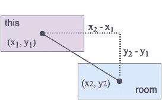

# 在 JavaScript 脚本中构建带角的段落

> 原文：<https://javascript.plainenglish.io/javascript-roguelikes-connecting-diagonal-dungeon-rooms-using-corners-79f460f96615?source=collection_archive---------4----------------------->


Image by Author

如果你想要一个可视化的有挑战性的编程任务，试着写一个自动生成关卡的冒险游戏。有时候，我正在写逻辑，把房间和通道连接起来，我发现自己拿起一张纸，画了许多图表来检查我的想法。

在过去的几周里，我一直在用 JavaScript 为 rogue likes——涉及过程级生成的 2D 冒险游戏——写房间生成算法。

在之前的教程中，我讲述了如何只用直走廊连接房间。虽然这对于彼此面对的房间很有效，但是成对的彼此对角的房间却被忽略了！结果，我们最终得到的是不相连的房间网络，如下图所示。


在本教程中，我们将编写逻辑，使用两个在拐角处相交的通道连接两个对角放置的房间。结果将会是一个看起来像下面的游戏关卡。


请随意阅读这篇文章或完成部分或全部项目，这取决于您在旅程中所处的位置。

# 项目文件

虽然本文涵盖了一个更大的游戏项目的一部分，但是每个阶段都有自己的起始代码目录，因此您可以直接进入第 4 阶段，而无需任何前期工作。

要下载项目目录，可以去这个 [Git repo](https://github.com/nevkatz/js-roguelike-rooms) ，点击*代码*，点击*下载 ZIP。*或者，您可以从命令行克隆它:

```
git clone https://github.com/nevkatz/js-roguelike-rooms.git
```

在下载的 repo 中，有一个`phase-4-corners`目录，您可以使用下面的结构在其中工作。

```
phase-4-corners
  |
  *--index.html
  |
  *--css 
  |   |
  |   *--style.css
  |
  |
  *--js 
      |
      *--**script.js**
      |
      *--game.js
      |
      *--**room.js**
      |
      *--path.js
```

在这个阶段 4 目录中，先前阶段的所有方法都已经完成。这可以让您腾出手来完成手头的任务，这些任务出现在两个 JavaScript 文件中:

*   `script.js`，运行游戏
*   `room.js`，其中包含了`Room`类

如果有帮助的话，您可以查看一下`phase-5-recursion`目录中的完整代码，这是下一篇教程要用到的，还有`solutions`目录。

# 概观

我们将在`room.js`中编写实现以下功能的方法:

*   查找附近的房间
*   用一对垂直的路径连接对角的一对房间

在`room.js`中写入上述逻辑后，我们将在`script.js`中激活它。如果完成的算法运行在两个房间的对角线上，它将尝试用相交于一个角的两条线将它们连接起来。


Diagonal rooms can still connect

`script.js`中处理等级生成的功能是`generateMapRooms`。到目前为止，它看起来像下面的函数。

generateMapRooms function.

请注意，房间生成后，我们将遍历所有房间。在下面的代码中，每个房间都试图连接到直接面对它的一个房间。

```
for (var room of game.rooms) {       

      success = room.findFacingRooms(min); }
```

在这个循环中，我们将最终添加一个额外的功能，`nearestNeighbor`，它根据中心之间的距离找到最近的可用房间，并尝试与之连接。

```
for (var room of game.rooms) {       

      success = room.findFacingRooms(min); **success = nearestNeighbor();** }
```

如果房间是斜向的，我们将编写额外的逻辑来处理这个问题，通过建立两个在一个角落相交的垂直走廊。

# 查找附近的邻居

在我们连接到一个房间之前，我们必须找到一个——`nearestNeighbor`的目标是找到最近的可用房间。它是这样工作的:

*   通过过滤掉方法调用(MC)房间和它已经连接到的房间，制作一个可用测试房间的列表。
*   从最近到最远对房间进行排序。
*   首先尝试连接到最近的房间。
*   如果不起作用，尝试下一个最接近的。
*   重复，直到我们找到一个房间或到达列表的末尾。

过程就是这样。让我们打开`room.js`文件，并在现有的`nearestNeighbor`方法中声明一个`success`变量。

```
Room.prototype.nearestNeighbor = function(rooms) { **let success = false;**}
```

## 过滤室

在这个方法中，让我们找到潜在的房间——要么从传入的参数中，要么从上一篇教程中的`findPotentialRooms()`函数中，

```
let success = false;**rooms = rooms || this.findPotentialRooms();**
```

下面是`findPotentialRooms`，一个`Room`对象用它从游戏范围的`rooms`数组中过滤掉它自己和它的邻居。

现在，让我们使用另一种自定义方法过滤掉被中间房间阻挡的那些，这种方法已经在我们的[之前的教程](/connecting-rooms-in-a-javascript-roguelike-8e6212c54c9) : `roomBetween`中编写和介绍过。

```
rooms = rooms.filter(x => !this.roomBetween(x));
```

## 查找房间的邻近度

为了评估一个给定的房间有多近，我们需要一点数学知识。让我们看看下面的两个房间，中心之间的距离是一个直角三角形的斜边。


The distance between centers

要求距离，我们可以减去坐标，得到三角形的两条“腿”。然后我们可以把它们加在一起，求出平方根。


Image from Google search results.

辅助函数`distanceTo`使用这个距离公式找到两个房间中心之间的距离。下面是完整的功能。

The distanceTo method.

让我们看看当紫色房间调用方法时，函数是如何与图连接的。



In the code, the purple room calling the method is known as “this.” The other one is “room.”

*   *x1* 和 *x2* 写成`this.center.x`和`room.center.x`。
*   同时， *y1* 和 *y2* 分别是`this.center.y`和`room.center.y`。
*   `x`值之差为`diffX`。

```
let diffX = this.center.x - room.center.x;
```

*   `y`值之差为`diffY`。

```
let diffY = this.center.y - room.center.y;
```

*   在下面的行中，`Math.pow()`计算每个距离的平方，`Math.sqrt()`计算总和的平方根。

```
let d = **Math.sqrt**(**Math.pow**(diffX, 2) + **Math.pow**(diffY, 2));
```

## 根据距离对房间进行分类

现在`distanceTo`已经完成，让我们编写第二个助手，我们可以用它来根据房间离方法调用房间的远近对它们进行排序。

```
const compareDist = (room1,room2) => {
      return distanceTo(room1) - distanceTo(room2);
};
```

我们的助手就位后，让我们将房间从近到远排序。

```
let sorted = rooms.sort(compareDist);
```

## 尝试连接到可能的房间

最后，让我们循环遍历各个房间，并在房间成功连接一个房间时返回。最近的房间有优先权，但是如果一个不行，我们就去下一个最近的房间。

```
for (let room of sorted) { success = this.connectRoom(room); if (success) { break; }
}
return success;
```

注意，在循环中，我们调用了`connectRoom`方法，它连接了对面的房间，但还没有连接对角的房间。

下面是完整的`nearestNeighbor`方法，包括`distanceTo`、`compareDist`和`connectRoom`。

回到`script.js`，我们现在可以将`nearestNeighbor()`添加到`generateMapRooms`函数的循环中。

```
for (var room of game.rooms) { success = room.findFacingRooms(min); **success = room.nearestNeighbor();**}
```

代码运行时应该没有错误，但是对角线房间还不能连接。为了实现这一点，我们需要加强`connectRoom`方法，它看起来像下面这样。

The initial method only connects facing rooms.

这就把我们带到了教程的第二部分，它涉及到对角方向房间的连接。

# 用转角连接房间

如果最近的邻居在斜对面，我们希望使用两个在拐角处相遇的通道来连接房间。


The basic idea.

为了弄清楚我们将在哪里实现这一点，让我们仔细看看`connectRoom`中的现有代码，到目前为止，只有当面对的房间有足够多的`x`或`y`坐标时，这些代码才会连接它们。(最小坐标数`min`设置为`3`。)

The connect room function.

为此，它调用`directConnect`，这在[之前的教程](/connecting-rooms-in-a-javascript-roguelike-8e6212c54c9)中有所介绍，并用一条直线连接面对的房间。

如果尝试直接连接失败，`success`将在`directConnect`之后`false`。如果是这种情况，我们希望尝试连接两条在拐角处相交的路径。

```
if (this.sharesCoordsWith(room, 'x', min) || 
    this.sharesCoordsWith(room, 'y', min)) { success = this.directConnect(room, min);}
**if (!success) {****// try a corner!
}**
```

下面是我们可以在`!success`条件中添加的内容:两个辅助方法，`vertCorner`和`horizCorner`，它们将尝试构建这两条拐角形成线。

```
if (!success) {

 **     let vertCorner = {x:this.center.x,y:room.center.y};** **let horizCorner = {x:room.center.x, y:this.center.y};**
}
```

## 形成拐角路径的两种方式

如果房间使用第一种方法`cornerVert`，一条垂直路径连接到其顶部或底部。


The cornerVert method makes a vertical line touch the method-calling room.

如果房间使用另一种方法`cornerHoriz`，路径将连接到它的左边或右边。


The cornerHoriz method makes a horizontal line touch the method-calling room.

## 决定哪种转角类型

我们采用的方法取决于两件事:

*   随机值，存储在新变量`vert`中，介于 0 和 1 之间；
*   不管这个角落是否在另一个房间

下面是决定角类型的代码，您可以将它直接添加到定义角的逻辑的下面。

我们首先做一件相当于抛硬币的事情，看看我们是否希望原始路径垂直或水平地连接到方法调用室。

```
let vert = Math.random() < 0.5;
```

布尔值`vert`在决定这一点上有一定作用，但并没有全部权力。

同样通过调用`inRoom`获得水平角，看看其他方法是否会失败，即使`vert`是`false`，我们仍然可以尝试`cornerVert`。

```
if ((vert || **game.inRoom(horizCorner**)) && !game.inRoom(vertCorner)) {
         success = this.cornerVert(room, vertCorner);
}
```

## 一系列用于检查角砖的一行程序

现在让我们快速绕到`game.js`并编写`inRoom`方法，一个`Game`对象用它来测试一个可能的角落是否会在任何一个房间里。

该方法在`game.rooms`上调用`find`来查看是否有房间`encloses`角落瓷砖的`x`和`y`坐标。

## 房间里有瓷砖吗？

`encloses`方法通过在`x`和`y`坐标上调用另一个方法`contains`来测试一个点是否在一个房间中。

```
Room.prototype.encloses = function(x,y) {
   return this.contains(x,'x') && this.contains(y,'y');
}
```

## 直线包含坐标吗？

`contains`方法测试坐标`c`(或者是`x`或者是`y`)是否分别位于房间水平或垂直边的起点和终点之间。我们可以这样写。

```
Room.prototype.contains = function(c, prop) {
   return c >= this.start[prop] && c <= this.end[prop];
}
```

有了`inRoom`和它的助手，我们可以避免绘制一个落在房间里的角。现在，我们来看看如何用转角连接房间。

## 形成一个角落

在`cornerVert`方法中，方法调用室(`this`)以垂直线到达拐角。


An example of how a room would connect with cornerVert.

回到`connectRoom`，我们用下面的线定义了这个角。

```
let vertCorner = {x:this.center.x,y:room.center.y};
```

角落，以及目标房间，然后被传入`cornerVert`。

```
success = this.cornerVert(room, vertCorner);
```

## 拐角倒置法

现在让我们开始`cornerVert`方法并初始化我们的垂直和水平路径。

```
Room.prototype.cornerVert = function(room, corner) {let vert = new Path(), horiz = new Path();
}
```

## 上述案例

先说垂直路径。如果调用方法的房间(紫色)在目标房间(蓝色)的上面，那么路径就从它的下面开始，一直延伸到角落。


The case in cornerVert where the room calling the method is above.

这个场景在这里的代码中被检查和处理，其中`this`是方法调用房间，`room`是目标房间。

```
if (this.end.y < room.center.y) {
      vert.start = {x:this.center.x, y:this.end.y + 1};
      vert.end = corner;
}
```

## 下例

如果方法调用(MC)房间在下面，路径从角落开始，向下，在 MC 房间的顶部结束。


The case in cornerVert where the room calling the method is below.

下面的代码以同样的方式处理这种情况。

```
else if (this.start.y > room.center.y)  { vert.start = corner;
       vert.end = {x:this.center.x, y:this.start.y - 1};
}
```

如果两种情况都不成立，这意味着目标房间的垂直中心在 MC 房间的顶部和底部之间，所以我们必须返回`false`。

```
else { return false; }
```

## 左边的箱子

现在，让我们创建水平路径。如果 MC 房间在左侧，则该线从角落开始，一直延伸到目标房间。


The case in cornerVert where the room calling the method is on the left.

```
if (this.onLeft(room)) {
   horiz.start = corner;
   horiz.end = {x:room.start.x - 1, y:room.center.y};
 }
```

## 正确的案例

如果尝试连接的房间在右边，则水平路径从目标房间向右画到角落。


The case in cornerVert where the method-calling room is on the right.

```
else if (this.center.x > room.end.x) {
      horiz.start = {x:room.end.x + 1, y:room.center.y};
      horiz.end = corner;
}
```

## 连接房间

如果生成的路径不与其他路径相邻，我们就绘制它们，使房间成为邻居。

```
if (!vert.isAdjacentVert() && !horiz.isAdjacentHoriz() {
      game.addPath(vert);
      game.addPath(horiz);
      this.addNeighbor(room);
}
```

最后，我们根据目标房间现在是否是邻居返回一个布尔值。

```
return this.neighbors.includes(room);
```

随意检查[全法](https://gist.github.com/nevkatz/3910bd2c48cc8a1c204c991fe9dbbf83)检查你的工作。

## 拐角水平法

现在，让我们试着用一条水平线与方法调用室形成一个角。该方法以与`cornerVert`相同的方式开始。

```
Room.prototype.cornerHoriz = function(room, corner) {let horiz = new Path(), vert = new Path;}
```

下面是一个关于`cornerHoriz`的例子，水平线的起点与方法调用方接触。


Here, the horizontal line touches the method-calling room.

如果 MC 房间的右边缘在另一个房间的垂直中线的左边，则水平线从方法调用房间画到角落。

```
if (this.end.x < room.center.x) {
         horiz.start = {x:this.end.x + 1,y:this.center.y},
         horiz.end = corner
}
```

之后，如果 MC 房间的水平中线高于另一个房间的顶边，则从角落向另一个房间绘制垂直线。


Here, the MC room’s (dashed) midline is above the top edge of the room.

下面的代码使用`this.center.y`表示中线的位置，包含了这一点。

```
if (this.center.y < room.start.y) {
      vert.start = corner,
      vert.end = {x:room.center.x, y:room.start.y - 1}
}
```

所以像以前一样，我们检查两个房间是如何定位的，并相应地画线。

看你能不能自己写完`cornerHoriz`剩下的部分。万一遇到阻碍，可以参考这个 [Github gis](https://gist.github.com/nevkatz/bfe82e85bf77044e07aa6ef2fbf5d9f3) t 或者`solutions`文件夹里的`room.js`获取完整代码。

一旦完成，返回到`script.js`中的`generateMapRooms`。一旦出现，就在`findFacingRooms`下面添加`nearestNeighbor`方法。这将使房间有可能通过在拐角处相交的路径连接到其他房间。

```
for (var room of game.rooms) { success = room.findFacingRooms(min); **success = room.nearestNeighbor();**

}
```

如果你做到了这一点，干得好。你现在应该可以在你的`project`目录中测试整个游戏了。这是一支笔，供你检查工作。

# 后续步骤

*   请注意，所有拐角形成路径都从房间的水平或垂直中心开始。您可以尝试修改代码，使它们从中心以外的地方开始。
*   在少数情况下，并非所有房间都是连通的。我们将在下一个用递归查找房间的教程中解决这个问题。

目前就这些，如果你感兴趣的话，前面的教程在下面。日安！

[](/connecting-rooms-in-a-javascript-roguelike-8e6212c54c9) [## 如何在 JavaScript Roguelike 中连接房间

### 让我们用香草 JS 建造一些走廊。

javascript.plainenglish.io](/connecting-rooms-in-a-javascript-roguelike-8e6212c54c9) 

*考虑注册*[***Medium***](https://medium.com/@nevkatz/membership)*无限制访问我的文章以及成千上万其他作家的文章。*

*更多内容请看*[***plain English . io***](https://plainenglish.io/)*。报名参加我们的* [***免费周报***](http://newsletter.plainenglish.io/) *。关注我们关于*[***Twitter***](https://twitter.com/inPlainEngHQ)*和*[***LinkedIn***](https://www.linkedin.com/company/inplainenglish/)*。加入我们的* [***社区不和谐***](https://discord.gg/GtDtUAvyhW) *。*