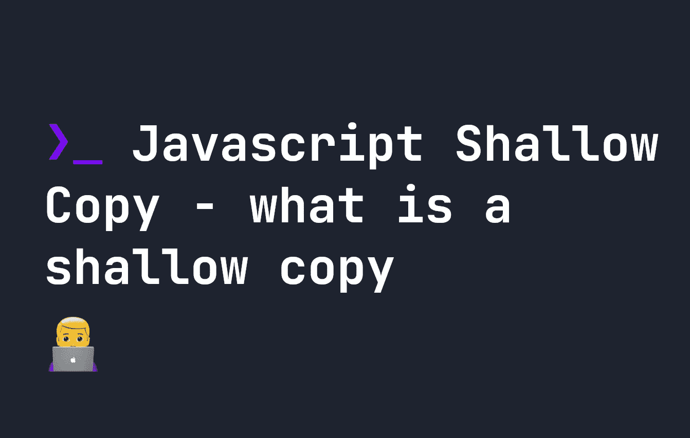

# JavaScript 浅拷贝——什么是浅拷贝？

> 原文：<https://javascript.plainenglish.io/javascript-shallow-copy-what-is-a-shallow-copy-99c8a26acba2?source=collection_archive---------10----------------------->

## JavaScript 中的浅拷贝是指向内存中相同引用的拷贝，因此是相同的值。让我们了解一下它们是如何工作的。



**浅拷贝**和**深拷贝**是 Javascript 中的术语，如果你以前从未听说过，可能会感到困惑。经常听说像[切片](https://fjolt.com/article/javascript-slice)或[过滤](https://fjolt.com/article/javascript-filter)这样的数组方法只是原始数组的一个简单拷贝。

# JavaScript 中的浅拷贝是什么？

**数组或对象的浅拷贝**是指它们在内存中都有相同的[引用](https://fjolt.com/article/javascript-by-reference-by-value)。这意味着如果你改变浅层拷贝，它**也可能**改变原始拷贝。我说**可能是**，因为情况并非总是如此。

让我们看一个使用`slice`的例子:

```
let arrayOne = [ '⚡️', '🔎', '🔑', '🔩' ];
let arrayOneSlice = arrayOne.slice(2, 3); console.log(arrayOne); // [ '⚡️', '🔎', '🔑', '🔩' ]
console.log(arrayOneSlice); // [ '🔑' ]
```

这里我们有一个数组，我们把它放在变量`arrayOneSlice`中`slice`。这两个数组在内存中有相同的引用，因为`slice`对它们进行了浅层复制。所以如果我们试图更新`arrayOneSlice`，它也会影响`arrayOne`，对吗？

```
let arrayOne = [ '⚡️', '🔎', '🔑', '🔩' ];
let arrayOneSlice = arrayOne.slice(2, 3); // Update arrayOneSlice
arrayOneSlice[2] = '⚡️'console.log(arrayOne); // [ '⚡️', '🔎', '🔑', '🔩' ]
console.log(arrayOneSlice); // [ '🔑', empty, '⚡️' ]
```

只是，它没有——因为我们使用了方括号符号，Javascript 将其解释为将新值放入`[2]`位置。所以只有`arrayOneSlice`被更新——这也是有原因的。虽然'🔑处于`arrayOne`中的`[2]`位置，处于`arrayOneSlice`中的`[0]`位置。这可能会给人一种错觉，以为这两个数组是副本，彼此独立运行——但事实也并非如此。考虑下面的例子:

```
let arrayOne = [ { items: [ '🔎' ]}, '🔎', '🔑', '🔩' ];
let arrayOneSlice = arrayOne.slice(0, 3); // Update arrayOneSlice
arrayOneSlice[0].items = [ '⚡️' ]console.log(arrayOne); // [ { items: [ '⚡️' ]}, '🔎', '🔑', '🔩' ]
console.log(arrayOneSlice); // [ { items: [ '⚡️' ]}, '🔎', '🔑' ]
```

这里，我们更新了`arrayOneSlice[0].items`，它在两个数组上都被更新了，因为`items`存在于两个数组的相同位置，我们没有分配新的值，而是使用点`.`符号来更新现有的属性。在 Javascript 中，这更新了我们使用`slice`制作的原件和副本。

**使用浅层副本要记住的要点**是，调整一个副本会影响你试图复制的原件——内存中的引用是相同的，引用指向数组的值——所以你必须更加小心。你不想做的是创建一个意外的行为，数组的原始和副本在你期望的时候没有同步更新。

# 那么如何用 Javascript 做深度拷贝呢？

历史上，Javascript 在深度拷贝方面有一点问题。Javascript 中的大多数方法，像[三点语法](https://fjolt.com/article/javascript-three-dots-spread-operator)、`Object.create()`、`Object.assign()`和`Array.from()`都是浅拷贝。

**深层副本**在内存中有不同的引用，所以你不用担心在使用它们时会改变原始副本。当我们想要避免这种情况时，这使得它们非常有用。

深度拷贝可以通过序列化来实现，或者通过定制脚本将对象或数组的每个部分复制到一个新的对象或数组中，从而在内存中创建一个新的引用。例如，这将在 JavaScript 中创建一个具有新引用的新数组:

```
let myArray = [ 1, 2, 3, 4 ];
let deepCopy = JSON.parse(JSON.stringify(myArray));
```

您也可以使用`structuredClone()`功能进行深度复制:

```
let myArray = [ 1, 2, 3, 4 ];
let deepCopy = structuredClone(myArray);
```

现在我们已经创建了具有深层副本的新数组，我们不再需要担心在更改副本时会弄乱原始数组。

# 结论

浅层复制非常令人困惑，是 JavaScript 的众多怪癖之一。了解它们是什么可以在将来调试时为您省去很多麻烦，使用深层副本是避免这些问题的好方法。

*更多内容请看*[***plain English . io***](https://plainenglish.io/)*。报名参加我们的* [***免费周报***](http://newsletter.plainenglish.io/) *。关注我们关于*[***Twitter***](https://twitter.com/inPlainEngHQ)[***LinkedIn***](https://www.linkedin.com/company/inplainenglish/)*[***YouTube***](https://www.youtube.com/channel/UCtipWUghju290NWcn8jhyAw)*[***不和***](https://discord.gg/GtDtUAvyhW) *。对增长黑客感兴趣？检查* [***电路***](https://circuit.ooo/) *。***