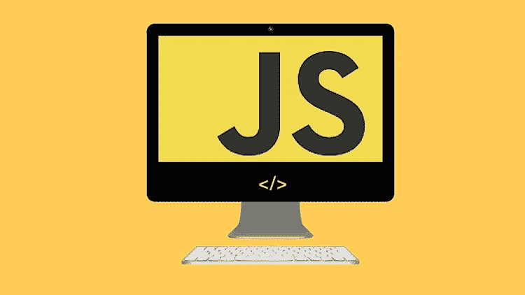

# JavaScript 严格模式概述

> 原文：<https://javascript.plainenglish.io/javascript-strict-mode-71f514f7aa39?source=collection_archive---------2----------------------->

## JavaScript 严格模式是 ECMAScript 5 中的一个创新特性，它使我们能够将程序置于严格的操作视角中。



# 介绍

[JavaScript](https://www.technologiesinindustry4.com/2022/01/javascript-data-types.html) 严格模式是 ECMAScript 5 中的一个创新特性。它使我们能够从严格的操作角度来看待一个程序。这种严格的上下文会阻止执行明确的操作，并抛出额外的异常。

声明使用严格启动浏览器使用严格模式。它是 [JavaScript](https://www.technologiesinindustry4.com/2022/01/javascript-data-types.html) 的一个紧凑且更安全的特性集。使用严格文本的目的是指定代码应该在严格模式下实现。它支持我们对一些隐藏的 bug 进行分类。我们不能在严格模式下练习未声明的变量。

在本文中，我们将对 [JavaScript](https://www.technologiesinindustry4.com/2022/01/javascript-data-types.html) 中的严格模式进行概述。

# 描述

JavaScript 的严格模式是一种挑选 JavaScript 的有限变体的方法。以这种方式间接退出草率模式。严格模式故意具有不同于普通代码的语义。浏览器，而不是备份严格模式，将以不同于浏览器的行为运行代码。因此，不要依赖没有特性测试的严格模式来支持严格模式的相关特性。

# 利益

*   严格模式对普通的 [JavaScript](https://www.technologiesinindustry4.com/2022/01/javascript-data-types.html) 语义进行了各种修改。
*   它通过将不同的 JavaScript 静默错误改为抛出错误来移除它们。
*   它修复了 JavaScript 引擎难以进行优化的错误。
*   严格模式代码有时可能会比非严格模式的匹配代码运行得更快。
*   它禁止在 ECMAScript 的未来版本中定义一些语法。
*   当采取相对不安全的行动时，严格模式停止。
*   例如，快速访问全局对象。
*   严格模式限制不清楚或考虑不周的特性。
*   这使得编写安全的 [JavaScript](https://www.technologiesinindustry4.com/2022/01/javascript-data-types.html) 变得轻松。

# 为什么要使用严格模式？

在 JavaScript 中使用严格模式有几个好处。一件简单的事情是如果我们在全局状态下定义一个变量。例如，剥夺识别 var 命令，如下所述。

```
"use strict";
globalVar = "evil"
```

在严格模式下这将是一个错误。这对我们的开发人员来说是一个好消息，因为全局变量在 JavaScript 中是非常糟糕的。另一方面，如果同样的代码在非严格模式下运行，就不会有关于这个错误的抱怨。无论我们是在严格模式还是非严格模式下运行， [JavaScript](https://www.technologiesinindustry4.com/2022/01/javascript-data-types.html) 中的相同代码可能会产生不同的结果。

# 严格模式的使用

有两种方法可以使用严格模式

*   在整个脚本的全局范围内使用。
*   它可以在单独的功能中实现。

请记住，严格模式不适用于用{}大括号括起来的块语句。

## **整个脚本的全局范围:**

*   将精确的语句严格用于调用整个脚本的严格模式。
*   同样，在任何其他语句之前使用 strict。

```
// Whole-script strict mode syntax
'use strict';
 let v = "strict mode script!";
```

*   这是不可能盲目地连接无冲突的脚本。
*   尝试将严格模式脚本与非严格模式脚本连接起来。
*   整个连接看起来是严格的，因为反过来也是如此。

## **函数的严格模式:**

*   把精确的语句严格用于调用函数的严格模式。
*   此外，在任何其他语句之前，严格地在函数体中使用。

```
function strict() {
  // Function-level strict mode syntax
  'use strict';
  function nested() { return 'And so am I!'; }
  return "Hi!  I'm a strict mode function!  " + nested();
}
function notStrict() { return "I'm not strict."; }
```

# 在严格模式下不允许

*   未定义变量的实践
*   保留关键字用作变量或函数名
*   匹配对象的属性
*   函数的相同参数
*   将值分配给只读属性
*   调整参数对象
*   八进制数字文字
*   with 语句
*   用于生成变量的 eval 函数

# 保护 [JavaScript](https://www.technologiesinindustry4.com/2022/01/javascript-data-types.html)

*   我们使用严格模式使编写安全可靠的 JavaScript 变得更加容易。
*   它的易处理性使得在没有许多运行时检查的情况下做到这一点令人难以置信。
*   一些严格模式的变化，以及用户提交的 JavaScript 必须是严格模式代码。
*   以明确的方式调用它，大大减少了对那些运行时命令的需求。
*   在严格模式下，分配给函数的值不需要成为对象。
*   这始终是一个正常函数的对象。

```
'use strict';
function fun() { return this; }
console.assert(fun() === undefined);
console.assert(fun.call(2) === 2);
console.assert(fun.apply(null) === null);
console.assert(fun.call(undefined) === undefined);
console.assert(fun.bind(true)() === true);
```

# 结论

*   JavaScript 中的严格模式使得编写安全的 [JavaScript](https://www.technologiesinindustry4.com/2022/01/javascript-data-types.html) 更加容易。
*   它在接受糟糕的语法成为真正的错误之前就偏离了。
*   开发人员将不会获得任何在标准 JavaScript 中为不可写属性赋值的错误反馈。
*   在严格模式下，对不可写属性的某些赋值将引发错误。
*   在严格模式下，为将来的 JavaScript 版本保留的关键字不能用作变量名。
*   如果我们使用浏览器控制台来测试任何特性，默认情况下不需要严格模式。我们必须使用 use strict 手动添加。

欲了解更多详情，请访问:

[](https://www.technologiesinindustry4.com/2022/01/javascript-strict-mode.html) [## JavaScript 严格模式

### 简介 JavaScript 严格模式是 ECMAScript 5 中的一个创新特性。它使我们能够把一个程序放在一个…

www.technologiesinindustry4.com](https://www.technologiesinindustry4.com/2022/01/javascript-strict-mode.html) 

*更多内容请看*[***plain English . io***](http://plainenglish.io/)*。报名参加我们的* [***免费周报***](http://newsletter.plainenglish.io/) *。在我们的* [***社区***](https://discord.gg/GtDtUAvyhW) *获得独家获得写作机会和建议。*