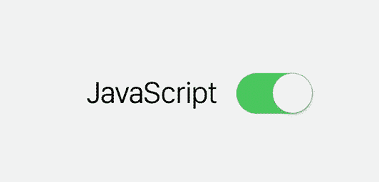
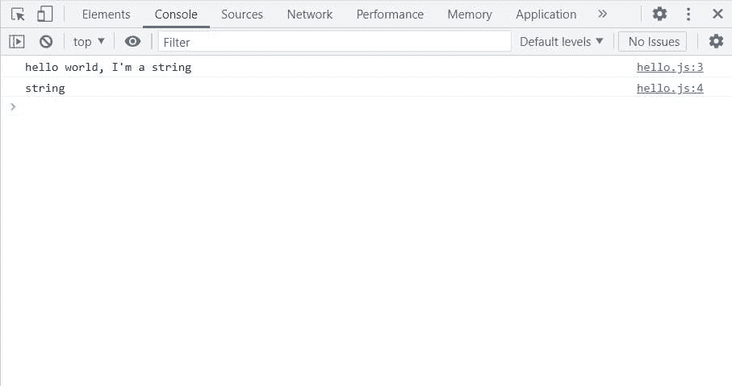
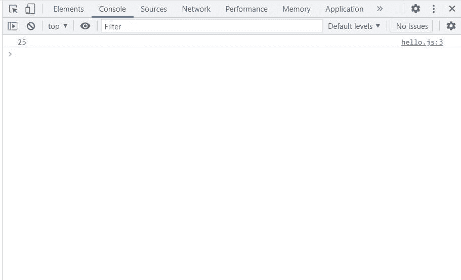
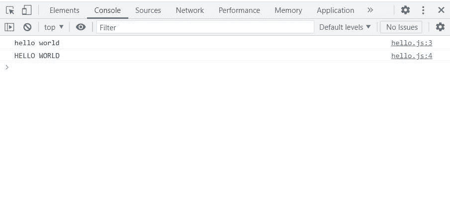
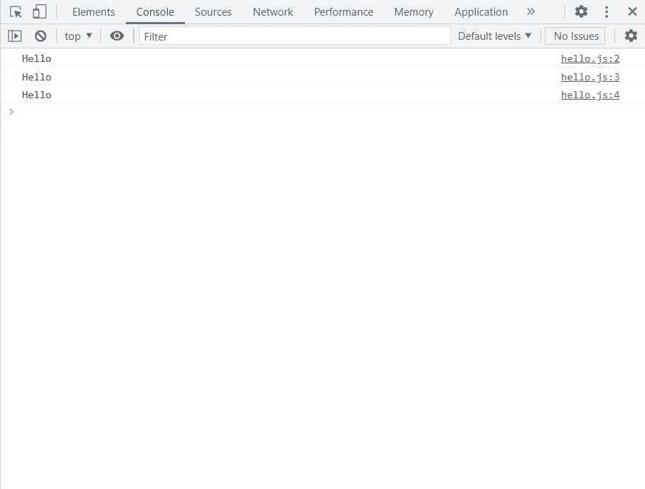
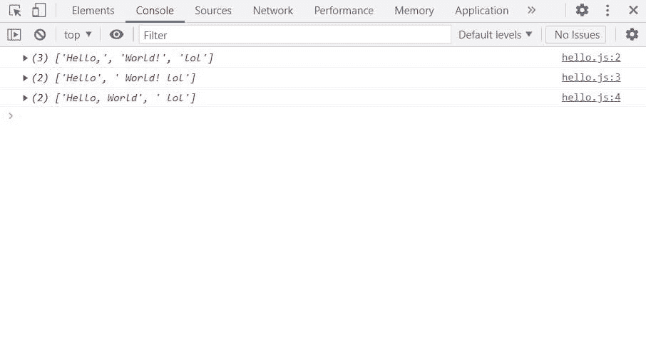
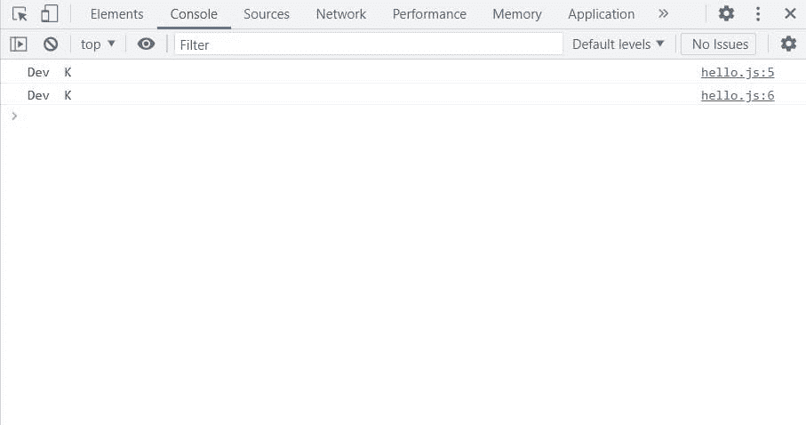
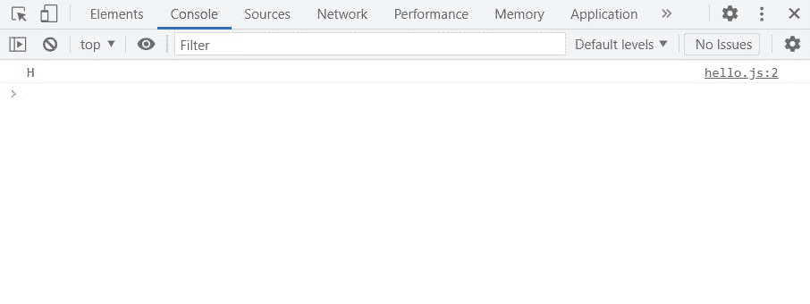
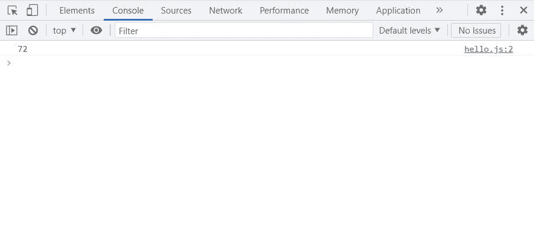

# JavaScript 字符串及其方法

> 原文：<https://javascript.plainenglish.io/javascript-string-methods-b4d3e9068fce?source=collection_archive---------10----------------------->



# 介绍

JavaScript 是最流行的 web 开发语言。几乎 95%的网站或网络应用程序都使用 JavaScript。所以，如果你在网上工作，了解 JavaScript 是很重要的。

在这篇文章中，我将解释 JavaScript 中的字符串，这是编程中最重要的概念之一，也是我们在日常生活中使用的东西。

# 关于弦乐的一切

字符串基本上是一个句子，或者你可以说是一个字符的集合或列表，就像本文中的内容是显示给你的字符串。或者假设当你在 google 上搜索某个东西时，你得到一个链接列表，或者当你在一个调查表格中输入一些特征数据，比如一个段落，它们也是字符串。在 JavaScript 中`String`可以使用`var`或`let`关键字来定义:

```
var str = "hello world, I'm a string";console.log(str);
console.log(typeof str);
```



# 字符串中的方法

# 长度

假设你想找出一个字符串的长度(字符串中的字符数)。在这种情况下，您可以使用:

```
var str = "hello world, I'm a string";
console.log(str.length);
```



# 大写和小写

假设你想让字符串中的每个字母都大写，或者你想让字符串中的每个字符都小写，那么在这种情况下你可以使用:

```
var capstr = "hello world";
var lowerstr = "HELLO WORLD";
console.log(capstr.toLowerCase());
console.log(lowerstr.toUpperCase());
```



# 从字符串中提取一部分

假设您想从给定的字符串中提取特定的部分，在这种情况下，您可以使用三种不同的方法:

```
var str = "Hello World!";
console.log(str.slice(0, 5));
console.log(str.substring(0, 5));
console.log(str.substr(0, 5));
```

这里的每个方法都有两个参数，前一个是`start`，后一个是`end`



# 拆分、修剪和连接

作为开发人员，您经常会遇到需要修剪输入的字符串以节省数据库空间的情况，在这种情况下，您可以使用 JavaScript 中的 trim 方法来删除字符串两边所有多余的空格:

```
var str = "   Hello World!   ";
console.log(str.trim());
```


现在，你有了一种感觉，如何从一个特定的标记中分离出一个字符串。例如，如果我让你在得到感叹号`!`的地方分割一个字符串，在这种情况下，你可以使用 split 方法，它将返回一个数组:

```
var str = "Hello, World! lol";
console.log(str.split(" "));
console.log(str.split(","));
console.log(str.split("!"));
```



现在，如果你想连接两个弹簧，比如名字和姓氏，你可以使用`concat()`或者使用`+`操作符:

复制

```
var firstName = "Dev ";
var lastName = "K";
var fullname = firstName.concat(" " + lastName);
var fullnameTwo = firstName + " " + lastName;
console.log(fullname);
console.log(fullnameTwo);
```



# 玩角色

假设我让你从一个字符串中返回一个字符，在这种情况下你可以使用`chatAt(position)`，这会返回给你一个给定位置的字符:

```
var str = "Hello World!";
console.log(str.charAt(0));
```



现在，如果你想得到字符串中某个特定字符的字符代码，你可以使用`charCodeAt(position)`，这将返回给你一个给定位置的字符代码:

```
var str = "Hello World!";
console.log(str.charCodeAt(0));
```



这将返回`72`，它是`H`的字符代码。

## 结论

所以，这就是我们作为开发人员在日常生活中使用的最常见的 JavaScript 字符串方法。如果你喜欢我的文章，一定要和你的同事分享。保持快乐，保持安全。

# 连接

[**领英**](https://www.linkedin.com/in/kumar009/)

[**碎碎念**](https://twitter.com/kumarkalyan_)

*更多内容看* [***说白了。报名参加我们的***](http://plainenglish.io/) **[***免费周报***](http://newsletter.plainenglish.io/) *。在我们的* [***社区不和谐***](https://discord.gg/GtDtUAvyhW) *获得独家获取写作机会和建议。***