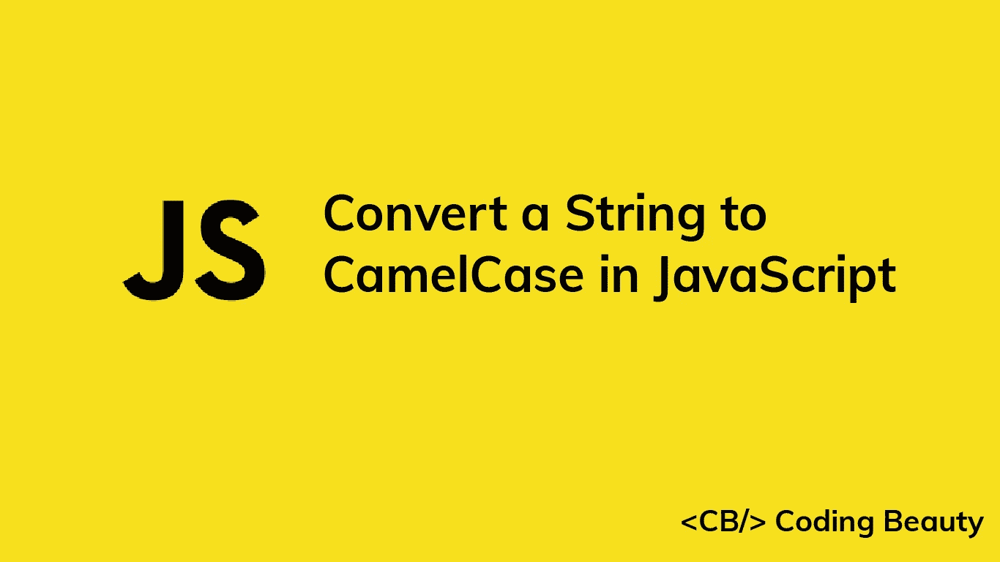

# 如何在 JavaScript 中将字符串转换为 CamelCase

> 原文：<https://javascript.plainenglish.io/javascript-string-to-camelcase-f9342850aa34?source=collection_archive---------4----------------------->



在 camelcase 中，短语的第一个单词是小写的，后面所有的单词都是大写的。在本文中，我们将探讨一些将 JavaScript 字符串转换成 camelcase 的简单方法。

# 字符串正则表达式替换

我们可以使用带有正则表达式匹配的`String` `replace`方法将字符串转换为骆驼大小写:

```
function camelize(str) {
  return str
    .replace(/(?:^\w|[A-Z]|\b\w)/g, (letter, index) =>
      index === 0
        ? letter.toLowerCase()
        : letter.toUpperCase()
    )
    .replace(/\s+/g, '');
}camelize('first variable name'); // firstVariableName
camelize('FirstVariable Name'); // firstVariableName
camelize('FirstVariableName'); // firstVariableName
```

第一个正则表达式用`^\w`匹配第一个字母，用`\b\w`匹配每个单词的第一个字母。它还匹配任何带有`[A-Z]`的大写字母。如果它是字符串的第一个字母，它就小写，否则就大写。之后，它在第二个正则表达式中用`\s+`删除结果单词中的任何空格。

# 洛达什驼峰法

我们还可以使用 lodash 库中的`camelCase`方法将字符串转换成 camelcase。它的工作方式类似于上面的`camelize`函数。

```
_.camelize('first variable name'); // firstVariableName
_.camelize('FirstVariable Name'); // firstVariableName
_.camelize('FirstVariableName'); // firstVariableName
```

*更新于:*[*codingbeautydev.com*](https://codingbeautydev.com/blog/javascript-string-to-camelcase/)

每周获取新的 web 开发技巧和教程。


[**订阅**](https://codingbeautydev.com/newsletter)

*更多内容看* [***说白了。报名参加我们的***](https://plainenglish.io/) **[***免费每周简讯***](http://newsletter.plainenglish.io/) *。关注我们* [***推特***](https://twitter.com/inPlainEngHQ) *和*[***LinkedIn***](https://www.linkedin.com/company/inplainenglish/)*。查看我们的* [***社区不和谐***](https://discord.gg/GtDtUAvyhW) *加入我们的* [***人才集体***](https://inplainenglish.pallet.com/talent/welcome) *。***