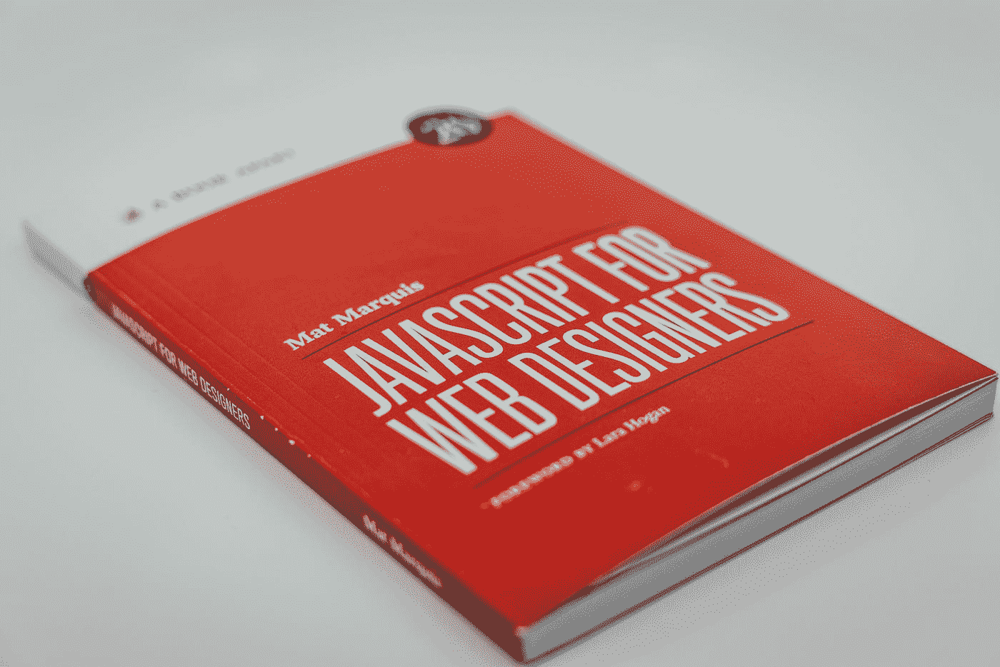

# JavaScript 字符串及其属性

> 原文：<https://javascript.plainenglish.io/javascript-strings-and-their-properties-b62fc80ab1f6?source=collection_archive---------16----------------------->

## 掌握使用 JavaScript 处理文本的艺术



Photo by [Claudio Schwarz](https://unsplash.com/@purzlbaum?utm_source=medium&utm_medium=referral) on [Unsplash](https://unsplash.com?utm_source=medium&utm_medium=referral)

JavaScript 作为一种编程语言有几种数据类型，而字符串数据类型恰好是其中最常用的数据类型之一。

JavaScript 中的字符串只是一系列字符(a-z、A-Z、0–9 和特殊字符)。字符串也可以称为字符串文字。字符用单引号或双引号括起来。

让我们来看一个字符串文字的例子。

```
'John Doe' //string literal with single quotes"Hello World!" //string literal with double quotes 
```

## 将字符串赋给变量

JavaScript 中使用字符串的方式是，将字符串赋给变量，这样字符串就可以在 JavaScript 代码的多个地方使用。

```
var age = "20years";var full_name = "Jane Doe";var email = 'johndoe@email.com';var favorite_fruit = new string("mango");
```

在上面的代码示例中，我们声明了三个不同的变量:**年龄**、**全名**和一个**电子邮件**变量。

为 **age** 变量分配了一个文本字符串(“20 年”)，为 **full_name** 变量分配了字符串“Jane Doe”，最后为 **email** 变量分配了字符串“johndoe@email.com”。

既然已经声明了这三个变量，并为它们分配了字符串值，我们就可以在代码的不同部分使用它们，并且每当我们在代码的任何部分使用任何变量名时，JavaScript 解释器都知道我们实际上引用的是存储在这些变量中的字符串值。

现在让我们来看看一些 JavaScript 字符串属性。

## 1.长度

length 属性用于确定字符串值的长度(长度/字符数)。

```
let month = "January";console.log(month.length); //returns 7 
```

这个特定的代码示例返回七(7)，因为它们实际上是文本字符串“January”中的七个字符。

```
let full_name = 'John Doe';console.log(full_name.length); //returns 8
```

在这里，我们得到 8，这是因为“John”和“Doe”之间的空格也被算作一个字符。

## 2.到大写

在 JavaScript 中，有时我们需要将一个文本字符串中的所有字符从小写转换成大写，这时 **toUpperCase()** 方法就派上了用场。

```
let full_name = 'Jane Doe';console.log(full_name.toUpperCase()); //returns JANE DOE
```

在本例中，toUpperCase()方法将存储在 full_name 变量中的字符串值的所有字符转换为大写字母。

## 3.变为小写

**toLowerCase()** 与 **toUpperCase()** 方法正好相反。此方法用于将字符串中的字符转换成小写字母。

让我们看一个例子。

```
let email = "JOHNDOE@EMAIL.COM";console.log(email.toLowerCase()); //returns janedoe@email.com
```

在这个例子中，我们看到 toLowerCase()方法将 email 变量中存储的字符串值的所有字符转换为小写(小写字母)。

## 4.替换

**replace()** 方法用字符串值中的另一个值替换指定的值。

```
let definition = "matter is anything that has weight and occupies space";let new_string = definition.replace("anything", "something"); console.log(new_string); //returns "matter is something that has weight and occupies space"
```

所以，在这个例子中，我们清楚地看到， **replace()** 用“某物”替换了单词“任何东西”。如果找到匹配，这个方法可以查找和替换字符串中的任何内容。

## 5.串联

**concat()** 方法用于连接两个或多个字符串值。

让我们看一个关于 **concat()** 方法如何工作的例子。

```
let first_name = "John";let last_name = 'Doe';let full_name = first_name.concat(" ", last_name);console.log(full_name); //returns "John Doe"
```

正如我们在输出中看到的， **concat()** 方法只是将 last_name 变量中的一个空格和字符串值添加到 first_name 变量中的字符串值和 full_name 变量中存储的新字符串中。

## 6.修剪开始

trimStart() 方法删除一串文本开头的任何空白。但是，此方法不删除字符之间的空格，也不删除字符串末尾的空格。

这里有一个例子。

```
let full_name = "   Johnny Cash   ";console.log(full_name.trimStart()); //returns "John Doe   "
```

当我们使用 **trimStart()** 方法时，我们在这个例子中看到，只有字符串开头的空格被删除，而末尾和字符之间的空格没有被删除。

## 7.修剪末端

**trimEnd()** 方法与 **trimStart()方法相反。**该方法删除一串文本末尾的任何空白。然而， **trimStart()** 方法不会删除字符和字符串开头之间的空格。

这里有一个例子。

```
let full_name = "   Johnny Cash   ";console.log(full_name.trimEnd()); //returns "   John Doe"
```

通过使用 **trimEnd()** 方法，我们在这个例子中看到，只有字符串末尾的空格被删除，而开头和字符之间的空格没有被修改。

## 8.附加装饰

trim() 方法删除一串文本两边的空白。然而，值得注意的是，这个方法不会删除字符串中字符之间的空格。

这里有一个例子。

```
let name = "    Johnny Cash    ";let trimed_name = name.trim();console.log(trimed_name); //returns "Johnny Cash"
```

在此示例中，trim 方法删除了 name 变量中存储的文本字符串两边的空格，然后将末尾没有空格的新文本字符串赋给 trimed_name 变量。

## 9.人物在

实际上有两种方法来访问字符串中的单个字符，但是，我们将看一下 **charAt()** 方法。

**charAt()** 方法根据调用时传递给它的索引号返回字符串值中的特定字符。值得注意的是，JavaScript 中字符串的字符有一个从零开始的索引系统，这意味着 JavaScript 中任何字符串的第一个字符的索引都是零(0)。

让我们来看看这个方法的实际应用。

```
const first_month = 'January';console.log(first_month.charAt(0)); //returns "J"console.log(first_month.charAt(1)); //returns "a"console.log(first_month.charAt(2)); //returns "n"
```

正如我们在上面的例子中看到的，我们已经声明了一个名为 first_month 的变量，并为其分配了字符串值“January”。

当我们使用 first_month **控制台记录字符串中的第一个字符(“一月”)时。charAt(0)** 我们得到“J”，正月**。charAt(1)** 返回“a”和正月**。charAt(2)** 返回“n”。

您可以通过参考 JavaScript 在线文档来了解更多关于 JavaScript 中字符串的知识。

这个话题到此为止。感谢您的阅读。

如果你喜欢这个故事，不要犹豫，跟着我，为更多这样的故事鼓掌。

编码快乐！

*更多内容看* [***说白了就是 io***](http://plainenglish.io/) *。报名参加我们的* [***免费周报***](http://newsletter.plainenglish.io/) *。在我们的* [***社区获得独家访问写作机会和建议***](https://discord.gg/GtDtUAvyhW) *。*