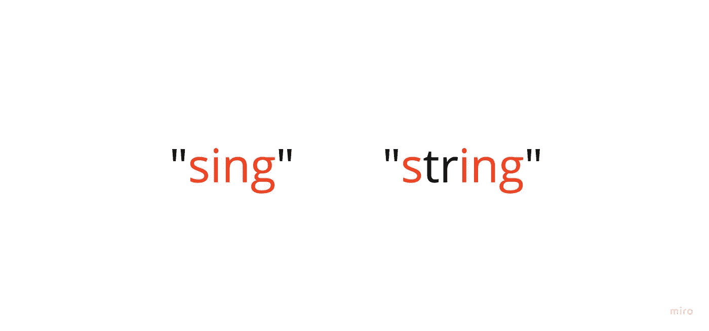

# JavaScript 子序列

> 原文：<https://javascript.plainenglish.io/javascript-subsequence-18996feb8c0f?source=collection_archive---------9----------------------->

## 另一个多指针模型

作为上一篇关注多指针问题解决模式的帖子的后续，我想再做一个问题来真正让这个概念深入人心，对我来说变得直观。

这一次，目标是识别一个字符串中的字符是否也能在另一个字符串中找到(以及排序问题)。

所以，如果我们传入上面的两个字符串，我们将返回 true。相反，如果我们传入“abc”和“acb ”,我们将返回 false。

让我们跳进来吧！

就像上一篇文章一样，我们将设置两个指针，只是这次一个用于迭代第一个字符串，另一个用于迭代第二个字符串。

在第 6 行，你可以看到我们在遍历完所有的 string1 之后想要停止，因为如果我们这样做了，我们找到了每个字母的匹配，并且我们的返回值为 true(找到了子序列)。

在循环中，这非常简单。如果两个单词中的字母在指针索引处匹配，我们就找到了匹配，两个指针都可以向前移动。如果不是，那么我们唯一感兴趣的是向前移动第二个指针，检查下一个字母是否与第一个指针匹配。

最后一部分是(在第 12 行)我们将检查我们的 p2 位置，如果我们已经移动了整个 string2，但是我们的循环仍然在运行(因为我们没有移动整个子串)，那么可以肯定地说，我们的子序列字符没有全部在第二个字符串中找到，我们返回 false。

这绝对不是一种让我为我想成为专家的问题做好准备的技术(中等难度到高难度的 Leetcode ),但它很有趣。我以前用了更多的时间复杂度更差的迭代来达到同样的结果，所以这是一个受欢迎的迂回！

*更多内容请看*[***plain English . io***](https://plainenglish.io/)*。报名参加我们的* [***免费周报***](http://newsletter.plainenglish.io/) *。关注我们关于*[***Twitter***](https://twitter.com/inPlainEngHQ)*和*[***LinkedIn***](https://www.linkedin.com/company/inplainenglish/)*。查看我们的* [***社区不和谐***](https://discord.gg/GtDtUAvyhW) *加入我们的* [***人才集体***](https://inplainenglish.pallet.com/talent/welcome) *。*