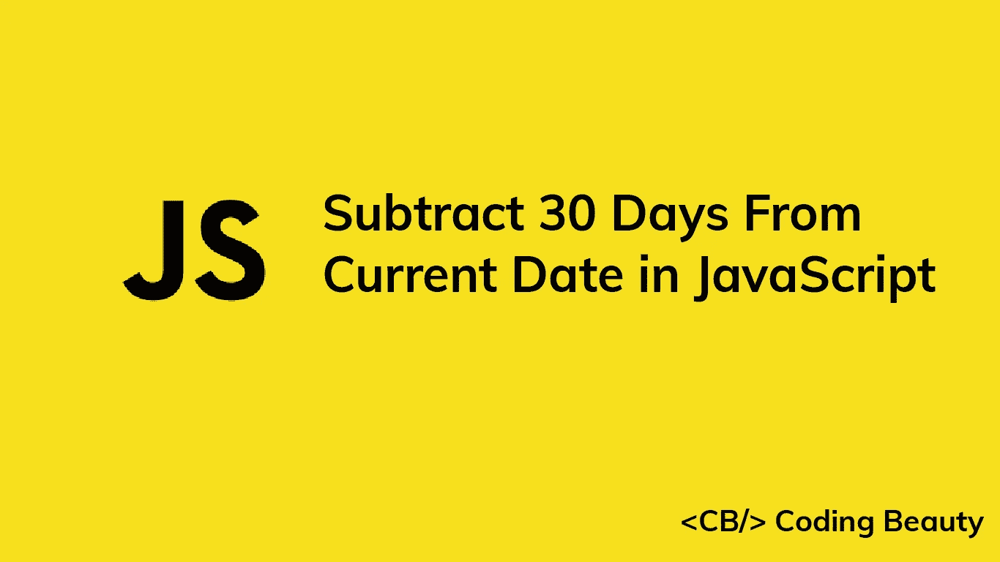

# 如何用 JavaScript 从当前日期减去 30 天

> 原文：<https://javascript.plainenglish.io/javascript-subtract-30-days-from-current-date-8a92b8fc2b1f?source=collection_archive---------7----------------------->

## 关于如何用 JavaScript 轻松地从当前日期减去 30 天的指南。



# 1.Date setDate()和 getDate()方法

要用 JavaScript 从当前日期减去 30 天:

1.  使用`Date()`构造函数创建一个带有当前日期的新的`Date`对象。
2.  在这个对象上调用`getDate()`方法来获取天数。
3.  从`getDate()`的返回值中减去 30。
4.  将减法的结果传递给`setDate()`方法。

```
// Current date: September 29, 2022
const date = new Date();date.setDate(date.getDate() - 30);// New date: August 30, 2022
console.log(date);
```

`Date getDate()`方法返回一个介于 1 和 31 之间的数字，表示特定的`Date`是一个月中的哪一天。

`Date setDate()`方法将`Date`对象中的日期更改为作为参数传递的数字。

如果您指定的日期会改变`Date`的月份或年份，`setDate()`会自动更新`Date`信息以反映这一点。

```
// April 25, 2022
const date = new Date('2022-04-25T00:00:00.000Z');date.setDate(40);// May 10, 2022
console.log(date); // 2022-05-10T00:00:00.000Zconsole.log(date.getDate()); // 10
```

四月只有 30 天，所以在这里将`40`传递给`setDate()`会使月份增加 1，并将一个月中的某一天设置为`10`。

# 2.date-fns subDays()函数

或者，我们可以使用[日期-fns](https://www.npmjs.com/package/date-fns) NPM 包中的`subDays()`函数从当前日期减去 30 天。`subDays()`接受一个`Date`对象和要减去的天数作为参数。它返回一个减去天数的新的`Date`对象。

```
import { subDays } from 'date-fns';// Current date: September 29, 2022
const date = new Date();const newDate = subDays(date, 30);// New date: August 30, 2022
console.log(newDate);
```

注意，`subDays()`返回一个新的`Date`对象，而没有改变传递给它的对象。

*原载于*[*codingbeautydev.com*](https://cbdev.link/e822ad)

# JavaScript 做的每一件疯狂的事情

一本关于 JavaScript 微妙的警告和鲜为人知的部分的迷人指南。


[**报名**](https://cbdev.link/d3c4eb) 立即免费领取一份。