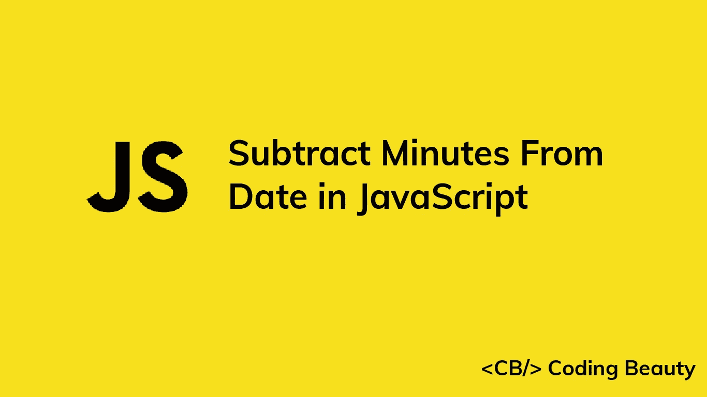

# 如何用 JavaScript 从日期中减去分钟

> 原文：<https://javascript.plainenglish.io/javascript-subtract-minutes-from-date-2e5e816f8313?source=collection_archive---------7----------------------->



让我们学习如何在 JavaScript 中轻松地从一个`Date`对象中减去任意分钟数。

# 1.`Date` `getMinutes()`和`setMinutes()`方法

从`Date`中减去分钟:

1.  调用`Date`上的`getMinutes()`方法得到会议记录。
2.  减去分钟数。
3.  将差异传递给`setMinutes()`方法。

例如:

```
function subtractMinutes(date, minutes) {
  date.setMinutes(date.getMinutes() - minutes); return date;
}// 2:20 pm on May 18, 2022
const date = new Date('2022-05-18T14:20:00.000Z');const newDate = subtractMinutes(date, 10);// 2:10 pm on May 18, 2022
console.log(newDate); // 2022-05-18T14:10:00.000Z
```

我们的`subtractMinutes()`函数接受一个`Date`对象和要减去的分钟数作为参数。它返回减去分钟后的同一个`Date`对象。

`Date` `getMinutes()`方法返回一个介于`0`和`59`之间的数字，表示特定`Date`的分钟数。

`Date` `setMinutes()`方法将`Date`的分钟数设置为指定的数字。

如果减去的分钟数减少了`Date`对象的小时、日、月或年，`setMinutes()`将自动更新`Date`中的信息以反映这一点。

```
// 10:10 am on March 13, 2022
const date = new Date('2022-03-13T10:10:00.000Z');date.setMinutes(date.getMinutes() - 30);// 9:40 am on March 13, 2022
console.log(date); // 2022-05-18T14:10:00.000Z
```

在本例中，将`Date`的分钟数减少 30 分钟会将小时数向后滚动 1 分钟。

## 避免副作用

`setMinutes()`方法改变了它所调用的`Date`对象。这给我们的`subtractMinutes()`函数带来了一个副作用。为了避免修改传递的`Date`并创建一个纯函数，制作一个`Date`的副本并在这个副本上调用`setMinutes()`，而不是原始的。

```
function subtractMinutes(date, minutes) {
  // 👇 make copy with "Date" constructor
  const dateCopy = new Date(date); dateCopy.setMinutes(date.getMinutes() - minutes); return dateCopy;
}const date = new Date('2022-02-20T11:25:00.000Z');const newDate = subtractMinutes(date, 5);// 11:20 am on Feb 20, 2022
console.log(newDate); // 2022-02-20T11:20:00.000Z// 👇 Original not modified
console.log(date); // 2022-02-20T11:25:00.000Z
```

**提示:**不修改外部状态的函数(即纯函数)更容易预测，也更容易推理，因为它们对于特定的输入总是给出相同的输出。这使得限制代码中副作用的数量成为一个很好的实践。

# 2.日期-fns `subMinutes()`功能

或者，我们可以使用 [date-fns](https://www.npmjs.com/package/date-fns) NPM 包中的`subMinutes()`函数来快速减去 JavaScript 中的`Date`分钟数。它像我们的纯`subtractMinutes()`函数一样工作。

```
import { subMinutes } from 'date-fns';const date = new Date('2022-10-03T20:50:00.000Z');const newDate = subMinutes(date, 25);// 8:25 pm on October 3, 2022
console.log(newDate); // 2019-02-20T11:20:00.000Z// Original not modified
console.log(date); // 2022-02-20T11:25:00.000Z
```

*原载于*[](https://cbdev.link/884f3c)

# *JavaScript 做的每一件疯狂的事情*

*一本关于 JavaScript 微妙的警告和鲜为人知的部分的迷人指南。*

**

*[**报名**](https://cbdev.link/d3c4eb) 立即免费领取一份。*

**更多内容看* [***说白了就是***](https://plainenglish.io/) *。报名参加我们的* [***免费每周简讯***](http://newsletter.plainenglish.io/) *。关注我们* [***推特***](https://twitter.com/inPlainEngHQ) ， [***领英***](https://www.linkedin.com/company/inplainenglish/) ***，***[***YouTube***](https://www.youtube.com/channel/UCtipWUghju290NWcn8jhyAw)***，*** *和*[*****不和谐*** *对成长黑客感兴趣？检查出***](https://discord.gg/GtDtUAvyhW) **[***电路***](https://circuit.ooo/) ***。******