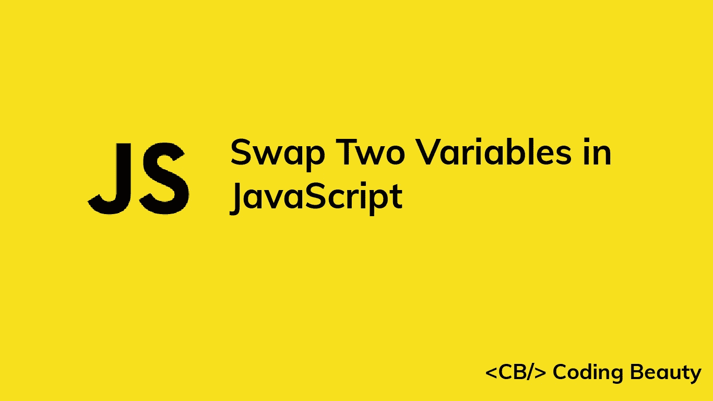

# 如何在 JavaScript 中快速交换两个变量

> 原文：<https://javascript.plainenglish.io/javascript-swap-two-variables-a57a1e1603d?source=collection_archive---------7----------------------->



# 1.临时变量

在 JavaScript 中交换两个变量:

1.  创建一个临时变量来存储第一个变量的值
2.  将第一个元素设置为第二个变量的值。
3.  将第二个变量设置为临时变量中的值。

例如:

```
let a = 1;
let b = 4;// Swap variables
let temp = a;
a = b;
b = temp;console.log(a); // 4
console.log(b); // 1
```

# 2.数组析构赋值

在 ES6+ JavaScript 中，我们可以用这个方法交换两个变量:

1.  创建一个新数组，以特定的顺序包含这两个变量。
2.  使用 JavaScript 数组析构语法将数组中的值解包到一个新数组中，该数组以相反的顺序包含两个变量。

使用这种方法，我们可以创建一个简洁的[一行程序](https://codingbeautydev.com/blog/javascript-one-liners/)来完成这项工作。

```
let a = 1;
let b = 4;[a, b] = [b, a];console.log(a); // 4
console.log(b); // 1
```

*原载于*【codingbeautydev.com】

# *ES13 中 11 个惊人的新 JavaScript 特性*

*本指南将带您快速了解 ECMAScript 13 中添加的所有最新功能。这些强大的新特性将会用更短、更富于表现力的代码来更新您的 JavaScript。*

**

*[注册](https://cbdev.link/900477)，立即获得免费副本。*

**更多内容看* [***说白了。报名参加我们的***](https://plainenglish.io/) **[***免费周报***](http://newsletter.plainenglish.io/) *。关注我们关于* [***推特***](https://twitter.com/inPlainEngHQ) ，[***LinkedIn***](https://www.linkedin.com/company/inplainenglish/)*，*[***YouTube***](https://www.youtube.com/channel/UCtipWUghju290NWcn8jhyAw)*，以及* [***不和***](https://discord.gg/GtDtUAvyhW) *。****