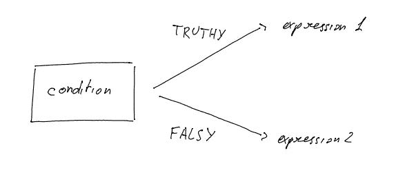

# JavaScript 三元运算符:实用指南

> 原文：<https://javascript.plainenglish.io/javascript-ternary-operator-b76a02c90850?source=collection_archive---------9----------------------->


Photo by [Pankaj Patel](https://unsplash.com/@pankajpatel?utm_source=medium&utm_medium=referral) on [Unsplash](https://unsplash.com?utm_source=medium&utm_medium=referral)

包含问号的 JavaScript 操作符列表可能会让第一次接触该语言的新开发人员感到惊讶。

我们已经讨论了[零化凝聚算子(？？)](https://medium.com/@lorenzozar/javascript-operator-5d3bd92e835e)作品。

在本帖中，我们将讨论一种叫做三元运算符的条件运算符。

# JavaScript 三元运算符

遵循 [MDN 定义](https://developer.mozilla.org/en-US/docs/Web/JavaScript/Reference/Operators/Conditional_Operator)，"*条件(三元)操作符是唯一一个接受三个操作数的 JavaScript 操作符:一个条件后跟一个问号(？)，然后是条件为 truthy 时要执行的表达式，后跟冒号(:)，最后是条件为 falsy* 时要执行的表达式。

```
*condition ? expression1 : expression2*
```

你可以这样理解这个操作符:如果*条件*为真，执行*表达式 1* 否则执行*表达式 2。*这并不完全准确，但在深入探讨真与假之前，让我们看一个条件只能为真或假的例子。

```
let condition = true;console.log(condition ? 'exp 1' : 'exp 2'); // exp 1
```

因为我们将名为 condition 的变量定义为 true，所以三元运算符执行第一个表达式，它是一个简单的字符串“exp 1”。

三元运算符周围的 console.log()记录三元运算符的结果，并记录“exp 1”。

这是三元运算符的核心概念。

从这里开始，我们将以两种方式进行扩展:

1.  使用带有真值和假值的三元运算符
2.  使用更复杂的表达式

# 1.具有真值和假值的三元算子

MDN 在讲 Javascript 三元运算符时，讲的是 truthy 和 falsy，而不是 true 和 false。

```
*condition ? expression1 : expression2*
```

如果*条件*为**真**执行*表达式 1* 否则(**假**)执行*表达式 2。*

简单来说，

*   [真值](https://developer.mozilla.org/en-US/docs/Glossary/Truthy)相等或者可以转换为`true`。哪些价值观是真实的？所有值，除非它们被定义为 falsy。谢谢…
*   [Falsy](https://developer.mozilla.org/en-US/docs/Glossary/Falsy) 值相等或者可以转换为`false`。(即 false、0、-0、0n，“”、null、undefined 和 NaN)。



JavaScript Ternary Operator

我们来举几个例子。

## 三元运算符和字符串

让我们把条件设为一个字符串:“非空文本为真”。由于这不是空字符串，三元运算符返回“exp 1”。

```
let condition = 'non-empty text is truthy';console.log(condition ? 'exp 1' : 'exp 2'); // exp 1
```

即使包含数字零的字符串也是非空字符串，因此运算符返回“exp 1”。

```
let condition = '0';console.log(condition ? 'exp 1' : 'exp 2'); // exp 1
```

## 三元运算符和数字

当条件是数字 0 时，三元运算符执行 exp 2，因为数字 0 是假的。

```
let condition = 0;console.log(condition ? 'exp 1' : 'exp 2'); // exp 2
```

情况可能会更复杂。

在下面的例子中，我们使用 [Math.random()](https://developer.mozilla.org/en-US/docs/Web/JavaScript/Reference/Global_Objects/Math/random) 生成一个介于 0 和 1 之间的随机数。

然后我们问这个数字是否大于 0.5。如果随机数大于 0.5，*条件*将评估为*真*。在此评估之后，如果*条件*为真，三元运算符将执行“exp 1”，否则执行“exp 2”。

```
let condition = Math.random() > 0.5;console.log(condition ? 'exp 1' : 'exp 2'); // it depends
```

# 2.使用更复杂的表达式

正如我们在上面看到的,*条件*可能比一个简单的字符串更复杂。但是，每个条件都必须计算为 true 或 falsy 才能返回表达式。

现在，我们将看到更复杂的表达式如何在三元运算符的上下文中工作。

接下来，我们定义两个函数，函数 1 和函数 2。尽管它们看起来相似，结果却大不相同。

当 function1 执行时，它记录 5 行，以“Number: 0”开始，以“Number: 4”结束。

当 function2 执行时，它记录 1 行“Number: 0”。看看下面的代码，想想结果。控制台中会打印出什么？

```
let condition = Math.random() > 0.5;const function1 = () => { for (let i = 0; i < 5; i++) { console.log('Number: ', i); }};const function2 = () => { for (let i = 0; i < 5; i++) { return 'Number: ' + i; }};console.log(condition ? function1() : function2()); 
```

# 结论

三元运算符中的表达式和条件可以或多或少复杂一些，但三元运算符的核心概念相当简单。

要使用三元运算符，请遵循以下逻辑:如果*条件*为**真值**则执行*表达式 1* 否则(**假值**)执行*表达式 2。*

如果这有用的话，你可能会喜欢关于 [JavaScript 的帖子？？无效合并运算符](https://medium.com/@lorenzozar/javascript-operator-5d3bd92e835e)！

*更多内容看* [***说白了就是***](http://plainenglish.io/) *。报名参加我们的* [***免费每周简讯***](http://newsletter.plainenglish.io/) *。在我们的* [***社区***](https://discord.gg/GtDtUAvyhW) *获得独家获得写作机会和建议。*