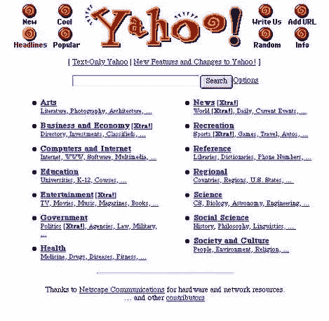
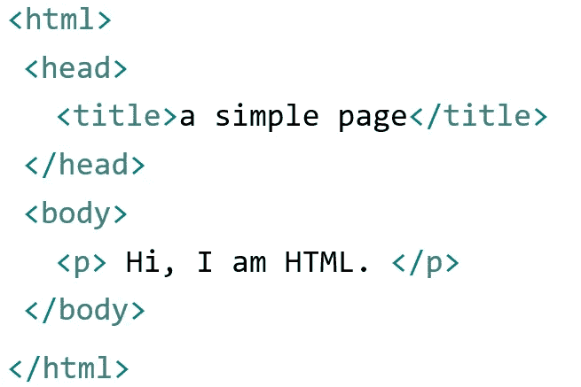
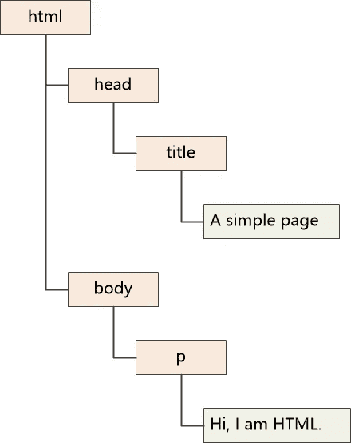
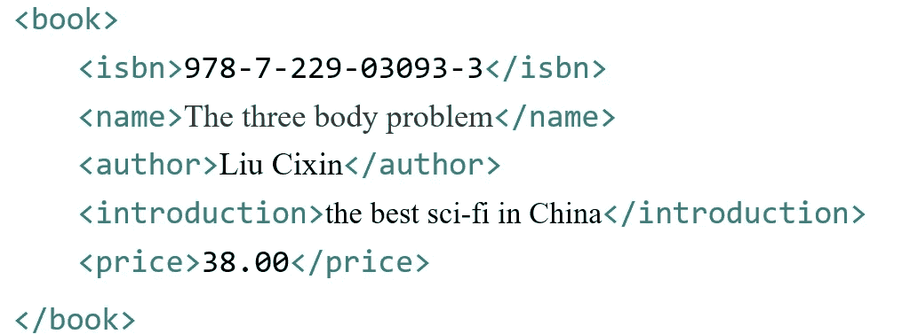
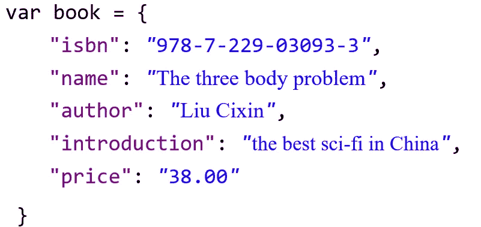
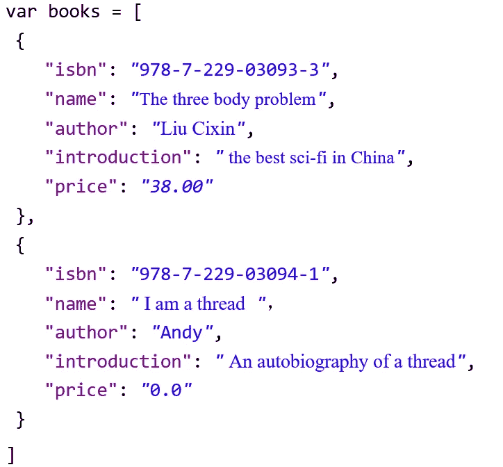

# JavaScript:失败者的崛起

> 原文：<https://javascript.plainenglish.io/javascript-the-rise-of-a-loser-f19b9de2029f?source=collection_archive---------15----------------------->

## 从失败者到成功者 JavaScript 是如何做到的？

没错，我就是大名鼎鼎的 Javascript，典型的赢家，前端编程之王。几百万程序员用我编程。如果你以前从未用过我，你绝对是个老古董。

但是当我是一个失败者的时候，我没有想到自己会达到这样的高度…

## **1。出生**

我出生在古老的浏览器网景。那时候的网页实在是太无聊了:它是由一些丑陋的静态文本和简单的图片组成的。很难想象，对吧？这比今天的花哨页面差多了。只要看看当时著名的雅虎网站:

在那个年代，人们仍然需要借助调制解调器使用拨号服务。更糟糕的是，人们别无选择，只能忍受每一次吱吱嘎嘎的声音。这就像一块铁片在刮锅底，拼命想把人逼疯。

这只是折磨的开始。互联网速度只有 28.8 千比特/秒，这意味着下载一个页面可能需要很长时间。

有一次，我的创造者布伦丹·艾希想通过他公司的浏览器网景买东西。于是他注册，填表，点击提交按钮，等了 38 秒，被服务器告知忘记选性别。

他非常生气。“操！为什么浏览器不能直接告诉我这个白痴狗屎！你是在告诉我，我必须将数据提交到几千公里外的服务器站点，以便轻松检查吗？”

浏览器改革势在必行。

布伦丹·艾奇去找老板说:“我受不了了。我需要一种可以在浏览器中运行的脚本语言，来帮助我做我应该在浏览器中做的事情。”

Boss 说:“网景也有这个想法，你为什么不设计一个？”。

布伦丹·艾希(Brendan Eich)说:“嗯，你听说过 LISP (Scheme，确切地说是 Scheme)，有史以来最好的编程语言吗？我们为什么不在浏览器中运行 Scheme？”

老板说:“我们公司有人会用 LISP 吗？”

布伦丹·艾希无言以对。

老板说，“我们现在和太阳公司合作。你听说过 Java 吗，他们刚刚发明的东西？小程序在浏览器里运行就是牛逼。Java 一定是未来的 web 语言。因此，如果你想出一种新的语言，确保它与 Java 相似，但更容易，那些网络开发人员就能使用它。”

我的创作者布伦丹·艾希非常沮丧，但是没有别的办法。他对 Java 毫无兴趣。结果我的设计他只用了 10 天。对了，我的原名是 LiveScript，但是为了迎合“邪恶”的 Java，我被改成了 JavaScript！

因为时间太有限，有些细节不够严谨。结果在很长一段时间里，JavaScript 产生的程序都是一片混乱。如果创造者预见到它将成为未来互联网上的第一语言，并在世界各地拥有成千上万的学习者，他会多花一点时间吗？

## **2。开发**

Java 是当时的明星语言。他年轻，精力充沛。他经常嘲笑我“你真的是计算机语言吗？”

我说:“当然，我的语法和你的差不多。”

Java 问:“为什么只在浏览器中运行？可以自己写程序运行吗？哦，对了，你会看文件吗？”

当然，我不能读文件。我生活在浏览器里。我写的程序只能嵌入 HTML 页面，由浏览器执行。他们给执行模块起了一个非常动态的名字:JavaScript 引擎。

于是我反击，“你知道吗，我有发动机！”

“我有虚拟机！”Java 毫不费力地进行了反击。

那个 C 哥还问我:“你为什么不试着编译运行一个程序呢？看，编译之后，我变成了机器语言。快了很多！."

我说:“算了吧。如果 JavaScript 需要在每一页上编译，速度会非常慢。”

不仅是 Java 和 C 还有 VB 和 Delphi 等流行语言都看不起我，暗地里骂我是失败者。

嗯，有道理。我无法自己运行，也无法像 VB 和 Delphi 那样画出漂亮的界面。我所能做的就是操作 HTML 的 DOM 和浏览器。

你可能不知道什么是 DOM，那么这么说吧:浏览器从服务器获取 HTML 页面时，会显示为一个页面给你看，但在内部，它其实是把 HTML 组织成一棵树给我看的，可以叫 DOM。例如:

**Hello World HTML 版**

DOM 树将如下所示:

有了这棵树，我可以做到最好。我可以找到 DOM 树中的任何节点并对其进行操作。例如，我可以隐藏节点、显示节点、改变颜色、获取文本值、改变文本值、添加一个函数来响应点击事件，等等。我几乎可以做你想做的任何事。

更重要的是，这些操作可以立即生效，这样你就不需要刷新网页了。

注意，这些操作完全是内部的，HTML 源代码没有改变。有时当你看 HTML 源代码时，你会发现这些源代码与你在浏览器中看到的不一致。那是我从后面改变了 DOM 树。

我的创作者 Brendan Eich 遇到的第一个问题是一块蛋糕。这只是一个简单的形式验证。

我不仅可以对 DOM 进行操作，还可以控制浏览器并执行像打开窗口、在窗口中前后移动、获取浏览器的名称和版本等行为。

你可能想问，为什么我们需要获取浏览器的名称和版本？

在网景和 IE 的浏览器大战中，双方争相在各自的浏览器中支持 JavaScript。为了针对不同的程序员，他们开发了很多自己浏览器的独特功能。有些功能只能在 IE 中使用，有些只能在 Netscape 中使用。因此，人们需要在采取具体行动之前识别浏览器。

无论如何，我的技能使浏览器中的网页更有活力，更有趣。

但仅此而已。我被困在浏览器和网页中。我也无能为力。

用 Java 的话说，这些都是鸡毛蒜皮的小把戏，我只是一个没有真正价值的失败者。

## **3。第一桶金**

互联网的发展超出了所有人的预期。几乎每个网站都用到了我。但我一直很沮丧:作为一门语言，我在浏览器中运行。我无法访问像 Java 这样的网络。更重要的是，我没有办法调用服务器端接口来获取数据。

用户只能通过 GET 或 POST 向服务器发送请求。服务器返回的数据是整个页面，而不是页面的一部分。也就是说，必须刷新整个页面，即使页面上只有一处文本更改。

1998 年，我和雄心勃勃的 IE5 见了一次面。双方就共同关心的话题深入交换了意见，并最终同意在 IE5 中引入一个新功能:XMLHttpRequest。它将允许我直接对服务器进行接口调用！

每次我打电话的时候，IE5 都会说:

“加油小 JS，拿着这个用户名和密码进入服务器端进程登录的界面。这个过程很耗时间，我不等你了。我先做点别的。得到服务器端返回的数据后，一定要记得调用我给你的函数。”

我知道这叫做异步调用，所以我通过 XMLHttpRequest 访问登录的 URL，耐心等待服务器完成工作，取回数据，然后调用那个函数。基本上，我需要更新 DOM 树的一个节点。比如我需要让包含用户名和密码的登录框消失，然后添加一条提示信息:登录成功！我很擅长这个。

如果网络速度和服务器的处理速度足够快，用户会发现他们不用刷新整个页面就可以成功登录。

IE 和我都没有预料到这个特性会带来一场革命:通过这种方式，页面可以在本地刷新，从而产生出色的体验。谷歌地图和 Gmail 等应用让互联网应用变得流行起来。

其他浏览器很快跟进，实现了类似的功能。各种各样的互动网站如雨后春笋般出现。

VB 和 Delphi 不再嘲笑我了，因为他们绝望地发现，他们擅长的所有桌面应用都被慢慢搬到了互联网上。没有人喜欢他们了。

我，JavaScript，赚了第一桶金，一路高歌猛进。

## **4。JSON 的发明**

然后有人把这种方法叫做 AJAX 之上，或者“异步 JavaScript 和 XML”(Asynchronous JavaScript And XML)。实际上，异步是好的，但 XML 是令人不安的。

例如，服务器返回以下 XML:

真实数据很少，标签(比如< name >)占用空间很大，数据很难找到。

我对 XML 说:“你是不是有点太大了？转学可能会很累。”

XML 说:“哈，你没明白。对于普通人来说，它是优雅的、格式良好的、可读的。反正运行得很好。”

“优雅？你在开玩笑吗？有这么多没用的数据。反正我得用 XML resolver 来分析你。太累了！”

“窝囊废！你甚至不能处理它。听着，Java 非常愿意用我。Spring、Struts 和 Hibernate——几乎所有的配置文件都是我做的！”

Java 补充道，“对。我甚至用 DTD 来看 XML 数据是否合法。”

我无言以对。

我想起了阿甘的话:如果你不能改变别人，先改变自己。

我看了看我的语法。有一个东西叫做对象，它有一个花括号。在花括号内，对象的属性以(name : value)的形式定义，属性之间用逗号分隔，如下所示:

这种结构完全可以实现 XML 内容！

我的语法也支持数组，这意味着可以实现更多的对象。

**JSON 阵列**

数组和对象支持嵌套，所有复杂结构都可以保存！

更重要的是，如果应用这种结构，我不需要任何 XML 解析器来分析数据。它是我语言的一部分，我可以直接使用它。

书籍[0]。姓名→返回“三体”

书籍[1]。介绍→返回《一根线的自传》

生活是美妙的！:-)

我把这个简单的模式叫做 JSON，并和服务器达成协议:让我们用 JSON 来传输数据。

至于 XML，就让老学究 Java 用吧！

## **5。山顶**

HTML 负责结构；CSS 负责呈现；而我(加上 AJAX，JSON))负责逻辑。

所以这是我们的前端编程团队。

ExtJS、prototype、JQuery 这样的框架将前端编程推向了另一个高峰。

还有我们神奇的 AngularJS 实现了 SPA(单页应用)。超乎想象。

我对 Java 说:“兄弟，现在我可以在浏览器端实现 MVC 了。你只需要通过服务器端的接口向我提供数据。''

但 Java 并没有放弃让我心烦，“不要那么骄傲。服务器端是核心。为什么不试试服务器端呢？”

我很惊讶。“服务器端？我从来没有想过这个问题。生活在一个拥有 64g 内存和 32 核处理器的 CPU 中是什么感觉？”

“它没有你想象的那么有趣。”Java 不耐烦地说，“多线程编程在很多事情上都需要锁。你可能在任何一步摔倒。对我来说，每个请求都需要一个线程。当涉及到数据库时，即使它很慢，线程也必须等待。”

“难道我们不能像我的 AJAX 一样使用异步操作吗？它可以在数据来的时候通知我。”我问 Java。

“不，我被设计成这样。我现在不能改变。”

如果我们把 JavaScript 放在服务器端会怎么样？这肯定是一个疯狂的想法。

首先，我们需要将浏览器的操作环境(JavaScript 引擎)移到服务器端。这个引擎要快，不然 Java 肯定笑话我。

最初的发动机不合格。直到 Chrome V8 我们才真正解决了这个问题。

其次，我们需要绕过 java 服务器的问题:当线程遇到一些像 IO/database/network 这样耗时的操作时，它无法等待。需要改成异步处理。

但是真的有人做到了。在我出生 10 年后，另一个天才 Ryan Dahl 在 2009 年把我带到了服务器端。那就是 Node.js。

现在 Java 无话可说了。当他还在怀疑我在服务器端的执行能力时，越来越多的 Node.js 站点证明了 JavaScript 确实在服务器端有了立足之地，而且它有一个巨大的优势:前端和后端都使用相同的开发语言:那就是我，JavaScript！

原来的前端开发人员，现在可以毫无阻碍的编写后端程序，成为所谓的“全栈工程师”！

这是我的故事，一个失败者的崛起。我的创造者从来没有预料到我会在几年后成为赢家。我猜他可能晚上一直在想，“我当时太心急了。为什么我没有把 JavaScript 做得更好？”

*更多内容请看*[***plain English . io***](http://plainenglish.io/)*。报名参加我们的* [***免费周报***](http://newsletter.plainenglish.io/) *。在我们的* [***社区***](https://discord.gg/GtDtUAvyhW) *获得独家获得写作机会和建议。*