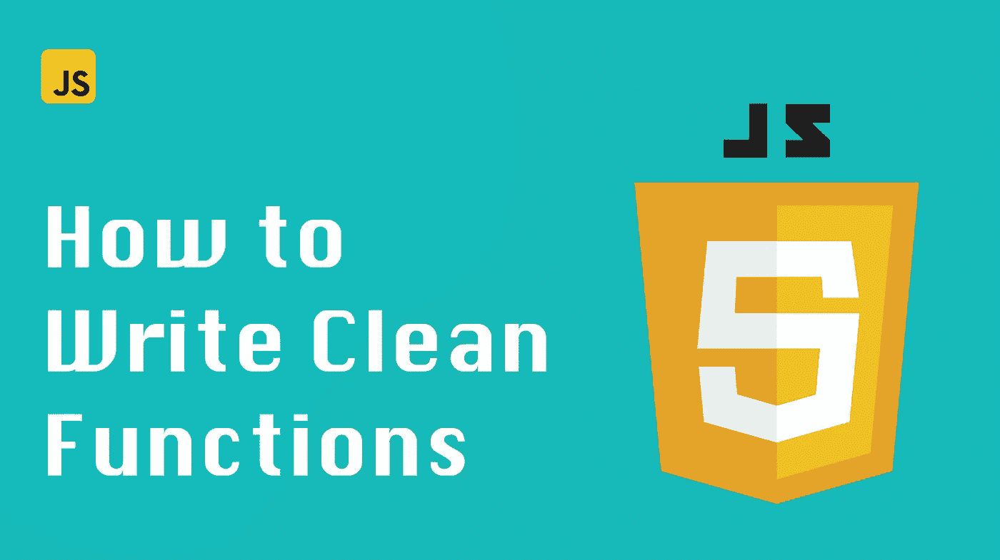

# JavaScript 技巧:如何编写干净的函数

> 原文：<https://javascript.plainenglish.io/javascript-tips-how-to-write-clean-functions-5de971694d38?source=collection_archive---------6----------------------->

## 这些技巧将使你的代码更容易维护，更容易阅读和理解。



在本帖中，我们将介绍用 JavaScript 编写干净函数的简单技巧。遵循这些提示将使您的代码更易于维护，更易于阅读和理解。

我们开始吧！

# 小心隐藏的副作用

“纯”函数是描述这一规则的另一种方式。给定相同的输入，纯函数总是返回相同的结果。它们也没有任何隐藏的副作用，这意味着它们不会在自己的功能范围之外修改输入或数据。任何应用程序的大部分通常都可以这样编写。

当然，我并不是说所有的副作用都是不好的，应该避免。你的程序*有*有副作用。否则有什么意义呢？

这里的技巧是在应用程序代码中增加副作用。例如，如果您正在编写一个从 API 获取数据的函数，这是一个副作用，您希望使它更加明显，并避免将其隐藏在函数调用堆栈中。

如果您的函数 ***让*** 对其输入进行更改会怎样？您仍然可以通过创建输入对象的新副本而不是就地修改它来保持它的纯净。让我们比较两个例子:

不好:

```
function addProperty(obj, key, value) {
    obj[key] = value;
    return obj;
}
```

好:

```
function addProperty(obj, key, value) {
    const newObj = { ...obj }
    newObj[key] = value;
    return newObj;
}
```

第一个函数违反了避免副作用的规则，因为它修改了输入对象。第二个函数保持输入对象不变，并返回添加了所需属性的新对象。

第二种方法是编写函数的更安全的方法。

# 处理带有大量参数的函数

您可以做几件事来提高多参数函数的 UX。一个简单的方法是用一个对象包装所有的参数。这里有一个例子

不好:

```
function addUser(firstName, lastName, age, city, state, zipCode) {
    // ... do something with the user info
}
```

好:

```
function addUser({ firstName, lastName, age, city, state, zipCode }) {
    // ... do something with the user info
}
```

第二个函数将有更好的 IDE 支持。在不改变函数签名的情况下添加新参数也很容易。当然，您将不再需要担心参数的顺序。

# Currying

Currying 是函数式编程中的一项基本技术。它用于创建接受多个参数的函数，一次一个。

您可以使用 currying 从现有的函数中创建参数更少的新函数。当您需要创建许多具有不同值的相似函数时，这很有用。

不同的函数式编程库(例如 [Ramda.js](https://ramdajs.com/) )提供了一些实用程序来使用不同数量的参数来执行函数。也就是说，在许多情况下，您可以自己实现一个简单的 curry 函数。

简单的 currying 方法的一个很好的例子是为 React 组件提供事件处理程序:

```
export default function SampleComponent({ onValueChange }) {
  const handleChange = (key) => {
    return (e) => onValueChange(key, e.target.value)
  }return (
    <form>
      <input onChange={handleChange('name')} />
      <input onChange={handleChange('email')} />
      <input onChange={handleChange('phone')} />
    </form>
  )
}
```

在上面的代码中，我们定义了一个`handleChange`函数，它接受一个键并返回一个事件处理函数。每当输入值改变时，调用`onValueChange`回调，由于 closure，这个回调已经预先填充了键。

现在，我们不必为每个输入创建单独的事件处理程序。我们可以用不同的键来处理`handleChange`函数，并多次重用它。

# 做一件事

有时我会看到这样的函数:

```
const createMeal = ({ type, addExtra }) => {
    const request = type === "appetizer" ? createAppetizer : createMainCourse;return request((response) => {
            if (addExtra) {
                if (type === "appetizer") {
                    response.dressing = "ceaser";
                } else if (type === "main") {
                    response.sides = "fries";
                }

                return response;
        }
    });
};createMeal({ type: "main", addExtra: true });
createMeal({ type: "appetizer", addExtra: false });
```

这个功能已经成熟，可以拆分了。没有理由它需要支持两种不同的用例。如果有两个更小、更专业的函数来代替就好得多了。

通常，这些函数不会这样开始。它们从小而简单开始，然后随着新需求的出现，它们变得越来越复杂。因此，时不时地后退一步，问问自己某个功能是否做得太多了，这一点很重要。

上面的代码最好改写成这样:

```
const createAppetizer = (addExtra) => {
    return createAppetizerAPI().then((response) => {
        if (addExtra) {
            response.sides = "fries";
        }
    });
};const createMainCourse = (addExtra) => {
    return createMainCourseAPI().then((response) => {
        if (addExtra) {
            response.dressing = "ceaser";
        }
    });
};
```

现在每个功能的意图都更加清晰了，它们也更容易重用。

这种拆分方法最适用于我们事先知道参数的函数。另一方面，具有动态参数的函数，比如用户输入，可能更难以这种方式进行拆分。

判断函数是否做得太多的一个好方法是问问自己为它编写测试有多容易。

一般来说，一个功能越容易测试越好。

# 调整你的应用决策树

下面是我经常看到的另一种编写函数的方式:

```
const filterOutMeals = ({ meals, customerOrder }) => {
    if (customerOrder.cancelled) return [];
    return meals.filter((meal) => !meal.isCold);
};
```

看起来不算太差，但是早期返回不需要在这个函数里。这又回到了将重要的决策和副作用放在调用堆栈中以使它们更加可见的想法。

下面是我重写代码的方法:

```
const filterOutMeals2 = ({ meals }) => {
    return meals.filter((meal) => !meal.isCold);
};const meals = customerOrder.cancelled ? [] : filterOutMeals2({ meals });
```

这样，这段代码的意图就更清楚了，因为如果客户取消订单，避免过滤的决策在决策树中处于更高的位置。

# 结论

编写干净的函数很重要，原因有几个。它使您的代码更具可读性、可重用性，并且更易于测试。

在这篇文章中，我们介绍了用 JavaScript 编写干净函数的一些简单技巧。希望这些提示对你有所帮助！如果你感兴趣，不久前我写了一篇关于重构你的代码的适当策略的独立博文。

如果你想获得更多的网络开发、反馈和打字技巧，可以考虑[在 Twitter 上关注我，](https://twitter.com/IskanderSamatov)在那里我分享我学到的东西。
快乐编码！

*原载于 2022 年 4 月 11 日*[*https://isamatov.com*](https://isamatov.com/javascript-clean-functions/)*。*

*更多内容请看*[***plain English . io***](https://plainenglish.io/)*。报名参加我们的* [***免费周报***](http://newsletter.plainenglish.io/) *。关注我们关于*[***Twitter***](https://twitter.com/inPlainEngHQ)*和*[***LinkedIn***](https://www.linkedin.com/company/inplainenglish/)*。加入我们的* [***社区不和谐***](https://discord.gg/GtDtUAvyhW) *。*