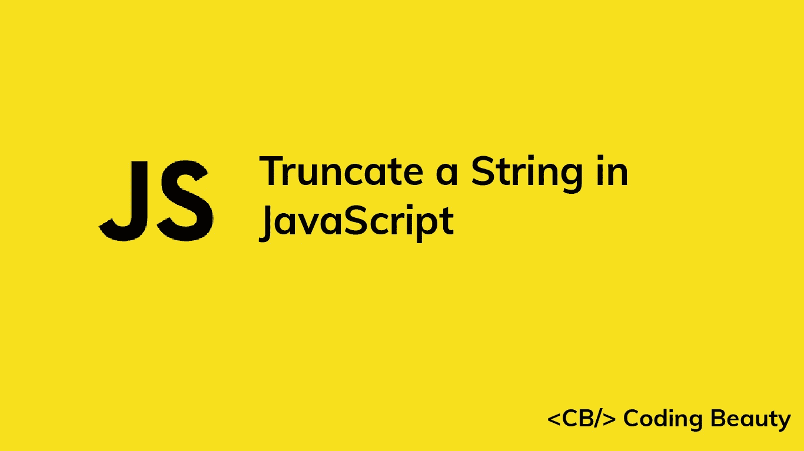

# 如何在 JavaScript 中截断字符串

> 原文：<https://javascript.plainenglish.io/javascript-truncate-string-2961514568f?source=collection_archive---------18----------------------->

## 如何在 JavaScript 中轻松截断字符串的指南。



截断字符串会限制显示的字符数，通常是为了节省空间。我们可以在 JavaScript 中通过编写一个`truncate`函数来截断一个字符串，该函数将该字符串作为第一个参数，将最大字符数作为第二个参数。

```
function truncate(str, length) {
  if (str.length > length) {
    return str.slice(0, length) + '...';
  } else return str;
}
```

如果字符串的字符数大于指定的长度，该函数将使用`slice`方法截断字符串。否则，它只是返回相同的字符串。

```
truncate('aaaaaa', 3)    // aaa...
truncate('abcde', 4)    // abcd...
truncate('aaaaaa', 8)    // aaaaaa
```

我们也可以用 JavaScript 三元运算符在一条语句中编写这个函数:

```
function truncate(str, length) {
  return str.length > length
    ? str.slice(0, length) + '...'
    : str;
}
```

这是一个`String`对象，所以我们可以用`substr`方法代替`slice`来截断字符串:

```
function truncate(str, length) {
  return str.length > length
    ? str.substr(0, length) + '...'
    : str;
}
```

我们可以使用 ES6 模板字符串来代替串联:

```
function truncate(str, length) {
  return str.length > length
    ? `${str.substr(0, length)}...`
    : str;
}
```

*更新于:*[](https://codingbeautydev.com/blog/javascript-truncate-string/)

# *订阅编码美容简讯*

*每周使用新的 web 开发技巧和教程来提升您的技能。*

**

*[**订阅**](https://codingbeautydev.com/newsletter)*