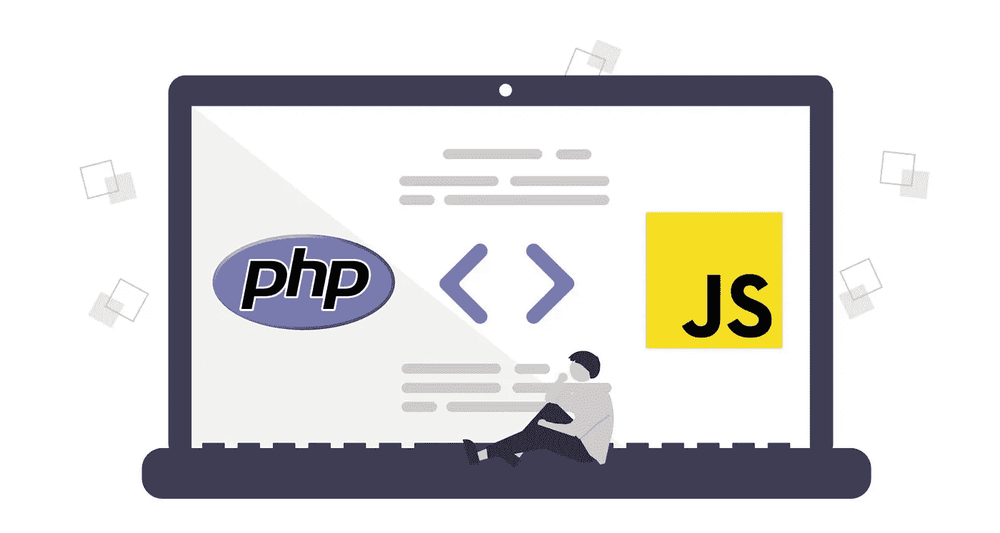
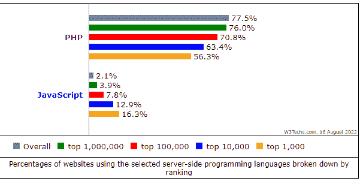

# JavaScript 与 PHP:哪个更适合 Web 开发？

> 原文：<https://javascript.plainenglish.io/javascript-vs-php-which-is-better-for-web-development-8c4996fdc69?source=collection_archive---------5----------------------->

JavaScript Vs PHP: Which is Best For Web Development?

在构建 web 应用程序时，编程语言的选择可能是一个极其重要的问题，因为 PHP 和 JavaScript 都被世界各地的开发人员广泛使用。两者都提供了独特的功能，使它们成为很好的选择，但是你应该选择哪一个呢？为应用程序开发选择最佳技术对于组织来说是一项艰巨的任务。

别担心，你的问题我们有答案！

本文比较了这两种语言，解释了它们是如何工作的，以及如何使用它们来创建动态 web 应用程序。无论你是一个有经验的开发人员还是一个新手，这个指南将帮助你对下一个项目使用哪种语言做出正确的决定。

让我们直接进入 JavaScript 和 PHP 之间的详细比较，以决定谁是赢家。

# 【JavaScript 和 PHP 的深入比较

## **1。JavaScript Vs PHP:理解概念**

***结论:*** *说到开发高性能应用，JavaScript 和 PHP 都独领风骚。但是 JavaScript 是客户端脚本语言，而 PHP 是服务器端脚本语言。所以，说到用法，* [*75%的网站都在用 PHP*](https://w3techs.com/technologies/comparison/pl-js,pl-php) *。但是，JavaScript 占据着强大的* [*市场地位*](https://w3techs.com/technologies/comparison/pl-js,pl-php) *。*

[Image Source](https://w3techs.com/technologies/comparison/pl-js,pl-php)

[Image Source](https://w3techs.com/technologies/comparison/pl-js,pl-php)

JavaScript 正在赢得这场战斗，因为它不再仅仅驻留在前端，PHP 作为后端。Node.js、Angular.js 和 React.js 的加入使 JavaScript 成为一个全栈平台。Javascript 几乎可以处理任何项目，从前端到后端。由于 JavaScript 几乎可以用于创建任何项目，因此它的多功能性和交互式元素通常是最佳选择。

如果你想构建一个快速、轻量级的 web 应用，那么 JavaScript 是一个不错的选择。它很容易学习，并且有大量的框架可以帮助您入门。此外，通过服务器端渲染，您可以轻松创建动态、响应迅速的用户界面。

另一方面，对于寻找一种通用脚本语言来驱动一些世界上最流行的网站的创业公司来说，PHP 是一个很好的选择。它很容易学习，并且有广泛的可用框架。然而，它可能比其他语言慢，并且不总是大规模应用程序的最佳选择。

## **2。JavaScript Vs PHP:编码速度**

***结论:*** *说到速度和性能，PHP 比 JavaScript 有优势。PHP 比 JavaScript 快，因为它被编译成二进制代码。另一方面，JavaScript 需要时间来解释和执行。因此，如果您想开发一个速度关键的应用程序，PHP 将是正确的选择。*

PHP 更适合更大、更复杂的应用程序。然而，JavaScript 更适合精益、简单和较小的项目。一般来说，编写代码更容易、更快，不需要做太多的前期规划，你就可以很快上手。

但是当你打算用 PHP 创建企业级项目时，你需要 [**雇佣一个 PHP 开发人员**](https://www.appsdevpro.com/hire-developers/hire-php-developers.html) 。人们普遍认为 PHP 比 JavaScript 更健壮，可以处理更多的流量，但是它需要更长的编写时间，而且不够直观。所以最好是把这项工作交给懂 PHP 的专家，他们可以帮助你扩展你的应用。

## **3。JavaScript Vs PHP:性能**

***结论:*** *说到性能，PHP 和 JavaScript 势均力敌。然而，近年来，JavaScript 一直领先。部分原因是 PHP 不是一种编译语言，这意味着它在运行之前不需要被转换成机器代码。这使得 PHP 比 JavaScript 略慢。*

无论你是开发简单的还是复杂的软件，性能都是你最渴望的。那么，对于应用程序的性能，你应该相信 JavaScript 还是 PHP 呢？我们去看看吧！

JavaScript 的特点是使用事件驱动、单线程、非阻塞 I/O 模型的设计。该设计由事件循环和节点集群提供支持。Node.js 被设计成异步处理整个程序，而不需要等待任何一行代码完成后再启动下一行。

这使得它成为直播平台等低延迟应用的最佳选择。Node.js 比使用 V8 引擎、持久服务器连接和回调函数时要好得多。

对于 PHP，执行模型是多线程的，带有阻塞 I/O，这与 JavaScript 不同。PHP 代码只能同步执行，所以在第一行执行之前，第二行不会被执行。这使得 PHP 比 JavaScript 更快。尽管 PHP 的性能不可否认较慢，但有人说它比 JavaScript 更稳定。然而，这种说法颇具争议，并未得到 100%的证实。

虽然 PHP 和 JS 具有同等水平的稳定性和可靠性，但 JavaScript 由于其非凡的速度而具有更大的优势。

## **4。JavaScript Vs PHP:学习曲线**

***结论:*** *两者都是传统语言，但是 PHP 是初学者友好的语言，而 JavaScript 如果你已经知道任何其他语言都很容易学会。*

学习 JavaScript 时，你需要理解提升和原型这样的概念。PHP 更容易学习，因为它更像传统的编程语言。如果你是从零开始，PHP 可能是更好的选择。此外，你可以 [**雇佣擅长制作应用程序的网络开发人员**](https://www.appsdevpro.com/hire-developers/hire-web-app-developers.html) 。但是如果你已经熟悉了另一种编程语言，学习 JavaScript 会更容易，因为概念更容易转移。

由于 JavaScript 是一种编程语言，而不是像 HTML 或 CSS 那样的标记语言，如果你已经有编程经验，你可能会发现学习 JavaScript 更容易。出于同样的原因，PHP 也被认为是一种容易学习的编程语言。JavaScript 和 PHP 都有很多在线教程和资源。

这两种语言都是解释性语言，这意味着您可以对代码进行更改并重新运行，而无需再次编译。

# **如何决定哪种技术最适合你的下一个软件开发项目？**

两种语言各有利弊。虽然一种语言非常适合任何初创公司，但另一种语言是企业的理想选择。所以这个游戏没有输赢。最终的选择最终取决于业务的需求。

在雇佣 PHP 开发人员或任何应用程序开发人员之前，一定要仔细评估你的需求。因此，当你在下一个应用程序中选择 PHP 还是 JavaScript 时，有一些关键的事情需要考虑。

*   **了解项目需求**

考虑一下你的应用程序需要什么样的特性和功能。然后决定一种语言是否为实现这些特性提供了更多或更好的选择。

*   **项目维护及未来技术使用选择**

在投资软件或网站开发的同时，要确保你选择的是一种更容易维护、背景强大的技术。从长远来看，考虑哪种语言更容易维护——从您自己使用它的能力和它的稳定性两方面来看。

*   **资源的可用性**

确保选择开发人员常用的编程语言。嗯，在 JavaScript 和 PHP 的情况下，你可以很容易地找到并[**雇用 PHP 开发人员**](https://www.appsdevpro.com/hire-developers/hire-php-developers.html) ，因为它是一种比 JavaScript 更成熟、更古老的语言。但专业人士的建议是，如果你需要外包，总是选择用一种语言开发应用程序，你可以找到熟练的开发人员来使用这种语言。

*   **应用程序的性能**

确定应用性能对您有多重要。有多少人会使用该应用程序？他们使用它的频率有多高？随着时间的推移，它会增长到多大？基于这些因素，选择一种能够快速扩展并确保优秀应用性能的语言是值得的。

*   **易于编写代码**

记住，一旦你决定了一种编程语言，就有各种各样的方法来实现代码。您可以从头开始编写，或者从各种模板引擎(如 Twig)中进行选择，这些引擎根据从 web 服务器接收的数据生成 HTML 页面。

你也可以找专家，他们可以帮助你评估需求，帮助你以更好的方式编写代码，避免遇到 bug。此外，他们最好知道使用现成模板的技巧，而不是从头开始编写。

# **为下一个项目选择 JavaScript 还是 PHP**

如果你不是技术人员，那么在阅读了本指南之后，你可能仍然在为你的项目选择哪种编程语言而左右为难。两种语言都有自己的强大之处。但是以下几点可能会帮助您决定在工作中使用哪一个:

## **如果您的项目包括:**请选择 PHP(作为您的后端语言)

*   LAMP (Apache、MySQL、PHP)栈就是解决方案栈的例子
*   其次，它需要一个 CMS，比如 Drupal、WordPress、Joomla 等。
*   一旦完成，你就可以将 PHP 与 PostgreSQL、MariaDB、Oracle、Sybase 等一起使用。

现在我们来谈谈 JavaScript。

## **如果您的项目包含以下任何一项，选择 JavaScript 是有意义的:**

*   这些技术包括 AngularJS、ReactJS、Backbone.js 和 Ember.js。
*   诸如 SPA(SPA 代表动态单页应用)之类的应用。
*   本课程还讨论了 MongoDB、Express.js、Node.js 等服务器技术。，以及 MEAN (Express.js，Angular.js，MongoDB)等解决方案栈。

# **最终想法:**

## 你的下一个项目应该选择 JavaScript 还是 PHP？

在这篇博客的结尾，有理由澄清一下，这篇博客并没有宣布任何赢家，因为 JavaScript 和 PHP 都是成熟的编程语言，各有利弊。为了从这些语言中获得最大的收益，你需要 [**雇佣拥有合适技能和知识的网络开发人员**](https://www.appsdevpro.com/hire-developers/hire-web-app-developers.html) 。

它们都在开发项目中占有一席之地，并以其特性而闻名。而且，如果你的网站每天没有几百万的访问量，PHP 可能是更好的选择。所以，如果你正在创建一个有大量流量和不断更新的 web 项目，考虑使用 JavaScript。

如果您对这两种技术都缺乏了解，最好联系一家领先的软件咨询公司，或者您可以在下面提出疑问以获得更多信息。他们将为您提供合适的技术组合，并能回答您的所有问题。

*更多内容看* [***说白了就是***](https://plainenglish.io/) *。报名参加我们的* [***免费周报***](http://newsletter.plainenglish.io/) *。关注我们关于* [***推特***](https://twitter.com/inPlainEngHQ) ， [***领英***](https://www.linkedin.com/company/inplainenglish/) *，*[***YouTube***](https://www.youtube.com/channel/UCtipWUghju290NWcn8jhyAw)*，以及* [***不和***](https://discord.gg/GtDtUAvyhW) *。*