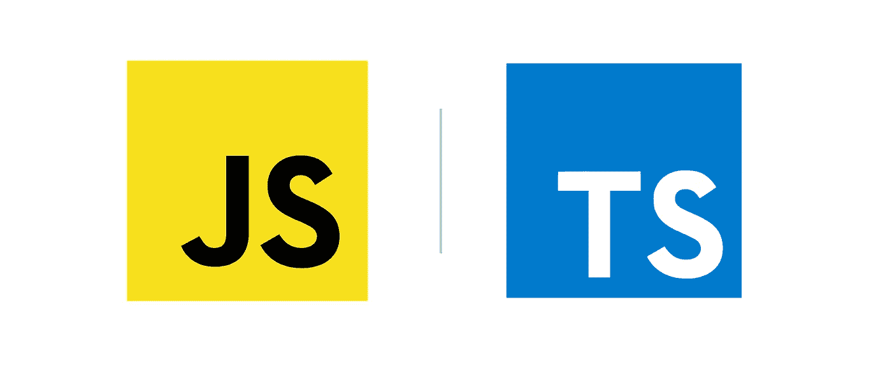

# JavaScript 与 TypeScript:两者有什么区别

> 原文：<https://javascript.plainenglish.io/javascript-vs-typescript-whats-the-difference-between-the-two-91d8ff3e135e?source=collection_archive---------17----------------------->

## 消除你对 JavaScript 和 TypeScript 的疑虑，为你的新项目选择一个最好的。

无论您是经验丰富的程序员还是新手，您都可能想知道是使用 JavaScript 还是 TypeScript 开始一个新项目。在本帖中，我将尝试解决每个人的疑问，并帮助您进行选择。

## 什么是 JavaScript

JavaScript，通常被称为 JS，是一种符合 ECMAScript 规范的编程语言。这是一个高层次，通常在运行时编译和多参数化。普通 Javascript 这个名字指的是不使用任何库。

## 在哪里使用 JavaScript

JavaScript 广泛应用于客户端、服务器端和移动应用程序中。JavaScript 可用于以下用途:

*   向网页添加交互行为。
*   创建网络和移动应用程序。
*   创建 web 服务器和开发服务器应用程序。
*   游戏开发。

## TypeScript 呢？

TypeScript 也称为 TS，它是强类型、面向对象和编译的。它由微软创建，就像 javascript 本身一样，完全基于 JavaScript，但增加了一些功能，使 typescript 变得如此特别。采用 TypeScript 作为开发工具有几个好处，比如静态类型、添加类和接口等等。

## TypeScript 有什么特点？

*   TypeScript 只是 JavaScript。要使用 TypeScript，您只需要 JavaScript 知识，这是因为所有的 TypeScript 代码都被转换为 JavaScript 来执行。
*   TypeScript 支持其他 JavaScript 库。因此，TypeScript 生成的 JavaScript 可以重用所有现有的 JavaScript 框架、工具和库。
*   JavaScript 文件是类型脚本文件。这仅仅意味着任何。js 文件可以转换成。ts 与其他类型脚本文件兼容。
*   TypeScript 是可移植的。TypeScript 可以在 JavaScript 运行的任何环境下运行，不需要任何其他框架运行。

## 使用 TypeScript 胜过 JavaScript 的好处

*   类和模块支持
*   静态类型检查
*   支持 ES6 功能
*   库 API 的清晰定义
*   对 JavaScript 打包的内置支持
*   JavaScript 超集

## 应该开始使用 TypeScript 吗？

看看 TypeScript 的优点，比如面向对象语言、可重用代码、简单、干净和一致。不可否认，强烈推荐使用 TypeScript 来构建大型项目或较小的项目。

这个题目到此为止。感谢您的阅读。

*更多内容请看*[***plain English . io***](http://plainenglish.io/)*。报名参加我们的**[***免费周报***](http://newsletter.plainenglish.io/) *。在我们的* [***社区获得独家访问写作机会和建议***](https://discord.gg/GtDtUAvyhW) *。**