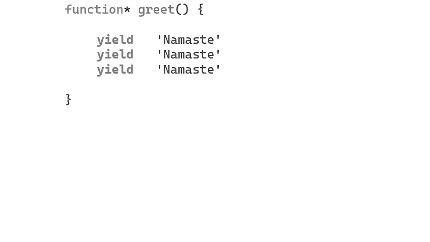

# JavaScript 的(秘密)超能力——没人愿意教你

> 原文：<https://javascript.plainenglish.io/javascripts-secret-super-power-no-one-ever-cared-to-teach-you-1331b252acf7?source=collection_archive---------0----------------------->

## 它是如此强大——我想知道为什么没有人教你这个！

[source](https://unsplash.com/photos/pVdiv_8oY_s)

当我第一次看到这个特性时，我忽略了它。

不是我，几乎每个人都在做同样的事情——他们在谈论这件事，但没有人真正解决房间里的大象。

我们究竟为什么会有这种特征？它给语言带来了什么新的价值，更重要的是，我们能用它做以前做不到的事情吗？

我们将踏上旅程，发现一些不可思议的东西，它们将永远改变你的编程方式。

你准备好了吗？

# 好吧，发电机——让我看看你有什么？

生成器看起来像普通的函数，但它们的工作方式非常不同。

它有一个 ***yield*** 运算符，类似于一个 ***return*** 语句，但它不返回预期值。相反，它生成一个具有包含预期值的 value 属性的对象。

***function*** object that in turn produces an **object** that contains a ***next*** method that is made of the ***function**** body.

与普通函数不同，这里有一个最终的 ***return*** 语句——当您点击 ***return*** 关键字时，函数终止。

发电机允许你无限期返回*u*唱**收益*T21*。当 JS 引擎遇到 ***yield*** 关键字时，执行会暂停而不是终止。**

`.next(**)**` resumes — `**yield**` pauses— `**return**` stops

我们不仅可以多次产生*，还可以将这些产量存储在一个数组中(使用 spread 运算符)。*

**

*这意味着也可以对其进行迭代。*

**

*This is why you might often hear***generators are iterator****

*一个小小的*星号可以导致代码行为发生如此多的变化，这难道不令人惊讶吗？*

*这是太多的行话，它仍然没有回答我们的问题，为什么我们首先使用发电机。*

*为什么要写这样的话:*

**

*当我们能以如此低的复杂度做同样的事情时。*

**

*那么，首先使用它们有什么意义呢？*

*我的意思是，我不确定有多少地方需要一个函数对象来迭代它们。*

*仅此而已吗？*

*你看——事情并不总是像它们看上去的那样——表面现象会欺骗很多人。*

*当我第一次听说他们进入这种语言时，我对他们为什么这样做感到很有趣。是 Python 社区的嫉妒将这个特性推进到了 JS 领域吗？或者它提供了一些真正不可思议的东西，我们可以用它做一些真正独特的事情，否则我们做不到。*

*关键是我们没有这样的语言特性——需要几年的时间来制定语言规范，并且有一整个团队在研究它。也许它带来了一些不同的东西。*

*生成器可以让你有一个非常复杂的 ***控制流。****

*利用发电机，我们可以做一些很酷的事情。*

*我们完成了在标准 JavaScript 中几乎不可能完成的事情(我们甚至可以超越 JavaScript)。*

**哇……什么意思——***超越 JavaScript？***一个特征如何超越语言？**

*等等——等等——我们一个一个来——慢慢来。*

*和我在一起会很有趣。*

*那么，我说到哪了？是— ***控制流程。****

*我们可以使用生成器，不仅可以让 ***生成*** 的值，还可以让 ***消耗*** 的值。*

**

*太棒了——只用几行代码，我们就创建了一个类似聊天的应用程序。*

*发电机不只是健谈，还擅长记东西。*

**

*Generators can be stateful, but they keep their state hidden in the closure*

*现在是最激动人心的部分——如果你对堆栈有所了解，我们知道它是有极限的。*

*如果我们尝试这样的东西，*

**

*我们很快就会遇到错误。*

**

*这就是发电机变得真正有趣的地方。*

*你准备好了吗？*

*听我说完— ***他们可以超越 JavaScript 栈极限！****

*你可以做一系列无限的函数调用。*

*现在，在我们进入这个话题之前，你知道你的心脏一天跳动几次吗？*

**

*By the way, that’s not how a heart looks in real life.*

**

*This is how it looks.*

*它有一种奇特的 ***lub-dub*** 音(你注意过吗？)这种声音是由心脏内的瓣膜关闭血液引起的。二尖瓣和三尖瓣关闭时，发出第一个音( ***lub*** )。当血液被挤出心脏后主动脉瓣和肺动脉瓣关闭时，下一个声音( ***配音*** )出现。*

*它以同步方式发生—一个启动另一个。*

*一天之内，它会这样做近 10 万次。*

*现在，这是一个很大的工作量。*

*但是我们可以使用生成器复制这一点——就像我们制作的聊天应用程序一样，其中一个生成器函数启动另一个——我们可以做同样的事情来制作心跳。*

*但是首先，让我警告你，如果我们尝试，我们将打破堆栈限制，所以不要运行下面的代码(我已经为你做了)。*

*这次我们要写一个更大的代码，不过不用担心，很简单。给代码一些时间来理解。*

**

*lub and dub are generator functions making the sound and keeping the count, function sound() pushes it as a msg to an array, and function `alive()` starts the heartbeat*

**

# *结论*

*不要让这成为你 ***发电机*** 探索的结束，而是开始。*

*即使很少被提及或关注，但我相信它有很多东西可以教你。*

*在很短的时间内，我们使用生成器编写了一个聊天应用程序，它利用消息来工作。这与您期望演员模型中的程序如何运行类似。我们编写的 ATM 程序和它的记忆能力将让你对状态机的工作原理有一个更深入的了解。您可以运行代码永久化，这将为您打开一个全新的世界——所以去探索它吧。*

*冒险就在那里…*

****附言:我们可以使用生成器做一些疯狂的异步流。****

*A must-watch if you want to broaden your programming horizons.*

# *感谢信*

*我想利用这最后的机会说声谢谢。*

*感谢您的光临！没有像你们这样的人，我不可能做我现在所做的事情，他们跟随我并带着那种信念阅读我的帖子。*

*我希望你能 [**和我一起**](https://polymathsomnath.medium.com/subscribe) 发表 [**我未来的博客文章**](https://polymathsomnath.medium.com/subscribe) 并留下来，因为我认为我们这里有一些伟大的东西。我希望在未来的许多年里，我能在你的职业生涯中帮助你！*

*下次见。再见！*

**更多内容请看* [***说白了就是***](https://plainenglish.io/) *。报名参加我们的* [***免费每周简讯***](http://newsletter.plainenglish.io/) *。关注我们关于* [***推特***](https://twitter.com/inPlainEngHQ) ，[***LinkedIn***](https://www.linkedin.com/company/inplainenglish/)*，*[***YouTube***](https://www.youtube.com/channel/UCtipWUghju290NWcn8jhyAw)*[***不和***](https://discord.gg/GtDtUAvyhW) *。对增长黑客感兴趣？检查出* [***电路***](https://circuit.ooo/) *。***