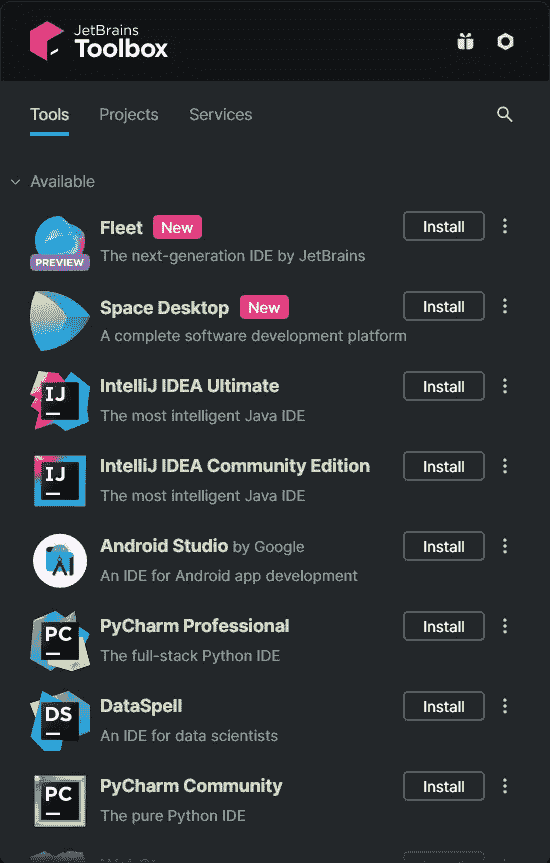
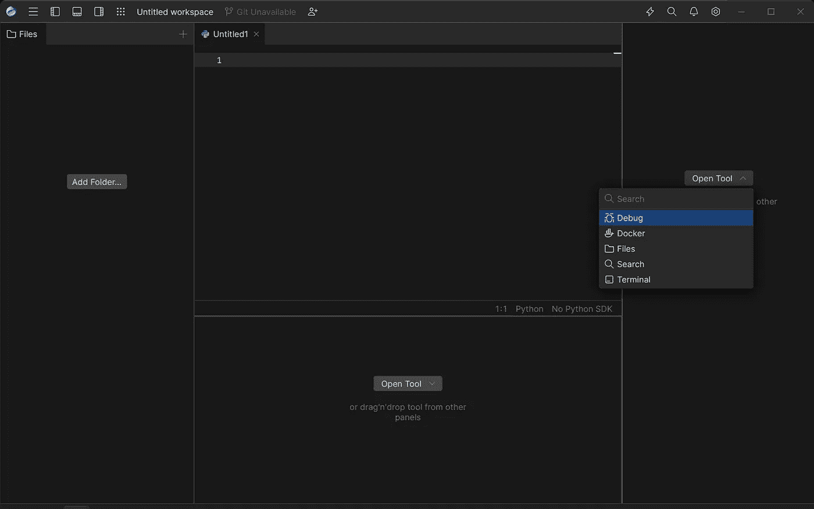
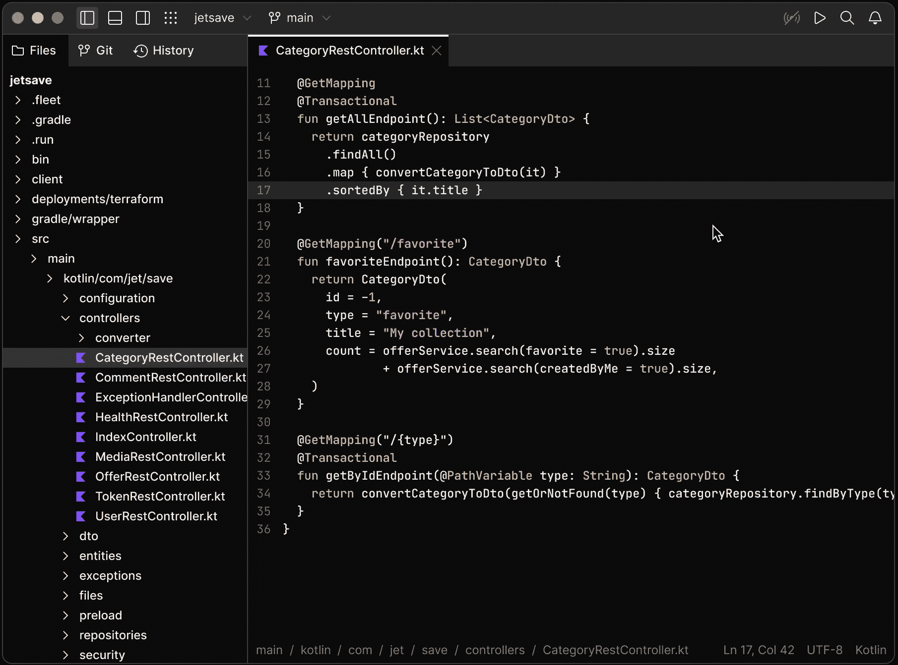

# JetBrains 舰队不是 VS 代码黑仔

> 原文：<https://javascript.plainenglish.io/jetbrains-fleet-is-not-a-vs-code-killer-13547a00ff9f?source=collection_archive---------2----------------------->

## 探索与 VS 代码相比，Fleet 的表现如何。

自从它被宣布以来，许多人将**舰队**称为 *VS 代码杀手*。Fleet 是 JetBrains 的全新 IDE，它提供了各种 IDE 和开发工具。JetBrains 的工具旨在通过自动化常见的重复性任务来帮助开发人员更快地工作，使他们能够保持专注。

在涉及 IntelliJ for Java、PhpStorm for PHP 等 ide 时，JetBrains 有着无可挑剔的记录。当他们宣布他们将在 2021 年 11 月推出一款新产品(Fleet)时，该产品旨在实现通用、灵活和轻量的目标。难怪许多人给 Fleet 起了“VS 代码杀手”的口号。

现在这支舰队对我们来说是一次公开的预演，而且自从它发射以来尘埃落定。让我们看看与 VSCode 相比，Fleet 的表现如何。

# 下载车队

Currently, you can only use Toolbox to install Fleet

安装舰队有点奇怪。要安装 fleet，您需要下载 JetBrains 的工具箱应用程序，然后只有您可以从工具列表中安装 Fleet。这确实违背了 Fleet 的轻量化原则。这可能会让一些人倒胃口。

JetBrains 表示，这是一项临时措施，并表示这将是为了简化和快速分发安装程序。但是 Toolbox 也有缺点，比如不能识别使用特定于产品的安装程序完成的现有安装。希望这真的是一项临时措施。

# 效率不高

JetBrains 将 Fleet 作为轻量级编辑器进行营销。但是，二进制文件和库的大小大约是 2GB。尽管 VSCode 是一个基于电子的应用程序，但与 VS Code 相比，Fleet 明显要慢一些。它还使用更多的内存。

当 Fleet 和 VS 代码有相同的项目打开时。相比之下，Fleet 使用超过 2GB 的内存，而 VS Code 仅使用 800MB 多一点。当相同的测试在不同的系统中对不同的项目运行时，内存占用测试给出了相似的结果。然而，当在安装了 fleet 的 Linux 上运行相同的测试时，它使用的 RAM 比在 Windows 机器上少。

它在分析代码和自动完成方面也慢得多。重新打开项目需要几分钟，而不是几秒钟。自动完成不是即时的。

# 连接

Fleet User Interface

与其他 JetBrains 产品相比，Fleet 的用户界面是最小的，也不是那么强大。一切都更加清晰可见。感觉更快，整合得更好。当加载代码建议时，它有一个非常好的光标动画。

这看起来有点像 VSCode 克隆。编辑文本文件、更改设置和按键绑定与 VS 代码非常相似。它有很好的 git 集成，也支持 git 历史面板。它还支持 docker 开箱即用。文字编辑也很不错。它还有一个叫做查找的功能。它允许您在文件中搜索文本。然而，它仍然没有插件支持。

# 智能模式

Smart Mode in Fleet

当您单击顶部的智能模式按钮时，编辑器会转换成一个成熟的集成开发环境，具有自动完成、重构等功能。因为这些特性需要对整个项目进行索引，所以选择只在需要的时候加入是很好的。

这是一个轻量级文本编辑器和一个成熟的 IDE 之间的交叉，尽管索引一个项目似乎需要很长时间，可能超过一分钟。您也可以通过插件在 vs 代码中获得完整的 IDE 功能，但是在智能模式下，这一切都是自动发生的。

# 合作

有了 Fleet，您可以与他人协作编写代码。Fleet 允许的远不止是简单地共享编辑器。您可以共享终端和调试会话，进行代码审查，探索代码，以及在没有设置的情况下做各种其他事情。

其他人可以加入您在机器上启动的协作会话，或者每个人都可以加入共享的远程开发环境。这对舰队来说是一个非常好的加分点。

# 付费与免费

VS 代码是免费的，维护良好，并且有很多插件。作为一个由微软支持的开源项目，它得到了巨大的支持。Fleet 目前只对“爱好与教育”免费，但对于专业用例，它将是一款付费产品，价格待定。对许多人来说，这可能是一个巨大的挫折。

像 Fleet 这样的付费产品永远无法与 VS Code 竞争。因为许多独立开发人员知道可以在 VS 代码中免费获得更好的产品时，他们绝不会愿意花钱购买 Fleet 这样的东西。

# 结论

JetBrains Fleet 是一款很有前景的产品，但是要从 vscode 获得一些市场份额将是一场艰苦的战斗，更不用说杀死真正的产品了。但对于现有的喷气大脑用户来说，Fleet 是一款很棒的产品。这支舰队的目标不是消灭 VS 代码，而是将 JetBrains IDEs 统一到一个由 JetBrains 的多种语言服务器支持的单一前端中。

这是对 JetBrains IntelliJ 平台的轻量级重新设计，高度关注远程开发。如果价格比其他智能手机便宜，它肯定能把它的一些用户吸引到 Fleet。但对其他人来说，舰队仍处于初级阶段，它是有希望的，它可能还需要几年才能与 VS 代码竞争。

*更多内容请看*[***plain English . io***](https://plainenglish.io/)*。报名参加我们的* [***免费周报***](http://newsletter.plainenglish.io/) *。关注我们关于*[***Twitter***](https://twitter.com/inPlainEngHQ)[***LinkedIn***](https://www.linkedin.com/company/inplainenglish/)*[***YouTube***](https://www.youtube.com/channel/UCtipWUghju290NWcn8jhyAw)*[***不和***](https://discord.gg/GtDtUAvyhW) *。对增长黑客感兴趣？检查* [***电路***](https://circuit.ooo/) *。***