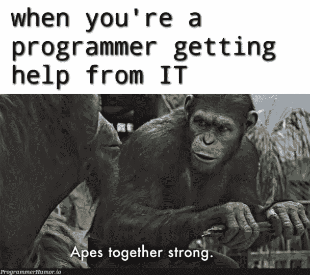
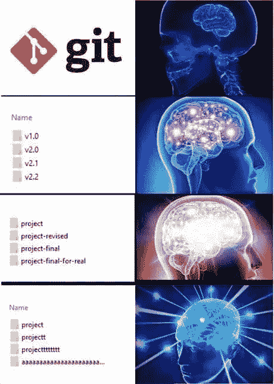
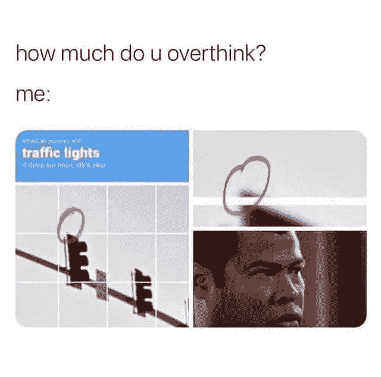

# 每个程序员都能理解的笑话

> 原文：<https://javascript.plainenglish.io/jokes-every-programmer-can-relate-to-50969168ef40?source=collection_archive---------0----------------------->

## 每日一剂编程迷因 2022

Photo by [Brooke Cagle](https://unsplash.com/@brookecagle?utm_source=medium&utm_medium=referral) on [Unsplash](https://unsplash.com?utm_source=medium&utm_medium=referral)

***模因和快乐有什么联系吗？*** 如果你是我这种类型的人，那么你可能也爱在下班后查看手机。猜猜我在那里看到了什么？

我主要是在互联网上看到**视频、抖音和模因**。我不知道为什么，但这有助于我提神醒脑，减轻工作压力。这就是为什么我相信*笑是人类最好的刷新按钮。*

在这篇文章中，我收集了一些我喜欢的网络迷因。

# 同宗兄弟…

Picture Credit:[https://programmerhumor.io/](https://programmerhumor.io/)

# 当有人告诉我你抄袭了我的代码..我发现了它…

Picture Credit:[https://programmerhumor.io/](https://programmerhumor.io/)

# 如果我们在电脑前坐 16 个小时会怎么样？

Picture Credit:[https://programmerhumor.io/](https://programmerhumor.io/)

# 当面试官是 Frontend 的时候，他不在乎你懂什么……有经验吗？

Picture Credit:[https://programmerhumor.io/](https://programmerhumor.io/)

# 奉献 100%…

Picture Credit:[https://programmerhumor.io/](https://programmerhumor.io/)

# 程序员可能写了这个..Gift = you，Gift=null，所以你=null

Picture Credit:[https://programmerhumor.io/](https://programmerhumor.io/)

# 正则表达式不能正常…

Picture Credit:[https://programmerhumor.io/](https://programmerhumor.io/)

# 真相…

Picture Credit:[https://programmerhumor.io/](https://programmerhumor.io/)

# 应该加到我的合流页面…

Picture Credit:[https://programmerhumor.io/](https://programmerhumor.io/)

# 是的，这种语言不支持…

Picture Credit:[https://programmerhumor.io/](https://programmerhumor.io/)

# 是...超级英雄存在…

Picture Credit:[https://programmerhumor.io/](https://programmerhumor.io/)

# 啊啊……

Picture Credit:[https://programmerhumor.io/](https://programmerhumor.io/)

# 这是特色…

Picture Credit:[https://programmerhumor.io/](https://programmerhumor.io/)

# 额外剂量:

# 你最喜欢哪一个？我以前有一个新的文件夹系列…

[https://www.reddit.com/r/ProgrammerHumor/comments/ojxtdg/git/](https://www.reddit.com/r/ProgrammerHumor/comments/ojxtdg/git/)

# 有史以来最好的编程回复…对面可怜的人…

[https://www.facebook.com/photo/?fbid=1200115330452532&set=gm.2876702175930666](https://www.facebook.com/photo/?fbid=1200115330452532&set=gm.2876702175930666)

# 当我获得 Windows 更新时，我也有同样的感觉…

[https://www.facebook.com/photo?fbid=1070897396773567&set=gm.6406455706046826](https://www.facebook.com/photo?fbid=1070897396773567&set=gm.6406455706046826)

# 你是人类吗？是的，我确实注意到了一些小事…

[https://www.facebook.com/BlaxkerHacker/photos/a.122991386210034/333988921776945/](https://www.facebook.com/BlaxkerHacker/photos/a.122991386210034/333988921776945/)

# 每当我被从库中看到的简单代码所吸引，一旦我开始使用它…

[https://www.monkeyuser.com/2021/new-library/](https://www.monkeyuser.com/2021/new-library/)

# 黑暗模式是生活…

[https://www.reddit.com/r/ProgrammerHumor/comments/ojvsfq/light_attracts_bugs/](https://www.reddit.com/r/ProgrammerHumor/comments/ojvsfq/light_attracts_bugs/)

# 我绝对需要全部…

[https://twitter.com/PR0GRAMMERHUM0R/status/1415295034891591688/photo/1](https://twitter.com/PR0GRAMMERHUM0R/status/1415295034891591688/photo/1)

# JAVA 程序员就像…

[https://programmerhumor.io/programming-memes/thats-wrong-boy/](https://programmerhumor.io/programming-memes/thats-wrong-boy/)

# 当产品负责人不理解技术依赖并提出需求时…

[https://programmerhumor.io/programming-memes/his-product-owner-clearly-didnt-understand-what-a-technical-dependency-was-during-spring-gooming/](https://programmerhumor.io/programming-memes/his-product-owner-clearly-didnt-understand-what-a-technical-dependency-was-during-spring-gooming/)

# 我还没想到土豆的这种深层次的激励信息…

[https://www.facebook.com/javascriptJS/photos/a.1387402908063976/2154381918032734/](https://www.facebook.com/javascriptJS/photos/a.1387402908063976/2154381918032734/)

# 乍一看，对我来说是一样的..然后发现括号是如何处理的…太旧了，可能因为我们现在已经格式化了…

[https://www.facebook.com/groups/programming.jokes](https://www.facebook.com/groups/programming.jokes)

# 当我的学长要求编写单元测试时…我相信我的程序也是这样做的…

[https://www.monkeyuser.com/](https://www.monkeyuser.com/)

*更多内容请看*[***plain English . io***](https://plainenglish.io/)*。报名参加我们的* [***免费周报***](http://newsletter.plainenglish.io/) *。关注我们上*[***Twitter***](https://twitter.com/inPlainEngHQ)[***LinkedIn***](https://www.linkedin.com/company/inplainenglish/)*[***YouTube***](https://www.youtube.com/channel/UCtipWUghju290NWcn8jhyAw)**和* [***不和***](https://discord.gg/GtDtUAvyhW) *对成长黑客感兴趣？检查* [***电路***](https://circuit.ooo/) ***。*****