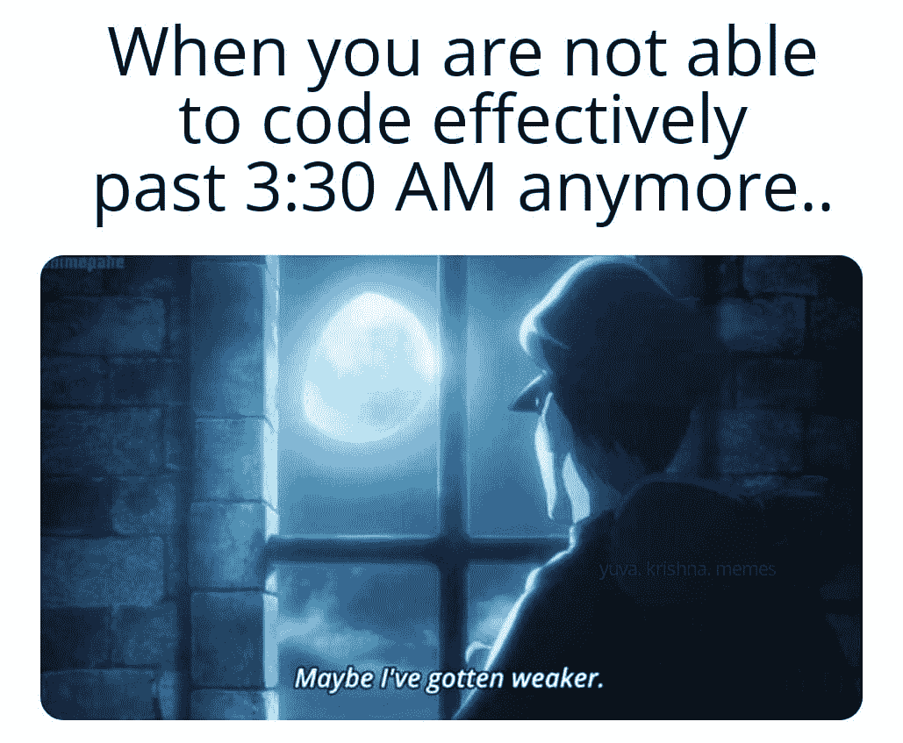

# 每个程序员都能理解的笑话

> 原文：<https://javascript.plainenglish.io/jokes-every-programmer-can-relate-to-da5371c0d4a7?source=collection_archive---------2----------------------->

## 与编程相关的趋势模因汇编

Photo by [Marija Zaric](https://unsplash.com/@simplicity?utm_source=medium&utm_medium=referral) on [Unsplash](https://unsplash.com?utm_source=medium&utm_medium=referral)

新的一年，新的开始。作为你的微笑专家，我又想出了一篇文章，汇集了我在社交媒体上发现的流行节目笑话。

这些笑话的目的是让你发笑，改善你的心情。因为:

# “笑声是人机最好的刷新按钮”

让我们沉浸在笑声中…

# 嗯。我只是来寻求帮助的…

Picture Credit:[https://www.reddit.com/r/ProgrammerHumor](https://www.reddit.com/r/ProgrammerHumor)

# 理解开发方法的最佳例子…

Picture Credit:[https://programmerhumor.io/programming-memes](https://programmerhumor.io/programming-memes)

# 昨天你什么都没做的感觉…

Picture Credit:[https://programmerhumor.io/programming-memes](https://programmerhumor.io/programming-memes)

# 它看起来较小，但有一个很大的后端…

Picture Credit: [https://www.monkeyuser.com/](https://www.monkeyuser.com/)

# 你是让我通过写代码来做单元测试吗？

Picture Credit:[https://programmerhumor.io/programming-memes](https://programmerhumor.io/programming-memes)

# 在家工作…

Picture Credit:[https://workchronicles.com/comics/](https://workchronicles.com/comics/)

# 预期…或者让我们加上尝试捕捉…

Picture Credit:[https://www.monkeyuser.com/](https://www.monkeyuser.com/)

# 涵盖所有边缘案例…

Picture Credit:[https://www.monkeyuser.com/](https://www.monkeyuser.com/)

# 试抓是最终的解决方案…

[https://www.reddit.com/r/ProgrammerHumor/](https://www.reddit.com/r/ProgrammerHumor/comments/smkmpe/am_i_the_only_one_who_overthinks_for_the_users/)

# 面试 vs .工作…

Picture Credit:[https://www.semicolonworld.com/humor/programming-memes](https://www.semicolonworld.com/humor/programming-memes)

# 视角…

Picture Credit:[https://programmerhumor.io/](https://programmerhumor.io/)

# 我们稍后会更改它…

Picture Credit:[https://www.semicolonworld.com/humor/programming-memes](https://www.semicolonworld.com/humor/programming-memes)

# 你是怎么做到的？

Picture Credit:[https://www.facebook.com/yuva.krishna.memes](https://www.facebook.com/yuva.krishna.memes)

# 奖励项目:

# 丑陋的事实…

[https://www.facebook.com/DZoneInc/photos/a.336758034711/10159517902774712/](https://www.facebook.com/DZoneInc/photos/a.336758034711/10159517902774712/)

# 让我们找到 bug 的根源…时间到了！

[https://www.monkeyuser.com/2018/root-cause/?sc=true&dir=random](https://www.monkeyuser.com/2018/root-cause/?sc=true&dir=random)

# 你的地址是什么？我的是…

[https://www.facebook.com/photo?fbid=4265063180221311&set=gm.2872966899620618](https://www.facebook.com/photo?fbid=4265063180221311&set=gm.2872966899620618)

# 我的代码感觉不好，如果我怀疑他…

[https://www.facebook.com/photo?fbid=1741999619316996&set=gm.2873716776212297](https://www.facebook.com/photo?fbid=1741999619316996&set=gm.2873716776212297)

# 不要挑战程序员的幽默

[https://www.reddit.com/r/ProgrammerHumor/comments/okr5j0/programmers_humor_touching_the_sky/](https://www.reddit.com/r/ProgrammerHumor/comments/okr5j0/programmers_humor_touching_the_sky/)

# 我随时准备释放…

[https://www.reddit.com/r/ProgrammerHumor/comments/okcd9m/minimum_viable_product/](https://www.reddit.com/r/ProgrammerHumor/comments/okcd9m/minimum_viable_product/)

# 如果它不起作用，让我们用更高的优先级来修复错误…

[https://programmerhumor.io/programming-memes/daily-life/](https://programmerhumor.io/programming-memes/daily-life/)

# 硬编码变量就像…

[https://programmerhumor.io/programming-memes/hard-coding-variables-be-like-2/](https://programmerhumor.io/programming-memes/hard-coding-variables-be-like-2/)

# 太具体的建议…

[https://programmerhumor.io/programming-memes/that-felt-a-little-bit-too-specific/](https://programmerhumor.io/programming-memes/that-felt-a-little-bit-too-specific/)

# 什么是递归？一个简单的答案。

[https://devrant.com/rants/1052316/this-is-how-recursive-functions-works](https://devrant.com/rants/1052316/this-is-how-recursive-functions-works)

# 其他人做的吗？

[https://www.facebook.com/photo/?fbid=2626573337649221&set=gm.2879879672279583](https://www.facebook.com/photo/?fbid=2626573337649221&set=gm.2879879672279583)

# 这是讽刺吗？是的…哈哈

[https://www.facebook.com/yuva.krishna.memes/photos/a.105527467815845/374844090884180/](https://www.facebook.com/yuva.krishna.memes/photos/a.105527467815845/374844090884180/)

# 一切皆有可能…什么都没有定义…一个晚上有几个小时？

[https://www.facebook.com/yuva.krishna.memes/photos/a.105527467815845/374439034258019/](https://www.facebook.com/yuva.krishna.memes/photos/a.105527467815845/374439034258019/)

# 我做了一些有用的事情，现在我可以把它添加到我的简历中

[https://www.facebook.com/jokesvala/photos/a.2330223400336101/6283529831672085/](https://www.facebook.com/jokesvala/photos/a.2330223400336101/6283529831672085/)

# 哇…这种感觉…

[https://www.facebook.com/photo/?fbid=10165386371885383&set=gm.837026157016641](https://www.facebook.com/photo/?fbid=10165386371885383&set=gm.837026157016641)

# 在 StackOverflow 上有人帮了你之后，世界是如此美好…

[https://www.facebook.com/jokesvala/photos/a.2330223400336101/6283493258342409/](https://www.facebook.com/jokesvala/photos/a.2330223400336101/6283493258342409/)

# 上传文件的物理方式是什么？

[https://www.facebook.com/Septatec/photos/a.3294457633926346/4250075005031266/](https://www.facebook.com/Septatec/photos/a.3294457633926346/4250075005031266/)

# 嗯…希望不会发生在任何人身上…如果是这样，这篇文章会对你有很大帮助…

[https://www.facebook.com/yuva.krishna.memes/photos/a.105527467815845/374823690886220/](https://www.facebook.com/yuva.krishna.memes/photos/a.105527467815845/374823690886220/)

# 谁干的？

[https://www.facebook.com/yuva.krishna.memes/photos/a.105527467815845/373596757675580/](https://www.facebook.com/yuva.krishna.memes/photos/a.105527467815845/373596757675580/)

# 调试就是以这样一种方式挤进去，缺陷会自己被注意到…

[https://www.facebook.com/yuva.krishna.memes/photos/a.105527467815845/373561211012468/](https://www.facebook.com/yuva.krishna.memes/photos/a.105527467815845/373561211012468/)

希望你玩得开心！下一篇文章再见。

*更多内容请看*[***plain English . io***](http://plainenglish.io/)*。报名参加我们的* [***免费周报***](http://newsletter.plainenglish.io/) *。在我们的* [***社区***](https://discord.gg/GtDtUAvyhW) *获得独家获得写作机会和建议。*